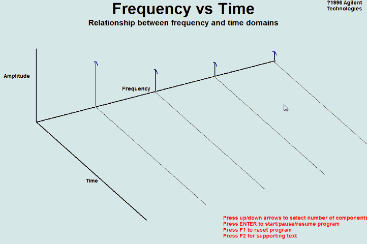

# DCN
# **一、 为什么会出现图卷积神经网络？**
**普通卷积神经网络**研究的对象是具备Euclidean domains的数据，Euclidean domains data数据最显著的特征是他们**具有规则的空间结构**，如图片是规则的正方形，语音是规则的一维序列等，这些特征都可以用一维或二维的矩阵来表示，**卷积神经网络处理起来比较高效。**

CNN的【平移不变性】在【非矩阵结构】数据上不适用：

* **平移不变性（translation invariance）**：比较好理解，在用基础的分类结构比如ResNet、Inception给一只猫分类时，无论猫怎么扭曲、平移，最终识别出来的都是猫，**输入怎么变形输出都不变这就是平移不变性**，网络的层次越深这个特性会越明显。
* **平移可变性（translation variance）**：针对目标检测的，比如一只猫从图片左侧移到了右侧，检测出的猫的坐标会发生变化就称为平移可变性。当卷积网络变深后最后一层卷积输出的feature map变小，物体在输入上的小偏移，经过N多层pooling后在最后的小feature map上会感知不到，这就是为什么R-FCN原文会说网络变深平移可变性变差。

**离散卷积本质就是一种加权求和。**CNN中的卷积就是一种离散卷积，本质上就是利用一个共享参数的过滤器（kernel），**通过计算中心像素点以及相邻像素点的加权和来构成feature map实现空间特征的提取，当然加权系数就是卷积核的权重系数(W)。**

那么卷积核的系数如何确定的呢？是**随机化初值，然后根据误差函数通过反向传播梯度下降进行迭代优化。**这是一个关键点，卷积核的参数通过优化求出才能实现特征提取的作用，**GCN的理论很大一部分工作就是为了引入可以优化的卷积参数。**

图数据中的空间特征具有以下特点：

1）** 节点特征：**每个节点有自己的特征；（体现在点上）

2） **结构特征：**图数据中的每个节点具有结构特征，即节点与节点存在一定的联系。（体现在边上）

总地来说，**图数据既要考虑节点信息，也要考虑结构信息**，图卷积神经网络就可以自动化地既学习节点特征，又能学习节点与节点之间的关联信息。

**图卷积的核心思想是利用『边的信息』对『节点信息』进行『聚合』从而生成新的『节点表示』！！！**

# **二、图卷积网络的两种理解方式**
**GCN的本质目的就是用来提取拓扑图的空间特征。**

图卷积神经网络主要有两类，

* 一类是**基于空间域或顶点域vertex domain(spatial domain)**
通俗点解释，**空域可以类比到直接在图片的像素点上进行卷积。**

**基于空域卷积的方法直接将卷积操作定义在每个结点的连接关系上，它跟传统的卷积神经网络中的卷积更相似一些。**在这个类别中比较有代表性的方法有 Message Passing Neural Networks(MPNN)\[1\], GraphSage\[2\], Diffusion Convolution Neural Networks(DCNN)\[3\], PATCHY-SAN\[4\]等

* 另一类则是**基于****频域****或谱域spectral domain**
通俗点解释，**频域可以类比到对图片进行傅里叶变换后，再进行卷积。**

这种思路就是希望借助图谱的理论来实现拓扑图上的卷积操作。从整个研究的时间进程来看：首先研究GSP（graph signal processing）的学者定义了graph上的Fourier Transformation，进而定义了graph上的convolution，最后与深度学习结合提出了Graph Convolutional Network。

# **三、什么是拉普拉斯矩阵？**
**拉普拉斯矩阵(Laplacian matrix) **也叫做**导纳矩阵**、**基尔霍夫矩阵**或**离散拉普拉斯算子**，主要应用在图论中，作为一个图的矩阵表示。

对于图 G=(V,E)，其Laplacian 矩阵的定义为 

$$
L=D-A
$$

其中 L 是Laplacian 矩阵， D=diag(d)是顶点的度矩阵（对角矩阵）,d=rowSum(A)，对角线上元素依次为各个顶点的度， A 是图的邻接矩阵。

Graph Fourier Transformation及Graph Convolution的定义都用到图的拉普拉斯矩阵。

**频域卷积的前提条件是图必须是无向图，只考虑无向图，那么L就是对称矩阵。**

## **1、常用的几种拉普拉斯矩阵**
### **（1）普通形式的拉普拉斯矩阵**
$$
L=D-A
$$

L中的元素给定为：

$$
L_{i,j} = \begin{cases}
  &diag(v_i)  &\text{ if } i=j \\
  &-1 &\text{ if } i≠ j \space \space and \space \space v_i \space \space is \space \space adjacent \space \space to \space \space v_i \\
  &0 &\text{ otherwise }
\end{cases}
$$

其中$diag(v_i)$表示定点$i$的度。

### **（2）对称归一化的拉普拉斯矩阵（Symmetric normalized Laplacian）**
$$
L^{sys} = D^{-\frac{1}{2}}L D^{-\frac{1}{2}} = I- D^{-\frac{1}{2}}A D^{-\frac{1}{2}}
$$

矩阵元素定义为：

$$
L_{i,j}^{sys} = \begin{cases}
  &1  &\text{ if } i=j \space \space and \space \space diag(v_i)≠ 0 \\
  &-\frac{1}{\sqrt[]{diag(v_i)diag(v_j)} } &\text{ if } i≠ j \space \space and \space \space v_i \space \space is \space \space adjacent \space \space to \space \space v_i \\
  &0 &\text{ otherwise }
\end{cases}
$$

很多GCN的论文中应用的是这种拉普拉斯矩阵

### **（3）随机游走归一化拉普拉斯矩阵（Random walk normalized Laplacian）**
$$
L^{rw} = D^{-1}L = I - D^{-1}A
$$

矩阵元素定义为：

$$
L_{i,j}^{rw} = \begin{cases}
  &1  &\text{ if } i=j \space \space and \space \space diag(v_i)≠ 0 \\
  &-\frac{1}{diag(v_i) } &\text{ if } i≠ j \space \space and \space \space v_i \space \space is \space \space adjacent \space \space to \space \space v_i \\
  &0 &\text{ otherwise }
\end{cases}
$$

### **（4）泛化的拉普拉斯 (Generalized Laplacian)**
泛化的拉普拉斯(用得少)定义为:

$$
\begin{cases}
  &Q_{i,j} <0  &\text{ if } i=j \space \space and \space \space diag(v_i)≠ 0 \\
  &Q_{i,j} = 0 &\text{ if } i≠ j \space \space and \space \space v_i \space \space is \space \space adjacent \space \space to \space \space v_i \\
  &anynumber &\text{ otherwise }
\end{cases}
$$

$$
A = \begin{Bmatrix}
  0&  1&  0&  0&  1& 0\\
  1&  0&  1&  0&  1& 0\\
  0&  1&  0&  1&  0& 0\\
  0&  0&  1&  0&  1& 1\\
  1&  1&  0&  1&  0& 0\\
  0&  0&  0&  1&  0& 0
\end{Bmatrix},\space \space D =\begin{Bmatrix}
  2&  0&  0&  0&  0& 0\\
  0&  3&  0&  0&  0& 0\\
 0 &  0&  2&  0&  0& 0\\
  0& 0 &  0&  3&  0& 0\\
  0&  0&  0& 0 &  3& 0\\
  0& 0 &  0&  0&  0&1
\end{Bmatrix},\space \space D^{-\frac{1}{2 }} =\begin{Bmatrix}
  \frac{1}{\sqrt[]{2} }&  0&  0&  0&  0& 0\\
  0&   \frac{1}{\sqrt[]{3} }&  0&  0&  0& 0\\
 0 &  0&  \frac{1}{\sqrt[]{2} }&  0&  0& 0\\
  0& 0 &  0&  \frac{1}{\sqrt[]{3} }&  0& 0\\
  0&  0&  0& 0 &  \frac{1}{\sqrt[]{3} }& 0\\
  0& 0 &  0&  0&  0&1
\end{Bmatrix}
$$

$$
\begin{align}
L&= D-A = \begin{Bmatrix}
  2&  -1&  0&  0&  -1& 0\\
  -1&  3&  -1&  0&  -1& 0\\
 0 &  -1&  2&  -1&  0& 0\\
  0& 0 &  -1&  3&  -1& -1\\
  -1&  -1&  0& -1 &  3& 0\\
  0& 0 &  0&  -1&  0&1
\end{Bmatrix}

\\
\\
L^{sys} &=  D^{-\frac{1}{2}}L D^{-\frac{1}{2}} = I- D^{-\frac{1}{2}}A D^{-\frac{1}{2}} =\begin{Bmatrix}
  1&  -\frac{1}{\sqrt[]{6} }&  0&  -\frac{1}{\sqrt[]{6} }&  0& 0\\
  -\frac{1}{\sqrt[]{6} }&  1&  -\frac{1}{\sqrt[]{6} }&  0&  -\frac{1}{\sqrt[]{9} }& 0\\
  0&  -\frac{1}{\sqrt[]{6} }&  1&  -\frac{1}{\sqrt[]{6} }&  0&0 \\
  -\frac{1}{\sqrt[]{6} }&  0&  -\frac{1}{\sqrt[]{6} }&  1&  -\frac{1}{\sqrt[]{9} }& -\frac{1}{\sqrt[]{3} }\\
  0&  -\frac{1}{\sqrt[]{9} }&  0&  -\frac{1}{\sqrt[]{9} }&  1& 0\\
  0&  0&  0&  -\frac{1}{\sqrt[]{3} }&  0& 1
\end{Bmatrix} 

\end{align}
$$

> **标准归一化的拉普拉斯矩阵还是对称的，并且符合前面的公式定义**

## **2、无向图的拉普拉斯矩阵有什么性质**
（1）拉普拉斯矩阵是半正定矩阵【[https://zhuanlan.zhihu.com/p/81169491](https://zhuanlan.zhihu.com/p/81169491)】。（最小特征值大于等于0）

（2）**特征值中0出现的次数就是图连通区域的个数。**

（3）最小特征值是0，因为拉普拉斯矩阵（普通形式：L = D − A L=D-AL=D−A）每一行的和均为0，并且**最小特征值对应的特征向量是每个值全为1的向量；**

（4）最小非零特征值是图的代数连通度。

## **3、为什么GCN要用拉普拉斯矩阵**
* 拉普拉斯矩阵是对称矩阵，可以进行特征分解（谱分解）
* 由于卷积在傅里叶域的计算相对简单，为了在graph上做傅里叶变换，需要找到graph的连续的正交基对应于傅里叶变换的基，因此要使用拉普拉斯矩阵的特征向量。

## **拉普拉斯矩阵的谱分解（特征分解）**
GCN的核心基于拉普拉斯矩阵的谱分解。

特征分解（Eigendecomposition），又称**谱分解**（Spectral decomposition）是将矩阵分解为由其特征值和特征向量表示的矩阵之积的方法。**只有对可对角化矩阵或有n个线性无关的特征向量的矩阵才可以施以特征分解。**

不是所有的矩阵都可以特征分解，其充要条件为**n阶方阵存在n个线性无关的特征向量**。

但是拉普拉斯矩阵是半正定矩阵（半正定矩阵本身就是对称矩阵），有如下三个性质：

* **对称矩阵一定n个线性无关的特征向量**
* 半正定矩阵的特征值一定非负
* **对阵矩阵的不同特征值对应的特征向量相互正交**，这些正交的特征向量构成的矩阵为正交矩阵。

由上拉普拉斯矩阵对称知一定可以谱分解，且分解后有特殊的形式。

# **傅里叶变换**

Graph上的傅里叶变换及卷积

把传统的傅里叶变换以及卷积迁移到Graph上来，核心工作其实就是把拉普拉斯算子的特征函数$e^{−iωt}$  变为Graph对应的拉普拉斯矩阵的特征向量。

傅立叶变换与拉普拉斯矩阵的关系：传统傅立叶变换的基，就是拉普拉斯矩阵的一组特征向量。

前面讲到可以用一组正交函数cos和sin(或$e^{−iωt}$ )表示任意函数，且傅里叶变换是连续形式的，在处理Graph时，用到的是傅里叶变换的离散形式。由于拉普拉斯矩阵进行谱分解以后，可以得到n个线性无关的特征向量，构成空间中的一组正交基，因此归一化拉普拉斯矩阵算子的特征向量构成了图傅里叶变换的基。图傅里叶变换将输入图的信号投影到了正交空间，相当于把图上定义的任意向量，表示成了拉普拉斯矩阵特征向量的线性组合。

# 

#### 

参考：

https://blog.csdn.net/yyl424525/article/details/100058264