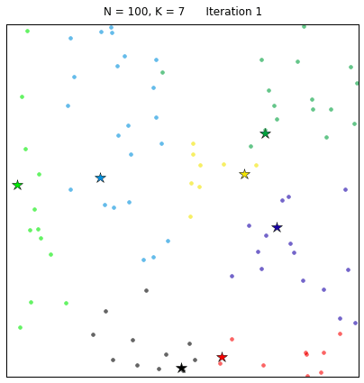
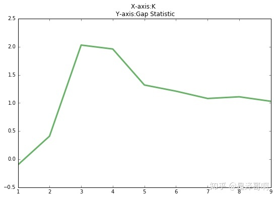
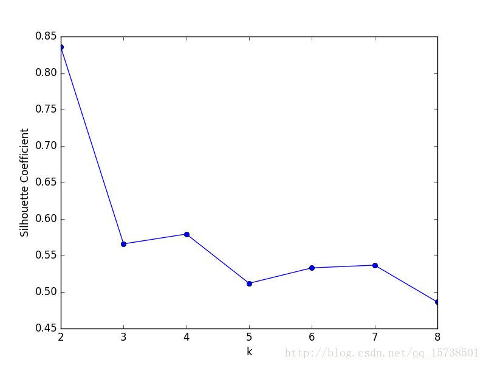

# K-Means、K-Means++
# **K-Means**
K-Mean算法，即 K 均值算法，是一种常见的聚类算法。算法会将数据集分为 K 个簇，每个簇使用簇内所有样本均值来表示，将该均值称为“质心”。容易受初始质心的影响；算法简单，容易实现；算法聚类时，容易产生空簇；算法可能收敛到局部最小值。


距离计算方式是 欧式距离。

$$
d(x,\mu) = \sqrt{\sum_{i=1}^{n} (x_i -\mu_i)^2}
$$

则一个簇中所有样本点到质心的距离的平方和为：

$$
\begin{align}

Cluster \space Sum\space  of \space Square\space (CSS)= & \sum_{j=0}^{m}\sum_{i=1}^{n}(x_i - \mu_i)^2
\\\\
Total \space Cluster\space  Sum \space of\space Square\space = & \sum_{i}^{k}CSS_i 

\end{align}
$$

其中，$m$为一个簇中样本的个数，$j$是每个样本的编号。这个公式被称为**簇内平方和****(cluster Sum of Square)**， 又叫做`Inertia`。(惯性；惰性；缺乏活力；保守；不活动；无力)

而将一个数据集中的所有簇的簇内平方和相加，就得到了**整体平方和****(Total Cluster Sum of Square)**，又叫做`Total Inertia`。**Total Inertia 越小，代表着每个簇内样本越相似，聚类的效果就越好。**因此 `KMeans` 追求的是，求解能够让`Inertia`最小化的质心。

|距离度量|质心|Inertia|
| ----- | ----- | ----- |
|欧几里得距离|均值|最小化每个样本点到质心的欧式距离之和|
|曼哈顿距离|中位数|最小化每个样本点到质心的曼哈顿距离之和|
|余弦距离|均值|最小化每个样本点到质心的余弦距离之和|


算法步骤：

```Plain Text
1.从样本中选择 K 个点作为初始质心（完全随机）
2.计算每个样本到各个质心的距离，将样本划分到距离最近的质心所对应的簇中
3.计算每个簇内所有样本的均值，并使用该均值更新簇的质心
4.重复步骤 2 与 3 ，直到达到以下条件之一：
    质心的位置变化小于指定的阈值（默认为 0.0001）
    达到最大迭代次数
```



看下伪代码：

```Plain Text
获取数据 n 个 m 维的数据
随机生成 K 个 m 维的点
while(t)
    for(int i=0;i < n;i++)
        for(int j=0;j < k;j++)
            计算点 i 到类 j 的距离
    for(int i=0;i < k;i++)
        1. 找出所有属于自己这一类的所有数据点
        2. 把自己的坐标修改为这些数据点的中心点坐标
end
```
时间复杂度：$O(tknm)$，其中，$t$ 为迭代次数，$k$ 为簇的数目，$n$ 为样本点数，$m$ 为样本点维度。

空间复杂度：$O(m(n+k))$，其中，$k$ 为簇的数目，$m$ 为样本点维度，$n$ 为样本点数。


## **K-Means优缺点**
### **优点**
* 容易理解，聚类效果不错，虽然是局部最优， 但往往局部最优就够了；
* 高效可伸缩，计算复杂度 为$O(NKt)$接近于线性（N是数据量，K是聚类总数，t是迭代轮数）。
* 处理大数据集的时候，该算法可以保证较好的伸缩性；
* 当簇近似高斯分布的时候，效果非常不错；
* 可解释度较强
* 算法尝试找出使平方误差函数值最小的 k 个划分。 当簇是密集的、球状或团状的，且簇与簇之间区别明显时，聚类效果较好 。


### **缺点**
* K 值需要人为设定，不同 K 值得到的结果不一样；
* 对初始的簇中心敏感，不同选取方式会得到不同结果；
* 对异常值敏感；
* 样本只能归为一类，不适合多分类任务；
* 不适合太离散的分类、样本类别不平衡的分类、非凸形状的分类。
* **「KMeans 本质上是一种基于欧式距离度量的数据划分方法，均值和方差大的维度将对数据的聚类结果产生决定性影响。「所以在聚类前对数据（「具体的说是每一个维度的特征」）做归一化和单位统一至关重要。此外，异常值会对均值计算产生较大影响，导致」中心偏移」**，因此对于"噪声"和孤立点数据最好能提前过滤 。

（1）K值很难确定
（2）容易收敛到局部最优解

（3）对噪音和异常点敏感，由于使用欧氏距离，对噪音和异常点比较敏感
（4）需样本存在均值（限定数据种类）
（5）聚类效果依赖于聚类中心的初始化
（6）对于非凸数据集或类别规模差异太大的数据效果不好，非凸数据集较难收敛，如果类别严重失衡，则聚类效果较差，有可能无法获取到较少数据的类别


# **算法调优与改进**
针对 K-means 算法的缺点，我们可以有很多种调优方式：如数据预处理（去除异常点），合理选择 K 值，高维映射等。以下将简单介绍：

## **数据预处理**
K-means 的本质是基于欧式距离的数据划分算法，均值和方差大的维度将对数据的聚类产生决定性影响。所以未做归一化处理和统一单位的数据是无法直接参与运算和比较的。常见的数据预处理方式有：数据归一化，数据标准化。

此外，离群点或者噪声数据会对均值产生较大的影响，导致中心偏移，因此我们还需要对数据进行**异常点检测(DBSCAN)**。

## **mini batch**
既然整个样本集合计算需要时间较长，那么通过抽样选取一部分样本进行聚类计算。

## **两边之差小于第三边**
两边之差小于第三边的三角形性质，来减少距离的计算。

对于一个样本点$x$和两个质心$c_1,c_2$。如果预先计算出这两个质心之间的距离$D(c_1,c_2)$。

如果计算发现$2D(x,c_1)<D(c_1,c_2)$，则有$D(x,c_1)<D(c_1,c_2) - D(x,c_1)<D(x,c_2)$，此时我们不需要再计算$D(x,c_2)$，也就是说省去一步距离计算。


## **合理选择 K 值**
K 值的选取对 K-means 影响很大，这也是 K-means 最大的缺点，常见的选取 K 值的方法有：手肘法、Gap statistic 方法。

### **手肘法**
手肘法的核心指标是**SSE**(sum of the squared errors，误差平方和)，

$$
SSE = \sum_{i=1}^{k}\sum_{p\in C_i} |p-m_i|^2
$$

其中，$C_i$是第$i$个簇，$p$是$C_i$中的样本点，$m_i$是$C_i$的质心（$C_i$中所有样本的均值），SSE是所有样本的聚类误差，代表了聚类效果的好坏。

手肘法的核心思想是：**随着聚类数k的增大，样本划分会更加精细，每个簇的聚合程度会逐渐提高，那么误差平方和SSE自然会逐渐变小。并且，当k小于真实聚类数时，由于k的增大会大幅增加每个簇的聚合程度，故SSE的下降幅度会很大，而当k到达真实聚类数时，再增加k所得到的聚合程度回报会迅速变小，所以SSE的下降幅度会骤减，然后随着k值的继续增大而趋于平缓，也就是说SSE和k的关系图是一个手肘的形状，而这个肘部对应的k值就是数据的真实聚类数。**当然，这也是该方法被称为手肘法的原因。


当 K < 3 时，曲线急速下降；当 K > 3 时，曲线趋于平稳，通过手肘法我们认为拐点 3 为 K 的最佳值。

手肘法的缺点：

* 需要人工看不够自动化
* 计算太容易受到特征数目的影响
* 不是有界的，误差是越小越好，但并不知道合适达到模型的极限，能否继续提高
* 它会受到超参数 K 的影响，随着$k$越大，误差定会越来越小，但并不代表模型效果越来越好
* Inertia 对数据的分布有假设，它假设数据满足凸分布，并且它假设数据是各向同性的 (`isotropic`)，所以使用`Inertia`作为评估指标，会让聚类算法在一些细长簇，环形簇，或者不规则形状的流形时表现不佳。


所以我们又有了 Gap statistic 方法，这个方法出自斯坦福大学的几个学者的论文：[Estimating the number of clusters in a data set via the gap statistic](https://link.zhihu.com/?target=https%3A//statweb.stanford.edu/~gwalther/gap)

$$
Gap(K) = E(logD_k) - logD_k
$$

其中，$D_k$为损失函数，$E(logD_k)$指的是$logD_k$的期望。这个数值通常通过蒙特卡洛模拟产生，我们在样本里所在的区域中按照均匀分布随机产生和原始样本数一样多的随机样本，并对这个随机样本做 K-Means，从而得到一个$D_k$。

如此往复多次，通常 20 次，我们可以得到 20 个$logD_k$。对这 20 个数值求平均值，就得到了$E(logD_k)$的近似值。最终可以计算 Gap Statisitc。而 Gap statistic 取得最大值所对应的 K 就是最佳的 K。



由图可见，当 K=3 时，Gap(K) 取值最大，所以最佳的簇数是 K=3。

Github 上一个项目叫 [gap\_statistic](https://link.zhihu.com/?target=https%3A//github.com/milesgranger/gap_statistic) ，可以更方便的获取建议的类簇个数。

### **轮廓系数法**
该方法的核心指标是轮廓系数（Silhouette Coefficient），某个样本点$X_i$ 的轮廓系数定义如下：

$$
S = \frac{b-a}{max(a,b)}
$$

其中，

$a$是$X_i$与**同簇**的其他样本的平均距离，称为**凝聚度**（将$a$称为样本$X_i$的**簇内不相似度**），

$b$是$X_i$与**最近簇**的其他样本的平均距离，称为**分离度**（将$b$称为样本$X_i$的**簇间不相似度的最小值**）。

而**最近簇**定义为：

$$
C_j = \underset{C_k}{argmax} \space \frac{1}{n}\sum_{p\in C_k} |p-X_i|^2
$$

其中，$p$是某个簇$C_k$中的样本。事实上，简单点说，就是用$X_i$到某个簇所有样本的平均距离作为衡量该点到该簇的距离后，选择离$X_i$最近的一个簇作为最近簇。

**求出所有样本的轮廓系数后再求平均值就得到了平均轮廓系数**。平均轮廓系数的取值范围为\[-1,1\]，且簇内样本的距离越近，簇间样本距离越远，**平均轮廓系数越大，聚类效果越好**。那么，很自然地，**平均轮廓系数最大的k便是最佳聚类数**。



可以看到，轮廓系数最大的k值是2，这表示我们的最佳聚类数为2。但是，值得注意的是，从k和SSE的手肘图可以看出，当k取2时，SSE还非常大，所以这是一个不太合理的聚类数，我们退而求其次，考虑轮廓系数第二大的k值4，这时候SSE已经处于一个较低的水平，因此最佳聚类系数应该取4而不是2。


但是，讲道理，k=2时轮廓系数最大，聚类效果应该非常好，那为什么SSE会这么大呢？

原因在于轮廓系数考虑了分离度b，也就是样本与最近簇中所有样本的平均距离。为什么这么说，因为从定义上看，轮廓系数大，不一定是凝聚度a（样本与同簇的其他样本的平均距离）小，而可能是b和a都很大的情况下b相对a大得多，这么一来，a是有可能取得比较大的。a一大，样本与同簇的其他样本的平均距离就大，簇的紧凑程度就弱，那么簇内样本离质心的距离也大，从而导致SSE较大。所以，虽然轮廓系数引入了分离度b而限制了聚类划分的程度，但是同样会引来最优结果的SSE比较大的问题，这一点也是值得注意的。

轮廓系数法确定出的最优k值不一定是最优的，有时候还需要根据SSE去辅助选取，这样一来相对手肘法就显得有点累赘。因此，如果没有特殊情况的话，我还是建议首先考虑用**手肘法**。


### 采用核函数
基于欧式距离的 K-means 假设了了各个数据簇的数据具有一样的的先验概率并呈现球形分布，但这种分布在实际生活中并不常见。面对非凸的数据分布形状时我们可以引入核函数来优化，这时算法又称为**核 K-means** 算法，是核聚类方法的一种。核聚类方法的主要思想是通过一个非线性映射，将输入空间中的数据点映射到高位的特征空间中，并在新的特征空间中进行聚类。非线性映射增加了数据点线性可分的概率，从而在经典的聚类算法失效的情况下，通过引入核函数可以达到更为准确的聚类结果。


# **K-Means++**
由KMeans算法可知，KMeans算法在聚类之前首先需要初始化$k$个簇中心，因此KMeans算法对初值敏感，对于不同的初始值，可能会导致不同的聚类结果。若初始化是个随机过程，很有可能$k$个簇中心都在同一个簇中，这种情况KMeans算法很大程度上都不会收敛到全局最小。

为了优化选择初始质心的方法，2007 年 Arthur, David, and Sergei Vassilvitskii 三人发表了论文[《k-means++: The Advantages of Careful Seeding》，](http://ilpubs.stanford.edu:8090/778/1/2006-13.pdf)**其算法原理为在初始化簇中心时，逐个选取 **$k$**个簇中心，且离其他簇中心越远的样本越有可能被选为下个簇中心。**

> 假设已经选取了n个初始聚类中心(0<n<K)，则在选取第n+1个聚类中心时：距离当前n个聚类中心越远的点会有更高的概率被选为第n+1个聚类中心。从原理上也解释的通：聚类中心当然是互相离得越远越好。

K-Means++，算法受初始质心影响较小；表现上，往往优于 K-Means 算法；与 K-Means算法不同仅在于初始质心的选择方式不同。

算法步骤：

* 从数据$X$中随机（均匀分布）选取一个样本点作为第一个初始聚类中心$C_i$。
* 计算每个样本与当前已有聚类中心之间的最短距离$D(x)$;再计算每个样本点被选为下个聚类中心的概率$P(x)= \frac{D(x)^2}{\sum_{x\in X}D(x)^2}$，最后选择最大概率值所对应的样本点作为下一个簇中心。
* 重复上步骤，直到选择$k$个聚类中心。

KMeans++算法初始化的簇中心彼此相距都十分的远，从而不可能再发生初始簇中心在同一个簇中的情况。


# 面试
## **K-means聚类中每个类别中心的初始点如何选择**
随机法：最简单的确定初始类簇中心点的方法是随机选择K个点作为初始的类簇中心点。

这k个点的距离尽可能远：首先随机选择一个点作为第一个初始类簇中心点，然后选择距离该点最远的那个点作为第二个初始类簇中心点，然后再选择距离前两个点的最近距离最大的点作为第三个初始类簇的中心点，以此类推，直到选出k个初始类簇中心。

可以对数据先进行层次聚类（博客后期会更新这类聚类算法），得到K个簇之后，从每个类簇中选择一个点，该点可以是该类簇的中心点，或者是距离类簇中心点最近的那个点。


## **K-means中空聚类的处理**
* 选择一个距离当前任何质心最远的点。这将消除当前对总平方误差影响最大的点。
* 从具有最大SSE的簇中选择一个替补的质心，这将分裂簇并降低聚类的总SSE。如果有多个空簇，则该过程重复多次。
* 如果噪点或者孤立点过多，考虑更换算法，如密度聚类


## K-means是否会一直陷入选择质心的循环停不下来？
不会，有数学证明Kmeans一定会收敛，大概思路是利用**SSE**的概念（也就是误差平方和），即每 个点到自身所归属质心的距离的平方和，这个平方和是一个**凸函数**，通过迭代一定可以到达它的**局部最优解**。

* 迭代次数设置
* 设定收敛判断距离


## **K-means 有损失函数吗？**
损失函数本质是用来衡量模型的拟合效果的，只有有着求解参数需求的算法，才会有损失函数。Kmeans 不求解什么参数，它的模型本质也没有在拟合数据，而是在对数据进行一 种探索。
另外，在决策树中有衡量分类效果的指标准确度`accuracy`，准确度所对应的损失叫做泛化误差，但不能通过最小化泛化误差来求解某个模型中需要的信息，我们只是希望模型的效果上表现出来的泛化误差 很小。因此决策树，KNN 等算法，是绝对没有损失函数的。
## **K-Means与KNN有什么区别**

1）KNN是分类算法，K-means是聚类算法；
2）KNN是监督学习，K-means是非监督学习

## **如何对K-means聚类效果进行评估**
轮廓系数（Silhouette Coefficient），是聚类效果好坏的一种评价方式。最早由 Peter J. Rousseeuw 在 1986 提出。它结合凝聚度和分离度两种因素。可以用来在相同原始数据的基础上用来评价不同算法、或者算法不同运行方式对聚类结果所产生的影响。


# 参考
[https://zhuanlan.zhihu.com/p/78798251](https://zhuanlan.zhihu.com/p/78798251)   【机器学习】K-means（非常详细）

[K-means算法详解及实现](https://blog.csdn.net/ft_sunshine/article/details/105374906)

[机器学习 | KMeans聚类分析详解](https://zhuanlan.zhihu.com/p/342052190#:~:text=K%20%E5%9D%87%E5%80%BC%EF%BC%88%20KMeans%20%EF%BC%89%E6%98%AF%E8%81%9A%E7%B1%BB%E4%B8%AD%E6%9C%80%E5%B8%B8%E7%94%A8%E7%9A%84%E6%96%B9%E6%B3%95%E4%B9%8B%E4%B8%80%EF%BC%8C%E5%9F%BA%E4%BA%8E%E7%82%B9%E4%B8%8E%E7%82%B9%E4%B9%8B%E9%97%B4%E7%9A%84%E8%B7%9D%E7%A6%BB%E7%9A%84%E7%9B%B8%E4%BC%BC%E5%BA%A6%E6%9D%A5%E8%AE%A1%E7%AE%97%E6%9C%80%E4%BD%B3%E7%B1%BB%E5%88%AB%E5%BD%92%E5%B1%9E%E3%80%82%20KMeans%20%E7%AE%97%E6%B3%95%E9%80%9A%E8%BF%87%E8%AF%95%E7%9D%80%E5%B0%86%E6%A0%B7%E6%9C%AC%E5%88%86%E7%A6%BB%E5%88%B0%20%E4%B8%AA%E6%96%B9%E5%B7%AE%E7%9B%B8%E7%AD%89%E7%9A%84%E7%BB%84%E4%B8%AD%E6%9D%A5%E5%AF%B9%E6%95%B0%E6%8D%AE%E8%BF%9B%E8%A1%8C%E8%81%9A%E7%B1%BB%EF%BC%8C%E4%BB%8E%E8%80%8C%E6%9C%80%E5%B0%8F%E5%8C%96%E7%9B%AE%E6%A0%87%E5%87%BD%E6%95%B0%20%28%E8%A7%81%E4%B8%8B%E6%96%87%29%E3%80%82,%E8%A2%AB%E5%88%86%E5%9C%A8%E5%90%8C%E4%B8%80%E4%B8%AA%E7%B0%87%E4%B8%AD%E7%9A%84%E6%95%B0%E6%8D%AE%E6%98%AF%E6%9C%89%E7%9B%B8%E4%BC%BC%E6%80%A7%E7%9A%84%EF%BC%8C%E8%80%8C%E4%B8%8D%E5%90%8C%E7%B0%87%E4%B8%AD%E7%9A%84%E6%95%B0%E6%8D%AE%E6%98%AF%E4%B8%8D%E5%90%8C%E7%9A%84%EF%BC%8C%E5%BD%93%E8%81%9A%E7%B1%BB%E5%AE%8C%E6%AF%95%E4%B9%8B%E5%90%8E%EF%BC%8C%E6%88%91%E4%BB%AC%E5%B0%B1%E8%A6%81%E5%88%86%E5%88%AB%E5%8E%BB%E7%A0%94%E7%A9%B6%E6%AF%8F%E4%B8%AA%E7%B0%87%E4%B8%AD%E7%9A%84%E6%A0%B7%E6%9C%AC%E9%83%BD%E6%9C%89%E4%BB%80%E4%B9%88%E6%A0%B7%E7%9A%84%E6%80%A7%E8%B4%A8%EF%BC%8C%E4%BB%8E%E8%80%8C%E6%A0%B9%E6%8D%AE%E4%B8%9A%E5%8A%A1%E9%9C%80%E6%B1%82%E5%88%B6%E5%AE%9A%E4%B8%8D%E5%90%8C%E7%9A%84%E5%95%86%E4%B8%9A%E6%88%96%E8%80%85%E7%A7%91%E6%8A%80%E7%AD%96%E7%95%A5%E3%80%82%20%E5%B8%B8%E7%94%A8%E4%BA%8E%E5%AE%A2%E6%88%B7%E5%88%86%E7%BE%A4%E3%80%81%E7%94%A8%E6%88%B7%E7%94%BB%E5%83%8F%E3%80%81%E7%B2%BE%E7%A1%AE%E8%90%A5%E9%94%80%E3%80%81%E5%9F%BA%E4%BA%8E%E8%81%9A%E7%B1%BB%E7%9A%84%E6%8E%A8%E8%8D%90%E7%B3%BB%E7%BB%9F%E3%80%82%20%E4%BB%8E%20%E4%B8%AA%E6%A0%B7%E6%9C%AC%E6%95%B0%E6%8D%AE%E4%B8%AD%E9%9A%8F%E6%9C%BA%E9%80%89%E5%8F%96%20%E4%B8%AA%E8%B4%A8%E5%BF%83%E4%BD%9C%E4%B8%BA%E5%88%9D%E5%A7%8B%E7%9A%84%E8%81%9A%E7%B1%BB%E4%B8%AD%E5%BF%83%E3%80%82%20%E8%B4%A8%E5%BF%83%E8%AE%B0%E4%B8%BA%20%E7%9B%B4%E5%88%B0%20%E6%94%B6%E6%95%9B%EF%BC%8C%E5%8D%B3%E6%89%80%E6%9C%89%E7%B0%87%E4%B8%8D%E5%86%8D%E5%8F%91%E7%94%9F%E5%8F%98%E5%8C%96%E3%80%82)