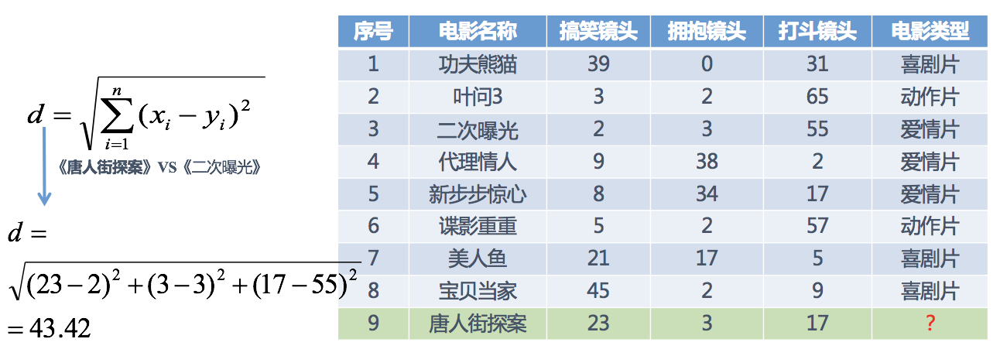
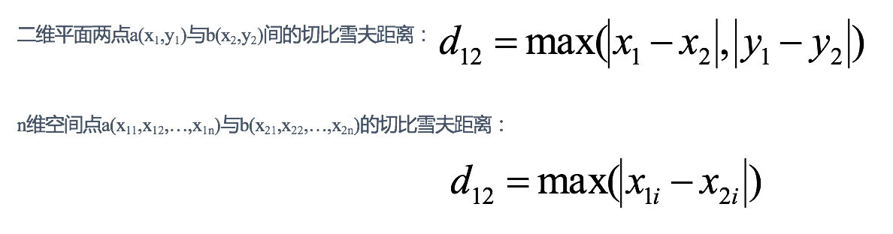
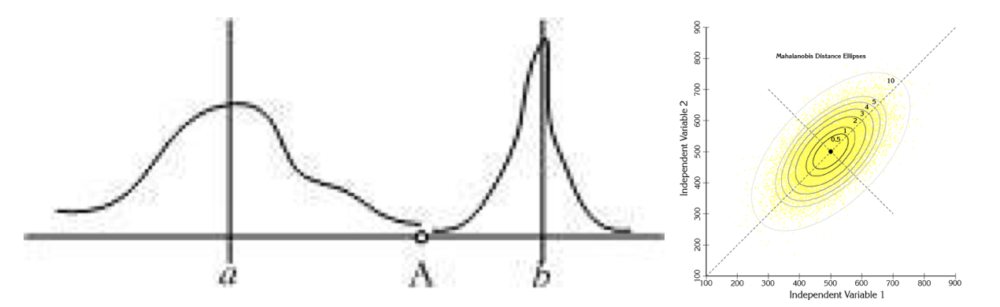

# KNN算法详解
# **一、KNN概念**
> k近邻法(k-nearest neighbor, k-NN)是1967年由Cover T和Hart P提出的一种基本分类与回归方法

KNN的全称是**K Nearest Neighbors**，意思是K个最近的邻居，**KNN的原理就是当预测一个新的值x的时候，根据它距离最近的K个点是什么类别来判断x属于哪个类别。**

举个例子：

假设我们现在有几部电影


其中？ 号电影不知道类别，如何去预测？我们可以利用K近邻算法的思想



分别计算每个电影和被预测电影的距离，然后求解


# **二、距离度量**
## **1、欧式距离(Euclidean Distance)**
欧氏距离是最容易直观理解的距离度量方法，我们小学、初中和高中接触到的两个点在空间中的距离一般都是指欧氏距离。


## **2、曼哈顿距离(Manhattan Distance)**
在曼哈顿街区要从一个十字路口开车到另一个十字路口，驾驶距离显然不是两点间的直线距离。这个实际驾驶距离就是“曼哈顿距离”。

**红线**、**蓝线**、**黄线**的距离即是曼哈顿距离（想象你在曼哈顿要从一个十字路口开车到另外一个十字路口实际驾驶距离就是这个“曼哈顿距离”也称为**“城市街区距离”(City Block distance)**），**绿线**为欧几里得距离。


## **3、切比雪夫距离 (Chebyshev Distance)**
国际象棋中，国王可以直行、横行、斜行，所以国王走一步可以移动到相邻8个方格中的任意一个。国王从格子(x1,y1)走到格子(x2,y2)最少需要多少步？这个距离就叫切比雪夫距离。




## **4、闵可夫斯基距离(Minkowski Distance)**
**闵氏距离不是一种距离，而是一组距离的定义，是对多个距离度量公式的概括性的表述。**

两个n维变量$a(x_{11},x_{12},…,x_{1n})$与$b(x{21},x{22},…,x{2n})$间的闵可夫斯基距离定义为：

$$
d_{12} = \sqrt[p]{\sum_{k=1}^{n}|x_{1k}-x_{2k}|^p }
$$

其中p是一个变参数：

当**p=1**时，就是**曼哈顿距离**；

当**p=2**时，就是**欧氏距离**；

当**p→∞**时，就是**切比雪夫距离**。

根据p的不同，闵氏距离可以表示某一类/种的距离。

**对比总结：**

**（1）闵氏距离，包括曼哈顿距离、欧氏距离和切比雪夫距离都存在明显的缺点:**

**e.g. 二维样本  (身高\[单位:cm\]，体重\[单位:kg\])，现有三个样本：a(180,50)，b(190,50)，c(180,60)。**

**a与b的闵氏距离（无论是曼哈顿距离、欧氏距离或切比雪夫距离）都等于a与c的闵氏距离。但实际上身高的10cm并不能和体重的10kg划等号。这是由于没有考虑量纲。**

**（2）闵氏距离的缺点：**

   * **将各个分量的量纲(scale)，也就是“单位”相同的看待了;**
   * ​**未考虑各个分量的分布（期望，方差等）可能是不同的。**

> 计算距离时，需要关注到特征量纲差异问题。假设各样本有年龄、工资两个特征变量，如计算欧氏距离的时候，(年龄1-年龄2)² 的值要远小于(工资1-工资2)² ，这意味着在不使用特征缩放的情况下，距离会被工资变量（大的数值）主导。因此，我们需要使用特征缩放来将全部的数值统一到一个量级上来解决此问题。特征的**单位或者大小相差较大，或者某特征的方差相比其他的特征要大出几个数量级**，**容易影响（支配）目标结果**，使得一些算法无法学习到其它的特征。通常的解决方法可以对数据进行“标准化”或“归一化”，对所有数值特征统一到标准的范围如0\~1。


### **归一化**
通过对原始数据进行变换把数据映射到(默认为\[0,1\])之间。


作用于每一列，$max$为一列的最大值，$min$为一列的最小值，那么$X^{'}$为最终结果，**mx，mi分别为指定区间值默认mx为1，mi为0**

那么怎么理解这个过程呢？我们通过一个例子。 


注意最大值最小值是变化的，另外，**最大值与最小值非常容易受异常点影响，所以这种方法鲁棒性较差，只适合传统精确小数据场景****。**

### **标准化**
通过对原始数据进行变换把数据变换到**均值为0，标准差为1**范围内


作用于每一列，mean为平均值，σ为标准差

所以回到刚才异常点的地方，我们再来看看标准化


* **对于归一化来说：**如果出现异常点，影响了最大值和最小值，那么结果显然会发生改变
* **对于标准化来说：**如果出现异常点，由于具有一定数据量，少量的异常点对于平均值的影响并不大，从而方差改变较小

**在已有样本足够多的情况下比较稳定，适合现代嘈杂大数据场景。**

## **5、标准化欧氏距离 (Standardized EuclideanDistance)**
标准化欧氏距离是针对欧氏距离的缺点而作的一种改进。

思路：既然数据各维分量的分布不一样，那先将各个分量都“标准化”到均值、方差相等。假设样本集X的**均值(mean)为m**，**标准差(standard deviation)为s**，$X^*$的“标准化变量”表示为：


如果将方差的倒数看成一个权重，也可称之为**加权欧氏距离(Weighted Euclidean distance)**。

**标准差是一组数值自平均值分散程度的一种测量观念。**

一个较大的标准差，代表大部分的**数值和其平均值之间差异较大**，一个较小的标准差，代表这些数值较接近平均值。

**标准差公式：**


公式中数值为$X1,X2,X3,……XN$（皆为实数），其平均值（算数平均值）μ，标准差为σ

**例如：**
A，B两组各有6位学生参加同一次语文测验，A组的分数为95，85，75，65，55，45　　
B组的分数为73，72，71，69，68，67  

这两组的平均数都是70，但A组的标准差为17.078分，B组的标准差为2.160分，说明A组学生之间的差距要比B组学生之间的差距大得多。

**方差描述随机变量对于数学期望的偏离程度。**

**方差是标准差的平方，方差(variance)是另一个常见的分布描述量。**如果说期望表示的是分布的中心位置，那么方差就是分布的离散程度。**方差越大，说明随机变量取值越离散，方差越小，说明数据大多集中在均值（数学期望）周围。**

**方差公式：**


公式中x为平均数，n为这组数据个数，x1,x2,x3……xn为这组数据具体数值。

## **5、余弦距离(Cosine Distance)**
几何中，夹角余弦可用来衡量两个向量方向的差异；机器学习中，借用这一概念来衡量样本向量之间的差异。

* 二维空间中向量A(x1,y1)与向量B(x2,y2)的夹角余弦公式：


* 两个n维样本点a(x11,x12,…,x1n)和b(x21,x22,…,x2n)的夹角余弦为：


即：


夹角余弦取值范围为\[-1,1\]。余弦越大表示两个向量的夹角越小，余弦越小表示两向量的夹角越大。当两个向量的方向重合时余弦取最大值1，当两个向量的方向完全相反余弦取最小值-1。

## **7、汉明距离(Hamming Distance)**
两个等长字符串s1与s2的汉明距离为：将其中一个变为另外一个所需要作的最小字符替换次数。

例如:

```Plain Text
  The Hamming distance between "1011101" and "1001001" is 2. 
  The Hamming distance between "2143896" and "2233796" is 3. 
  The Hamming distance between "toned" and "roses" is 3.
```
## **8、杰卡德距离(Jaccard Distance)**
**杰卡德相似系数(Jaccard similarity coefficient)**：两个集合A和B的交集元素在A，B的并集中所占的比例，称为两个集合的杰卡德相似系数，用符号J(A,B)表示：


**杰卡德距离(Jaccard Distance)**：与杰卡德相似系数相反，用两个集合中不同元素占所有元素的比例来衡量两个集合的区分度：


## **9、马氏距离(Mahalanobis Distance)**
下图有两个正态分布图，它们的均值分别为a和b，但方差不一样，则图中的A点离哪个总体更近？或者说A有更大的概率属于谁？显然，A离左边的更近，A属于左边总体的概率更大，尽管A与a的欧式距离远一些。这就是马氏距离的直观解释。



**马氏距离是基于样本分布的一种距离。**

马氏距离是由印度统计学家马哈拉诺比斯提出的，表示数据的协方差距离。它是一种有效的计算两个位置样本集的相似度的方法。

与欧式距离不同的是，它考虑到各种特性之间的联系，即独立于测量尺度。

**马氏距离定义：**设总体G为m维总体（考察m个指标），均值向量为μ=（μ1，μ2，… ...，μm，），协方差阵为∑=（σij）,

则样本X=（X1，X2，… …，Xm，）与总体G的马氏距离定义为：


马氏距离也可以定义为两个服从同一分布并且其协方差矩阵为∑的随机变量的差异程度：如果协方差矩阵为单位矩阵，马氏距离就简化为欧式距离；如果协方差矩阵为对角矩阵，则其也可称为正规化的欧式距离。

**马氏距离特性：**

1.**量纲无关**，排除变量之间的相关性的干扰；

2.**马氏距离的计算是建立在总体样本的基础上的**，如果拿同样的两个样本，放入两个不同的总体中，最后计算得出的两个样本间的马氏距离通常是不相同的，除非这两个总体的协方差矩阵碰巧相同；

3.计算马氏距离过程中，**要求总体样本数大于样本的维数**，否则得到的总体样本协方差矩阵逆矩阵不存在，这种情况下，用欧式距离计算即可。

4.还有一种情况，满足了条件总体样本数大于样本的维数，但是协方差矩阵的逆矩阵仍然不存在，比如三个样本点（3，4），（5，6），（7，8），这种情况是因为这三个样本在其所处的二维空间平面内共线。这种情况下，也采用欧式距离计算。


举例：

已知有两个类G1和G2，比如G1是设备A生产的产品，G2是设备B生产的同类产品。设备A的产品质量高（如考察指标为耐磨度X），其平均耐磨度μ1=80，反映设备精度的方差σ2(1)=0.25;设备B的产品质量稍差，其平均耐磨损度μ2=75，反映设备精度的方差σ2(2)=4.

今有一产品G0，测的耐磨损度X0=78，试判断该产品是哪一台设备生产的？

直观地看，X0与μ1（设备A）的绝对距离近些，按距离最近的原则，是否应把该产品判断设备A生产的？

考虑一种相对于分散性的距离，记X0与G1，G2的相对距离为d1，d2,则：


因为d2=1.5 < d1=4，按这种距离准则，应判断X0为设备B生产的。

设备B生产的产品质量较分散，出现X0为78的可能性较大；而设备A生产的产品质量较集中，出现X0为78的可能性较小。

这种相对于分散性的距离判断就是马氏距离。


# **三、K值的选择**
举个例子：


上图中绿色的点就是我们要预测的那个点，假设K=3。那么KNN算法就会找到与它距离最近的三个点（这里用圆圈把它圈起来了），看看哪种类别多一些，比如这个例子中是蓝色三角形多一些，新来的绿色点就归类到蓝三角了。


但是，**当K=5的时候，判定就变成不一样了**。这次变成红圆多一些，所以新来的绿点被归类成红圆。从这个例子中，我们就能看得出**K的取值是很重要的**。

**K值过小**：

​ 容易受到异常点的影响

**k值过大：**

​ 受到样本均衡的问题

有个反直觉的现象，K取值较小时，模型复杂度（容量）高，训练误差会减小，泛化能力减弱；K取值较大时，模型复杂度低，训练误差会增大，泛化能力有一定的提高。


原因是K取值小的时候（如k==1），仅用较小的领域中的训练样本进行预测，模型拟合能力比较强，决策就是只要紧跟着最近的训练样本（邻居）的结果。但是，当训练集包含”噪声样本“时，模型也很容易受这些噪声样本的影响（如图 过拟合情况，噪声样本在哪个位置，决策边界就会画到哪），这样会增大"学习"的方差，也就是**容易过拟合**。这时，多”听听其他邻居“训练样本的观点就能尽量减少这些噪声的影响。K值取值太大时，情况相反，容易欠拟合。

那么该如何确定K取多少值好呢？答案是通过**交叉验证**（将样本数据按照一定比例，拆分出训练用的数据和验证用的数据，比如6：4拆分出部分训练数据和验证数据），**从选取一个较小的K值开始，不断增加K的值，然后计算验证集合的方差，最终找到一个比较合适的K值。**

通过交叉验证计算方差后你大致会得到下面这样的图：


这个图其实很好理解，当你增大k的时候，一般错误率会先降低，因为有周围更多的样本可以借鉴了，分类效果会变好。但注意，和K-means不一样，当K值更大的时候，错误率会更高。这也很好理解，比如说你一共就35个样本，当你K增大到30的时候，KNN基本上就没意义了。

所以选择K点的时候可以选择一个较大的临界K点，当它继续增大或减小的时候，错误率都会上升，比如图中的K=10。

**K值选择问题，李航博士的一书「统计学习方法」上所说：**

1. 选择**较小的K值**，就相当于用较小的领域中的训练实例进行预测，“学习”近似误差会减小，只有与输入实例较近或相似的训练实例才会对预测结果起作用，与此同时带来的问题是“学习”的估计误差会增大，换句话说，**K值的减小就意味着整体模型变得复杂，容易发生过拟合；**
2. 选择**较大的K值**，就相当于用较大领域中的训练实例进行预测，其优点是可以减少学习的估计误差，但缺点是学习的近似误差会增大。这时候，**与输入实例较远（不相似的）训练实例也会对预测器作用，使预测发生错误，且K值的增大就意味着整体的模型变得简单。**
3. K=N（N为训练样本个数），则完全不可取，因为此时无论输入实例是什么，都只是简单的预测它属于在训练实例中最多的类，模型过于简单，忽略了训练实例中大量有用信息。

在实际应用中，K值一般取一个比较小的数值，例如采用交叉验证法（简单来说，就是把训练数据在分成两组:训练集和验证集）来选择最优的K值。对这个简单的分类器进行泛化，用核方法把这个线性模型扩展到非线性的情况，具体方法是把低维数据集映射到高维特征空间。

> **近似误差**：**对现有训练集的训练误差，关注训练集**，如果近似误差过小可能会出现过拟合的现象，对现有的训练集能有很好的预测，但是对未知的测试样本将会出现较大偏差的预测。模型本身不是最接近最佳模型。

> **估计误差**：**可以理解为对测试集的测试误差，关注测试集**，估计误差小说明对未知数据的预测能力好，模型本身最接近最佳模型。

# **四、决策方法**
决策方法就计算确认到新实例样本最邻近的K个实例后，如何确定新实例样本的标签值。

* **对于KNN分类：通常就是“多数表决，少数服从多数”**，k个“邻居”的最多数所属类别为预测类别（另外，可以基于距离的远近做加权，一般可以用距离的倒数作为权重，越近的邻居的类别更有可信度）。
* **对于KNN回归：通常就是“取均值”**，以k个“邻居”的标签值（目标值）的平均值作为预测值（同理也可以基于距离的远近做加权）。

取K个”邻居“平均值或者多数决策的方法，其实也就是经验损失最小化。


# **五、KD树**
KNN缺点是，算法只能盲目计算新样本与其他训练样本的两两距离确认出K个近邻，而近邻样本只是其中的某一部分，如何高效识别先粗筛出这部分，再计算这部分候选样本的距离呢？

一个解决办法是：利用KD树可以省去对大部分数据点的搜索，从而减少搜索的计算量，提高算法效率最优方法的时间复杂度为 O(n \* log(n)），就是算法原理复杂了点。

## **1、原理**
所谓的KD树就是n个特征维度的二叉树，可以对n维空间的样本划分到对应的一个个小空间。**KD树建采用的是从m个样本的n维特征中，分别计算n个特征的取值的方差，用方差最大的第k维特征nk来作为根节点。对于这个特征，我们选择特征nk的取值的中位数nkv对应的样本作为划分点，对于所有第k维特征的取值小于nkv的样本，我们划入左子树，对于第k维特征的取值大于等于nkv的样本，我们划入右子树，对于左子树和右子树，我们采用和刚才同样的办法来找方差最大的特征来做更节点，递归的生成KD树**。


黄色的点作为根节点，上面的点归左子树，下面的点归右子树，接下来再不断地划分，分割的那条线叫做**分割超平面（splitting hyperplane）**，在一维中是一个点，二维中是线，三维的是面。


黄色节点就是Root节点，下一层是红色，再下一层是绿色，再下一层是蓝色。


KD树实现KNN算法主要为两步：

1、构建KD树；

2、利用KD树快速寻找K最近邻并决策。

## **2、构建KD树**
举个例子：

比如我们有二维样本6个，{(2,3)，(5,4)，(9,6)，(4,7)，(8,1)，(7,2)}，构建kd树的具体步骤为：

1）找到划分的特征：6个数据点在x，y维度上的数据方差分别为6.97，5.37，所以**在x轴上方差更大，用第1维特征建树**。

2）确定划分中位数点（7,2）：根据x维上的值将数据排序，{（2，3），（4，7），（5，4），（7，2），（8，1），（9，6）}，6个数据的中值(所谓中值，即中间大小的值)为7（其实5也是，我们可以随机取一个，这里选7），所以划分点的数据是（7,2）。这样，该节点的分割超平面就是通过（7,2）并**垂直于x轴，划分点维度的直线x=7**；


3）确定左子空间和右子空间：分割超平面x=7将整个空间分为两部分：x<=7的部分为左子空间，包含3个节点={(2,3),(5,4),(4,7)}；另一部分为右子空间，包含2个节点={(9,6)，(8,1)}。

4）用同样的办法划分左子树的节点{(2,3),(5,4),(4,7)}和右子树的节点{(9,6)，(8,1)}。最终得到KD树。

最后得到的KD树如下：


## **3、利用KD树快速寻找K近邻并决策**
当我们生成KD树以后，就可以去预测测试集里面的目标点（待预测样本）。

基本原理：对于一个目标点，我们首先在KD树里面找到对应包含目标点的叶子节点。以目标点为圆心，以目标点到叶子节点样本实例的距离为半径，得到一个**超球体**，最近邻的点一定在这个超球体内部。然后返回叶子节点的父节点，检查另一个子节点包含的超矩形体是否和超球体相交，如果相交就到这个子节点寻找是否有更加近的近邻,有的话就更新最近邻。如果不相交那就简单了，我们直接返回父节点的父节点，在另一个子树继续搜索最近邻。当回溯到根节点时，算法结束，此时保存的最近邻节点就是最终的最近邻。

从上面的描述可以看出，**KD树划分后可以大大减少无效的最近邻搜索，很多样本点由于所在的超矩形体和超球体不相交，根本不需要计算距离。大大节省了计算时间。**

#### **查找点(2.1,3.1)**


在(7,2)点测试到达(5,4)，在(5,4)点测试到达(2,3)，然后search\_path中的结点为<(7,2),(5,4), (2,3)>，从search\_path中取出(2,3)作为当前最佳结点nearest, dist为0.141；

然后回溯至(5,4)，以(2.1,3.1)为圆心，以dist=0.141为半径画一个圆，并不和超平面y=4相交，如上图，所以不必跳到结点(5,4)的右子空间去搜索，因为右子空间中不可能有更近样本点了。

于是再回溯至(7,2)，同理，以(2.1,3.1)为圆心，以dist=0.141为半径画一个圆并不和超平面x=7相交，所以也不用跳到结点(7,2)的右子空间去搜索。

至此，search\_path为空，结束整个搜索，返回nearest(2,3)作为(2.1,3.1)的最近邻点，最近距离为0.141。

#### **查找点(2,4.5)**


在(7,2)处测试到达(5,4)，在(5,4)处测试到达(4,7)【优先选择在本域搜索】，然后search\_path中的结点为<(7,2),(5,4), (4,7)>，从search\_path中取出(4,7)作为当前最佳结点nearest, dist为3.202；

然后回溯至(5,4)，以(2,4.5)为圆心，以dist=3.202为半径画一个圆与超平面y=4相交，所以需要跳到(5,4)的左子空间去搜索。所以要将(2,3)加入到search\_path中，现在search\_path中的结点为<(7,2),(2, 3)>；另外，(5,4)与(2,4.5)的距离为3.04 < dist = 3.202，所以将(5,4)赋给nearest，并且dist=3.04。

回溯至(2,3)，(2,3)是叶子节点，直接平判断(2,3)是否离(2,4.5)更近，计算得到距离为1.5，所以nearest更新为(2,3)，dist更新为(1.5)

回溯至(7,2)，同理，以(2,4.5)为圆心，以dist=1.5为半径画一个圆并不和超平面x=7相交, 所以不用跳到结点(7,2)的右子空间去搜索。

至此，search\_path为空，结束整个搜索，返回nearest(2,3)作为(2,4.5)的最近邻点，最近距离为1.5。

## **4、总结**
首先**通过二叉树搜索**（比较待查询节点和分裂节点的分裂维的值，小于等于就进入左子树分支，大于就进入右子树分支直到叶子结点），**顺着“搜索路径”很快能找到最近邻的近似点**，也就是与待查询点处于同一个子空间的叶子结点；

然后再回溯搜索路径，并判断搜索路径上的结点的其他子结点空间中是否可能有距离查询点更近的数据点，如果有可能，则需要跳到其他子结点空间中去搜索（将其他子结点加入到搜索路径）。

重复这个过程直到搜索路径为空。

**KD 树对于低维度最近邻搜索比较好，但当K增长到很大时，搜索的效率就变得很低(维数灾难)。为了解决KD 树在高维数据上的问题，Ball 树结构被提了出来。KD 树是沿着笛卡尔积（坐标轴）方向迭代分割数据，而 Ball 树是通过一系列的超球体分割数据而非超长方体。**

# **六、** **KNN算法训练样本不平衡情况**
1、若正负样本处于不平衡状态，**运用投票决策的KNN算法**判断输入样本的所属类别：


结果显示输入样本为绿色类 。原因是红色类的个数远远小于绿色样本，**导致出现的分类错误 。**

2、若分类决策选择**限定半径最近邻法**，即以输入样本为圆心，最大半径R的圆内选择出现次数最多的类做为输入样本的类 。如下图，**黑色样本的分类结果正确**。


投票法是默认每个样本的权重相等，我们假定权重与距离成反比，**即距离越大，对结果的影响越小，那么该样本的权重也越小，反之，权重则越大，根据权重对输入样本进行分类 。**这种思想与adaBoost算法相似，分类性能好的弱分类器给予一个大的权重 。

# **七、KNN算法扩展**
## **1、最近质心算法**
这个算法比KNN还简单。它首先把样本按输出类别归类。对于第 L类的CL个样本。它会对这CL个样本的n维特征中每一维特征求平均值，最终该类别以n个平均值形成所谓的质心点。同理，每个类别会最终得到一个质心点。

当我们做预测时，仅仅需要比较预测样本和这些质心的距离，最小的距离对于的质心类别即为预测的类别。这个算法通常用在文本分类处理上。

## **2、ANN近似最近邻算法（Approximate Nearest Neighbor）**
**KNN **可能需要**大量的内存或空间来存储所有数据**，并且使用距离或接近程度的度量方法可能会在维度非常高的情况下（有许多输入变量）崩溃，这可能会对算法在你的问题上的性能产生负面影响。这就是所谓的**维数灾难**。

**KNN 存在的问题**

尽管 KNN 擅长查找相似项，但它使用详细的成对距离计算来查找邻居。如果你的数据包含 1000 个项，如若找出新产品的 K=3 最近邻，则算法需要对数据库中所有其他产品执行 1000 次新产品距离计算。这还不算太糟糕，但是想象一下，现实世界中的客户对客户（Customer-to-Customer，C2C）市场，其中的数据库包含数百万种产品，每天可能会上传数千种新产品。**将每个新产品与全部数百万种产品进行比较是不划算的，而且耗时良久，也就是说这种方法根本无法扩展**。

**解决方案**

将最近邻算法扩展至大规模数据的方法是**彻底避开暴力距离计算，使用 ANN 算法。**

**ANN近似最近邻算法**（Approximate Nearest Neighbor, ANN）则是一种通过**牺牲精度来换取时间和空间的方式从大量样本中获取最近邻的方法**，并以其**存储空间少、查找效率高**等优点引起了人们的广泛关注。

一家技术公司的数据科学主管 Marie Stephen Leo 撰文对 KNN 与 ANN 进行了比较，结果表明，**在搜索到最近邻的相似度为 99.3% 的情况下，ANN 比 sklearn 上的 KNN 快了 380 倍。**


### **（1）ANN原理**
严格地讲，ANN 是一种在 NN 搜索过程中**允许少量误差**的算法。但在实际的 C2C 市场中，真实的邻居数量比被搜索的 K 近邻数量要多。与暴力 KNN 相比，人工神经网络可以在短时间内获得卓越的准确性。ANN 算法有以下几种：

* Spotify 的 ANNOY
* Google 的 ScaNN
* Facebook 的 Faiss
* HNSW

### **（2）分层的可导航小世界（Hierarchical Navigable Small World, HNSW）**
在 HNSW 中，作者描述了一种使用多层图的 ANN 算法。在插入元素阶段，通过指数衰减概率分布随机选择每个元素的最大层，逐步构建 HNSW 图。这确保 layer=0 时有很多元素能够实现精细搜索，而 layer=2 时支持粗放搜索的元素数量少了 e^-2。最近邻搜索从最上层开始进行粗略搜索，然后逐步向下处理，直至最底层。使用贪心图路径算法遍历图，并找到所需邻居数量。


> *HNSW 图结构。最近邻搜索从最顶层开始（粗放搜索），在最底层结束（精细搜索）。*

> 文章的代码作者已在 GitHub 上给出：https://github.com/stephenleo/adventures-with-ann/blob/main/knn\_is\_dead.ipynb

# **八、KNN总结**
## **1、KNN算法的优点**
**1、算法简单，理论成熟，可用于分类和回归。**

与很多其他机器学习算法动辄需要复杂的微积分和概率论等数学原理相比，KNN的数学原理和具体实现都是简单直接的。

**2、鲁棒性好。**

**KNN对训练数据中的异常值并不敏感，对噪声明显的数据具有较好的鲁棒性。**

**3、对非线性数据效果好。**

因为这个算法中并没有关于数据的假设，不需要做线性回归。

**4、适合类域交叉样本。**

KNN方法主要靠周围有限的邻近的样本,而不是靠判别类域的方法来确定所属类别的，因此对于类域的交叉或重叠较多的待分样本集来说，KNN方法较其他方法更为适合。

**5、适合大样本自动分类**
该算法比较适用于样本容量比较大的类域的自动分类，而那些样本容量较小的类域采用这种算法比较容易产生误分

**6、预测效果好。对异常值不敏感。重新训练代价低。**


## **2、KNN算法的缺点或局限**
**1、总是需要确定K的值。**

这是一个复杂和反复调试的过程。

**2、计算成本高。**

因为要计算所有的训练样本的数据点之间的距离，所以预测过程中需要存储所有训练数据，对内存要求高。尤其是样本量、特征数非常多的时候。另外KD树、球树之类的模型建立也**需要大量的内存**。**随着训练数据量的增大，其预测速度也明显变慢。**

**3、对数据的规模和不相关的特征非常敏感。**

与决策树等方法相比，KNN无考虑到不同的特征重要性，各个归一化的特征的影响都是相同的。

**4、 使用懒散学习方法，导致预测时速度比起逻辑回归之类的算法慢。**

当要预测时，就临时进行 计算处理。需要计算待分样本与训练样本库中每一个样本的相似度，才能求得与 其最近的K个样本进行决策。
**5、输出可解释性不强**
**类别评分不是规格化，**不像一些通过概率评分的分类。例如决策树的输出可解释性就较强。
**6、对不均衡的样本不擅长**
只与少量的k相邻样本有关，样本不平衡的时候，对稀有类别的预测准确率低。
当样本不平衡时，如一个类的样本容量很大，而其他类样本容量很小时，有可能导致当输入一个新样本时，该样本的K个邻居中大容量类的样本占多数。该算法只计算“最近的”邻居样本，某一类的样本数量很大，那么或者这类样本并不接近目标样本，或者这类样本很靠近目标样本。无论怎样，数量并不能影响运行结果。可以采用权值的方法（和该样本距离小的邻居权值大）来改进。

## **3、KNN在实际工程中的应用**


# 九、面试题
**1、近似误差和估计误差的关系？**

**近似误差**：可以理解为对现有训练集的训练误差。其实可以理解为模型估计值与实际值之间的差距** 。**

**估计误差**：可以理解为对测试集的测试误差。其实可以理解为模型的估计系数与实际系数之间的差距。

近似误差，更关注于“训练”。估计误差，更关注于“测试”、“泛化”。

最小化近似误差容易过拟合；最小化估计误差整体的泛化能力好。

**2、KNN如何做回归任务？**

比如K=3，则找输入数据与训练集中最小距离的三个值，之后做平均则是输入数据的预测值。

**3、KNN中的K值过大过小的影响是什么？**

KNN中的K值选取对K近邻算法的结果会产生重大影响。

如果选择较小的K值，就相当于用较小领域中的训练实例进行预测，“学习”近似误差会减小，只有与输入实例较近或相似的训练实例才会对预测结果起作用，与此同时带来的问题是“学习”的估计误差会增大，换句话说，**K值的减小就意味着整体模型变得复杂，容易发生过拟合**

如果选择较大的K值，就相当于用较大领域中的训练实例进行预测，其优点是可以减少学习的估计误差，但缺点是学习的近似误差会增大。这时候，与输入实例较远（不相似的）训练实例也会对预测器作用，使预测发生错误，**故K值的增大就意味着整体的模型变得简单。**

K=N，则完全不足取，因为此时无论输入实例是什么，都只是简单的预测它属于在训练实例中最多的累，模型过于简单，忽略了训练实例中大量有用信息。

**简而言之：小的时候为过拟合，大的时候为欠拟合**

**4、KNN中的K值怎么选取？**

K值一般取一个比较小的数值，例如采用交叉验证法（简单来说就是一部分样本做训练集，一部分做测试集）来选择最优的K值。

# **参考：**
\[1\][【算法岗求职笔记】KNN · 六问六答](https://mp.weixin.qq.com/s?src=11&timestamp=1651849961&ver=3782&signature=xsQ48llN2KJ-D72GP883SQ1biupIBaewqmdmo7*RrKI6*1JmBMJkiHx6Pg6wJxWZmlehUGdVFXM6z27Qq7scR1nppTmRlHCPlD5nBmENGWGIqXgsGbX-DT0RANdVTtd8&new=1)

\[2\][KNN中的k如何选择？](https://blog.csdn.net/weixin_42234472/article/details/85062142)

\[3\]《统计学习方法》李航

\[4\][机器学习算法之KNN](https://mp.weixin.qq.com/s?src=11&timestamp=1651849944&ver=3782&signature=baPxtStJc4V-anTgLe2tzR2PKINo80hRPZnmc1HsMz0evli4lvcx-ytAPd6mmGr8UN3xtm4wvgDn4PY4aSP*PNJhWVATWblDiBksq2b-JG71rbgcJQVyn8qa9c*pQs8o&new=1)

\[5\][KNN算法原理](https://mp.weixin.qq.com/s?src=11&timestamp=1651834390&ver=3782&signature=ylUXEGoM0lp8xyvVjo6R8EWs22y1AxAL6JvMFmAEwiEzc2h-bGISMcKSXOUd-4mzHqhP777FVTOK2o6N5CMuDPXQkRhcFdKPYTkULn-2KVSIEw04Ew6UL2vlzp3rTgw2&new=1)

\[6\][深入理解KNN扩展到ANN](https://mp.weixin.qq.com/s/1bqqy4Z5fXJY7t-HlGC5Uw)

\[7\][K近邻算法(KNN)原理小结](https://mp.weixin.qq.com/s?src=11&timestamp=1651834390&ver=3782&signature=whzOCqs6YEeiYUP5VvF16VvKTMtvpuRfaUvIA9o32f6kqalo6Vwyxdc75HhfXfjfp1s5XG2hxh5A1ouTl6Xzt3zdp78xgwEPQ0fqJ-gzo-RTMPgwNqpVuOEeWf46gnUT&new=1)

\[8\][深入理解KNN扩展到ANN](https://mp.weixin.qq.com/s/1bqqy4Z5fXJY7t-HlGC5Uw)

\[9\]*https://medium.com/towards-artificial-intelligence/knn-k-nearest-neighbors-is-dead-fc16507eb3e*


