# Linear Regression 线性回归
# **一、什么是线性回归**
## **1、基本定义**
线性回归(Linear regression)是利用**回归方程(函数)对一个或多个自变量(特征值)和因变量(目标值)之间**关系进行建模的一种分析方式。

** 特点：只有一个自变量的情况称为单变量回归，多于一个自变量情况的叫做多元回归**

线性回归用矩阵表示举例

那么怎么理解呢？我们来看几个例子

* 期末成绩：0.7×考试成绩+0.3×平时成绩
* 房子价格 = 0.02×中心区域的距离 + 0.04×城市一氧化氮浓度 + (-0.12×自住房平均房价) + 0.254×城镇犯罪率

上面两个例子，**我们看到特征值与目标值之间建立了一个关系，这个关系可以理解为线性模型**。

> 我们在选择线性回归前，应该先绘制散点图看一下自变量和因变量的是否有线性关系（没有线性关系，不代表没有关系，事实上非线性的关系更加常见），如果不是线性关系，也可以尝试通过因变量和自变量进行变换（最好对自变量）。

## **2、线性、非线性、回归的区别**
**线性：**两个变量之间的关系**是****一次函数关系**的——图象**是直线**，叫做线性。

> **注意：题目的线性是指广义的线性，也就是数据与数据之间的关系。**
**非线性：**两个变量之间的关系**不是****一次函数关系**的——图象**不是直线**，叫做非线性。

**回归：**人们在测量事物的时候因为客观条件所限，求得的都是测量值，而不是事物真实的值，为了能够得到真实值，无限次的进行测量，最后通过这些测量数据计算**回归到真实值**，这就是回归的由来。

# **二、损失函数推导过程**
假设最终影响银行贷款的因素只有工资和年龄，要求你预测当一个新人来后，告诉工资和年龄，银行应该贷款多少给他？

| |x1|x2|y|
| :-----: | :-----: | :-----: | :-----: |
| |工资|年龄|额度|
|1|4000|24|20000|
|2|5500|26|60000|
|3|6000|64|79000|
|4|7500|44|45000|
|5|5000|25|？|

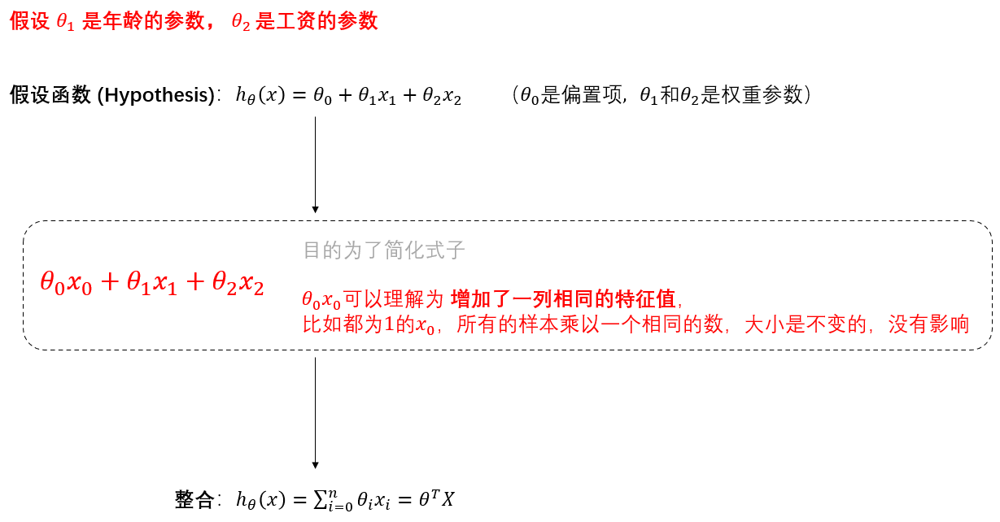

### **1、误差**
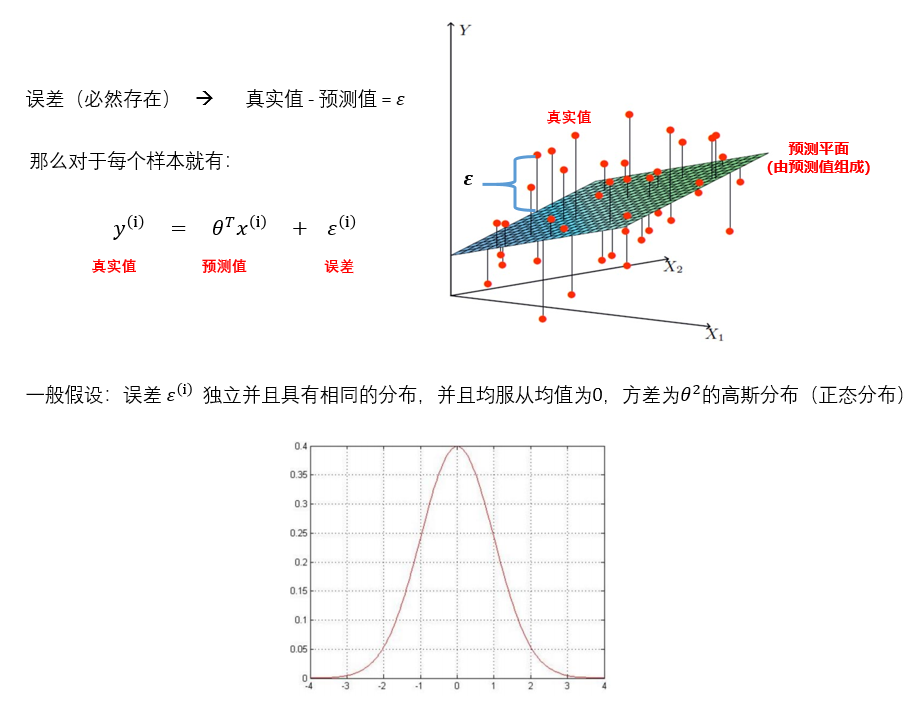

### **2、高斯分布（正态分布）**
高斯分布（**正态分布**）是一个常见的连续概率分布。

正态分布的**数学期望值**或期望值$μ$ 等于**位置参数，决定了分布的位置**；其**方差**$σ^2$ 或**标准差**$σ$ 等于尺度参数，**决定了分布的幅度**。正态分布的概率密度函数曲线呈钟形，因此人们又经常称之为钟形曲线（类似于寺庙里的大钟，因此得名）。我们通常所说的**标准正态分布是位置参数**$μ$** = 0 ，方差**$σ^2$** = 1的正态分布。**

若随机变量$X$服从一个位置参数为$μ$ 、方差为$σ^2$的正态分布，可以记为$X\sim N (μ,σ^2)$，可以写成如下形式:

$$
N(x|\mu,\sigma^2)=\frac{1}{ \sqrt{2\pi }\sigma }exp(-\frac{(x-\mu )^2}{2\sigma ^2} )
$$

$\mu$是均值期望，$\sigma^2$是方差，以上形式是基于只有一个变化维度的连续随机变量，因此以上又称为**一元高斯分布**。

从上面可以看到，一维高斯分布可以用变量均值和方差进行描述，那么二维高斯分布的呢？一维正态分布只有一个变量，则二维高斯分布则包含有两个变量，二维高斯分布的均值$μ$ 由两个变量的均值描述，其方差由变量的协方差矩阵进行描述。

> 均值可取实数轴上的任意数值，决定正态曲线的具体位置；标准差(\$\\theta\$)决定曲线的“陡峭”或“扁平”程度：标准差越大，正态曲线越扁平；标准差越小，正态曲线越陡峭。这是因为，**标准差越小，意味着大多数变量值离均数的距离越短，因此大多数值都紧密地聚集在均数周围**，图形所能覆盖的变量值就少些，于是都挤在一块，图形上呈现瘦高型。相反，**标准差越大，数据跨度就比较大，分散程度大，所覆盖的变量值就越多**，图形呈现“矮胖型”。值得注意的是，正态分布曲线与x轴围成的面积为1。

### **3、最小二乘法解释损失函数**
一般情况误差有$\varepsilon^{(i)}$ 正有负，如果直接对$\varepsilon^{(i)}$求和，则会出现正负抵消的情况，反映不出整体误差情况。如果使用平方和，不仅可以避免正负抵消的缺陷，而且整体的误差分布不变，所以一般使用平方和做损失函数。

$$
\sum_{i=1}^{m}(y_i-\hat{y}_i )^2 = \sum_{i=1}^{m}(y_i-X_iw)^2
$$

其中$y_i$是样本$i$对应的真实值，$\hat{y}_i$（即$X_iw$）是样本$i$在一组参数$w$下的预测值。

**由于每个样本的数据里存在较大差异，为了消除样本间差异的影响，使用****最小化均方误差（****MSE,均方误差****）****拟合，并得到损失函数。**

$$
J(\theta)=\frac{1}{2m}\sum^{m}_{i=1}(y_i-X_iw)^2
$$

其中，$\frac{1}{2}$**是为了求导计算方便，而**$\frac{1}{m}$**是将损失平均化，消除样本量**$m$**带来的影响。**

### **4、极大似然估计解释损失函数**
均值$\mu$=0，方差为 $\sigma^2$  的高斯分布：

$$
N(x|0,\sigma^2)=\frac{1}{ \sqrt{2\pi }\sigma }exp(-\frac{(x-0 )^2}{2\sigma ^2} )=\frac{1}{ \sqrt{2\pi }\sigma }exp(-\frac{(x )^2}{2\sigma ^2} )
$$

由于误差 $\varepsilon^{(i)}$服从均值$\mu$=0，方差为 $\sigma^2$  的高斯分布，结合误差，可以得出：

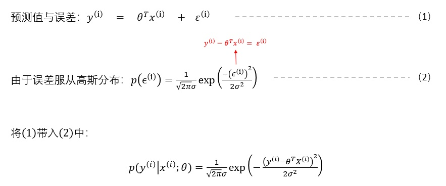

从（2）式可以看出，**误差**$\varepsilon^{(i)}$**越小，**$P(y^{(i)}|x^{(i)};\theta)$**概率越大，说明预测值与真实值越接近。**

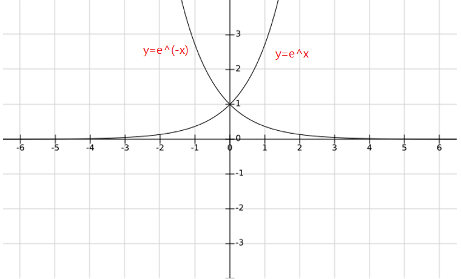

因线性回归模型是一条直线（或超平面）拟合多个点，所以需要满足所有误差取得最小值，即所有概率的乘积最大化，符合**似然函数**：

> 似然怎么解释呢？我们可以举一个栗子：比如你还单身，一个女生某一天在你打球的时候突然给你递了一瓶水，这时你心里就打鼓了，你老脸一红，琢磨着她是不是喜欢你了？当然，给你递一瓶水，你可能会开始注意到，但是不能确定她是否真的喜欢你，因为…你们那时在打年级赛，很多女生都给打篮球的队员递了一瓶水，嘿嘿∠( ᐛ 」∠)＿没想到吧！我们可以把**她对你的做那些事**看作是**数据**，是实际存在的，**她是不是喜欢你**看作是**参数**，你需要一点点揣测的。但是后来，她不仅每次在你打球的时候给你递水，还约你一块学习，一起看电影，一起吃饭，一起逛街，一起…**你看 她对你的做那些事（数据） 是不是越来越多，每一件事情都可以看作概率事件，这么多概率是事件出现在一块，可以组成一个联合概率，联合概率越大，那 她是不是喜欢你 的概率是不是就越大（参数 就越接近实际）**。通过 数据 ，对 她是否喜欢你 的这个“参数”进行逐步地推断，可以叫做**似然**，得到最可能性最大的 参数 ，就叫做**最大似然估计**。

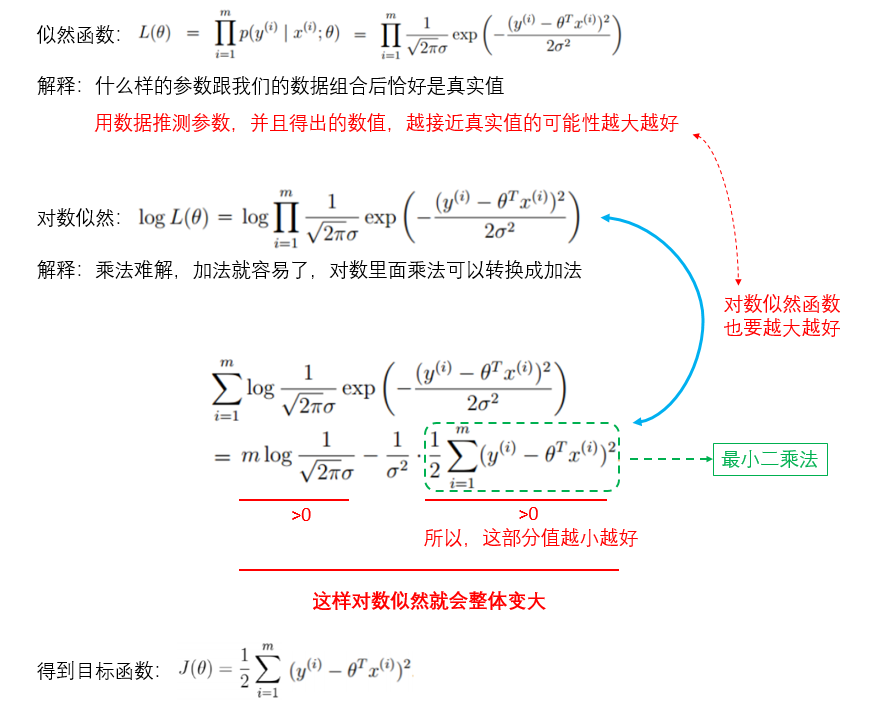

## **5、损失函数运作原理**
我们先从简单且好理解的**二维**视角去体验损失函数的运作，为此，我们先将 $θ_0$** 的值设为 0**，简化如下：

然后我们先对原始数据进行**特征工程处理**，之后计算出 **预测值 **$h_θ(x)$ , 然后是 **损失值**$J(θ_1)$，分别得到两个图像：

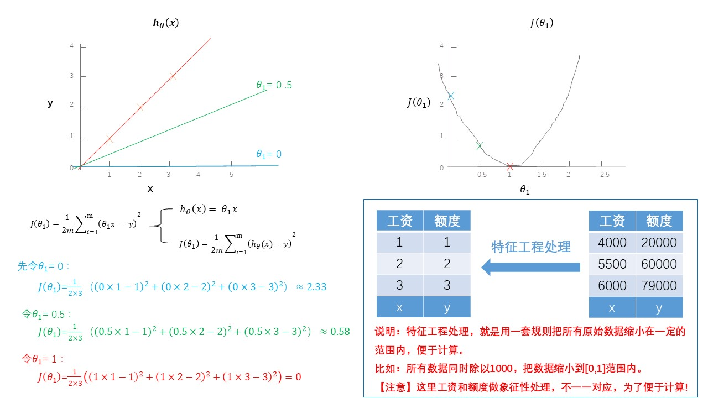

上面是**二维**视角去体验损失函数的运作，现在我们加大难度，从**三维**视角去看看。为此，我们保留 $θ_0$ 的存在。

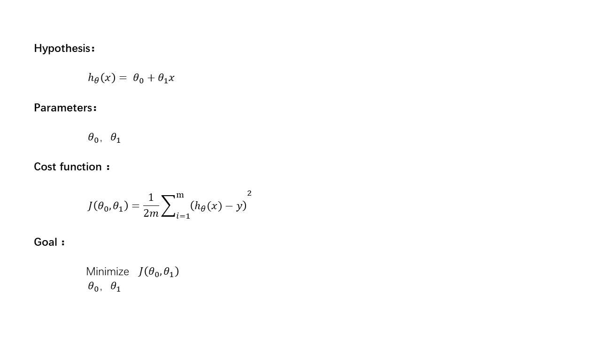

同样，先计算出 **预测值 **$h_ θ(x)$ , 然后是 **损失值**$J(θ_0，θ_1)$，分别得到两个图像：

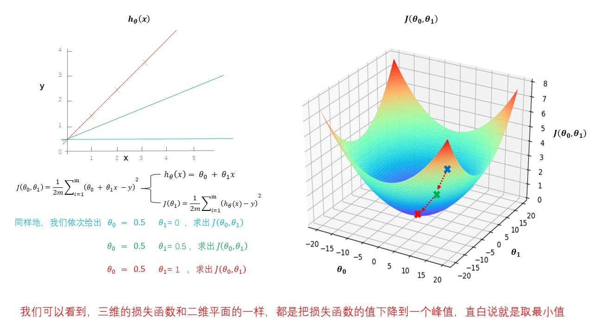

虽然损失函数的简单的3D图就比较直观，但是，对于复杂的3D图对于我们来说就不太友好了。。。比如下面两个：

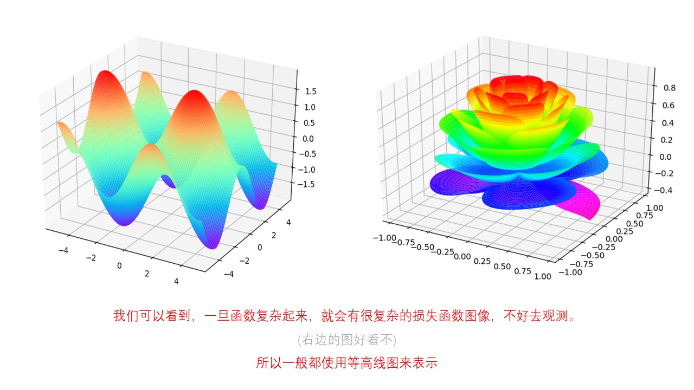

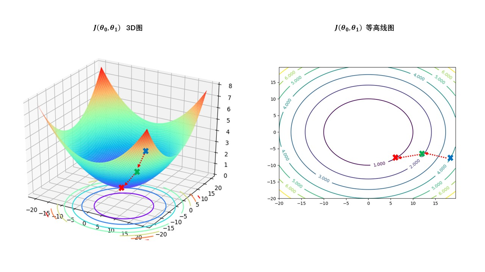

# **三、多元线性回归参数求解**
## **1、正规方程法**
$$
W= (X^TX)^{(-1)}X^Ty
$$

理解：$X$为特征值矩阵，$y$为目标值矩阵。直接求到最好的结果

缺点：当特征过多过复杂时，求解速度太慢并且得不到结果

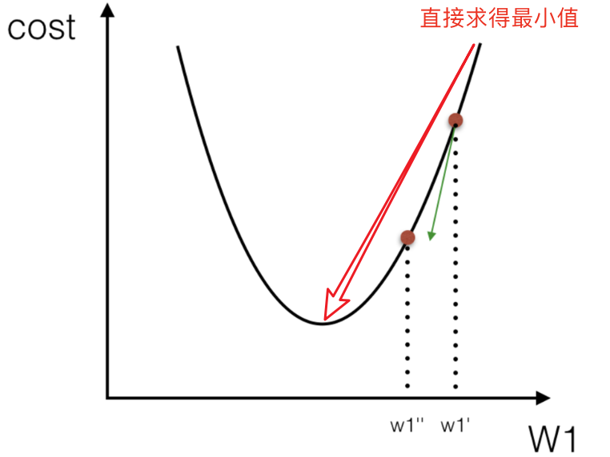

### **（1）正规方程的推导**
**Cost function** （损失函数）定义为：

其中，$y_i$为第$i$个训练样本的**真实值**，$h(x_i)$为第$i$个训练样本特征值组合预**测函值**

把该**Cost function** （损失函数）转换成矩阵写法：

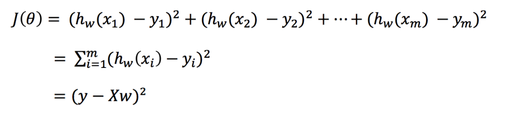

其中，$y$**是真实值矩阵，**$X$**是特征值矩阵，**$w$**是权重矩阵**

对其求解关于$w$的最小值，起止$y,X$ 均已知二次函数直接求导，导数为零的位置，即为最小值。

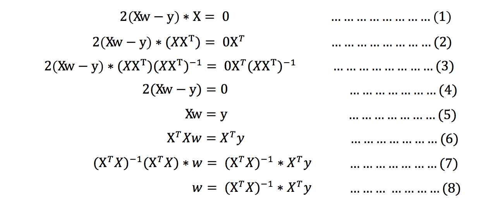

> 注：式(1)到式(2)推导过程中, X是一个m行n列的矩阵，并不能保证其有逆矩阵，但是右乘XT把其变成一个方阵，保证其有逆矩阵。

式（5）到式（6）推导过程中，和上类似。

### **（2）正规方程求解举例**
以下表示数据为例：

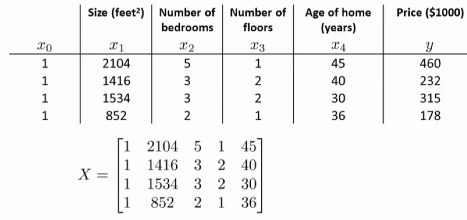

即：

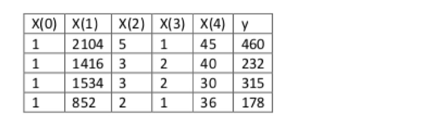

运用正规方程方法求解参数：

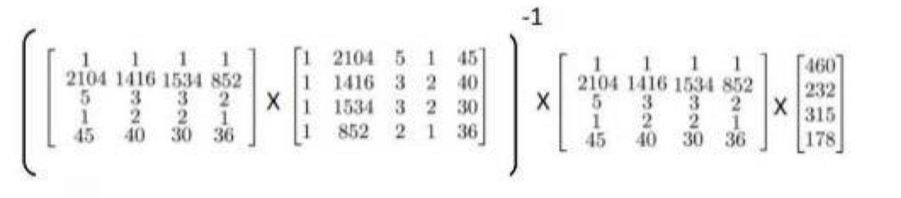

## **2、梯度下降法**
梯度下降法的基本思想可以类比为一个下山的过程。

假设这样一个场景：一个人被困在山上，需要从山上下来(i.e. 找到山的最低点，也就是山谷)。但此时山上的浓雾很大，导致可视度很低。因此，下山的路径就无法确定，他必须利用自己周围的信息去找到下山的路径。这个时候，他就可以利用梯度下降算法来帮助自己下山。具体来说就是，以他当前的所处的位置为基准，**寻找这个位置最陡峭的地方，然后朝着山的高度下降的地方走**，（同理，如果我们的目标是上山，也就是爬到山顶，那么此时应该是朝着最陡峭的方向往上走）。然后每走一段距离，都反复采用同一个方法，最后就能成功的抵达山谷。

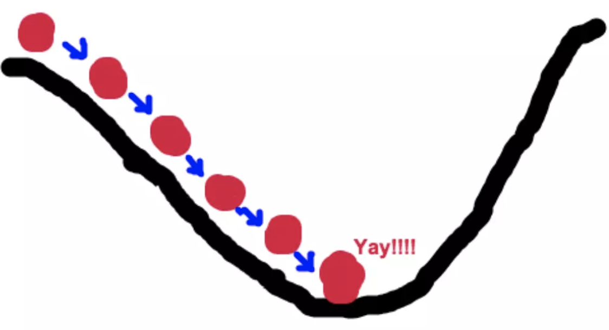

梯度下降的基本过程就和下山的场景很类似。

首先，我们有一个**可微分的函数**。这个函数就代表着一座山。

我们的目标就是找到**这个函数的最小值**，也就是山底。

> 在多变量函数中，梯度是一个向量，向量有方向，梯度的方向就指出了函数在给定点的上升最快的方向

**梯度下降（Gradient Descent）公式**

> 梯度的具体的数学含义可看这篇博客：[《什么是梯度》](https://www.cnblogs.com/yanFlyBlog/p/15143163.html)

$$
\theta_i = \theta_i - \alpha \frac{\partial }{\partial \theta_i}J(\theta)
$$

* **1) α是什么含义？**

α在梯度下降算法中被称作为**学习率**或者**步长**，意味着我们可以通过α来控制每一步走的距离，以保证不要步子跨的太大扯着蛋，哈哈，其实就是不要走太快，错过了最低点。同时也要保证不要走的太慢，导致太阳下山了，还没有走到山下。所以α的选择在梯度下降法中往往是很重要的！α不能太大也不能太小，太小的话，可能导致迟迟走不到最低点，太大的话，会导致错过最低点！

* **2) 为什么梯度要乘以一个负号**？

梯度前加一个负号，就意味着朝着梯度相反的方向前进！我们在前文提到，梯度的方向实际就是函数在此点上升最快的方向！而我们需要朝着下降最快的方向走，自然就是负的梯度的方向，所以此处需要加上负号

我们通过两个图更好理解梯度下降的过程

**所以有了梯度下降这样一个优化算法，回归就有了"自动学习"的能力**

一般梯度公式为：

$$
w_0 := w_0-\eta \bullet \frac{\partial J(w)}{\partial w_0}
$$

$$
w_1 := w_1-\eta \bullet \frac{\partial J(w)}{\partial w_1}
$$

两个公式写成矩阵形式：

$$
\begin{bmatrix}
w_0 \\w_1
\end{bmatrix} := \begin{bmatrix}
w_0 \\w_1
\end{bmatrix}-\eta \bullet \begin{bmatrix}
\frac{\partial J(w)}{\partial w_0} \\\frac{\partial J(w)}{\partial w_1}
\end{bmatrix}\Longrightarrow \begin{bmatrix}
w_0 \\w_1
\end{bmatrix} := \begin{bmatrix}
w_0 \\w_1
\end{bmatrix}-\eta \bullet \bigtriangledown J(w)
$$

其中，$\nabla$称为**哈密顿算子**，其定义如下：

$$
\bigtriangledown J(w)=(\frac{\partial J(w)}{\partial w_0},\frac{\partial J(w)}{\partial w_1} )
$$

常见的梯度下降算法有：

* 全梯度下降算法(Full gradient descent），
* 随机梯度下降算法（Stochastic gradient descent），
* 随机平均梯度下降算法（Stochastic average gradient descent）
* 小批量梯度下降算法（Mini-batch gradient descent）,

它们都是为了正确地调节权重向量，通过为每个权重计算一个梯度，从而更新权值，使目标函数尽可能最小化。其差别在于样本的使用方式不同。

### **（1）全梯度下降算法(Full gradient descent，FGD）**
**计算训练集所有样本误差**，对其求和再取平均值作为目标函数。

权重向量沿其梯度相反的方向移动，从而使当前目标函数减少得最多。

因为在执行每次更新时，我们需要**在整个数据集上计算所有的梯度，所以批梯度下降法的速度会很慢，同时，批梯度下降法无法处理超出内存容量限制的数据集**。

**批梯度下降法同样也不能在线更新模型，即在运行的过程中，不能增加新的样本。**

在整个训练数据集上计算损失函数关于参数θ的梯度：

$$
\theta=\theta-\eta\bullet \nabla_\theta J(\theta )
$$

其中，$\nabla$称为**哈密顿算子**，其定义如下：

$$
\bigtriangledown f=(\frac{\partial f}{\partial x_1},\frac{\partial f}{\partial x_2},...,\frac{\partial f}{\partial x_n}  )
$$

### **（2）随机梯度下降算法（Stochastic gradient descent，SGD）**
由于**FGD（全梯度下降算法）**每迭代更新一次权重都需要计算所有样本误差，而实际问题中经常有上亿的训练样本，故**效率偏低，且容易陷入局部最优解**，因此提出了随机梯度下降算法。

其每轮计算的目标函数**不再是全体样本误差，而仅是单个样本误差，即每次只代入计算一个样本目标函数的梯度来更新权重**，再取下一个样本重复此过程，直到损失函数值停止下降或损失函数值小于某个可以容忍的阈值。

此**过程简单，高效，通常可以较好地避免更新迭代收敛到局部最优解**。其迭代形式为

$$
\theta=\theta-\eta\bullet \nabla_\theta J(\theta ;x^{(i)};y^{(i)})
$$

其中，$x^{(i)}$表示一条训练样本的特征值，$y^{(i)}$表示一条训练样本的标签值

**每次只使用一个样本迭代，若遇上噪声则容易陷入局部最优解**。

### **（3）小批量梯度下降算法（Mini-batch gradient descent）**
小批量梯度下降算法是FGD（全梯度下降算法）和SGD（随机梯度下降算法）的折中方案，在一定程度上兼顾了以上两种方法的优点。

**每次从训练样本集上随机抽取一个小样本集，在抽出来的小样本集上采用FGD（全梯度下降算法）迭代更新权重。**

被抽出的小样本集所含样本点的个数称为batch\_size，通常设置为2的幂次方，更有利于GPU加速处理。

特别的，若batch\_size=1，则变成了**SGD（随机梯度下降算法）**；若batch\_size=n，则变成了**FGD（全梯度下降算法）**。其迭代形式为

$$
\theta=\theta-\eta\bullet \nabla_\theta J(\theta ;x^{(i:i+n)};y^{(i:i+n)})
$$
### **（4）随机平均梯度下降算法（SAG）**
在SGD（随机梯度下降算法）方法中，虽然避开了运算成本大的问题，但对于大数据训练而言，SGD（随机梯度下降算法）效果常不尽如人意，因为每一轮梯度更新都完全与上一轮的数据和梯度无关。

随机平均梯度算法克服了这个问题，在内存中为每一个样本都维护一个旧的梯度，随机选择第i个样本来更新此样本的梯度，其他样本的梯度保持不变，然后求得所有梯度的平均值，进而更新了参数。

如此，每一轮更新仅需计算一个样本的梯度，计算成本等同于SGD（随机梯度下降算法），但收敛速度快得多。

### **（5）四种基本梯度下降算法比较**
为了比对四种基本梯度下降算法的性能，我们通过一个逻辑二分类实验来说明。本文所用的Adult数据集来自UCI公共数据库（[http://archive.ics.uci.edu/ml/datasets/Adult）。](http://archive.ics.uci.edu/ml/datasets/Adult）。) 数据集共有15081条记录，包括“性别”“年龄”“受教育情况”“每周工作时常”等14个特征，数据标记列显示“年薪是否大于50000美元”。我们将数据集的80%作为训练集，剩下的20%作为测试集，使用逻辑回归建立预测模型，根据数据点的14个特征预测其数据标记（收入情况）。

以下6幅图反映了模型优化过程中四种梯度算法的性能差异。

在图1和图2中，横坐标代表有效迭代次数，纵坐标代表平均损失函数值。图1反映了前25次有效迭代过程中平均损失函数值的变化情况，为了便于观察，图2放大了第10次到25次的迭代情况。

从图1中可以看到，**四种梯度算法下，平均损失函数值随迭代次数的增加而减少**。**FG的迭代效率始终领先**，能在较少的迭代次数下取得较低的平均损失函数值。**FG与SAG的图像较平滑**，这是因为这两种算法在进行梯度更新时都结合了之前的梯度；**SG与mini-batch的图像曲折明显**，这是因为这两种算法在每轮更新梯度时都随机抽取一个或若干样本进行计算，并没有考虑到之前的梯度。

从图2中可以看到**虽然四条折现的纵坐标虽然都趋近于0，但SG和FG较早，mini-batch最晚****。**这说明如果想使用mini-batch获得最优参数，必须对其进行较其他三种梯度算法更多频次的迭代。

在图3，4，5，6中，横坐标表示时间，纵坐标表示平均损失函数值。

从图3中可以看出使用四种算法将平均损失函数值从0.7降到0.1最多只需要2.5s，由于本文程序在初始化梯度时将梯度设为了零，故前期的优化效果格外明显。其中SG在前期的表现最好，仅1.75s便将损失函值降到了0.1，虽然SG无法像FG那样达到线性收敛，但在处理大规模机器学习问题时，**为了节约时间成本和存储成本，可在训练的一开始先使用SG，后期考虑到收敛性和精度可改用其他算法****。**

从图4，5，6可以看出，随着平均损失函数值的不断减小，SG的性能逐渐反超FG，FG的优化效率最慢，即达到相同平均损失函数值时FG所需要的时间最久。

综合分析六幅图我们得出以下结论：

**（1）FG方法由于它每轮更新都要使用全体数据集，故花费的时间成本最多，内存存储最大。**

**（2）SAG在训练初期表现不佳，优化速度较慢。这是因为我们常将初始梯度设为0，而SAG每轮梯度更新都结合了上一轮梯度值。**

**（3）综合考虑迭代次数和运行时间，SG表现性能都很好，能在训练初期快速摆脱初始梯度值，快速将平均损失函数降到很低。但要注意，在使用SG方法时要慎重选择步长，否则容易错过最优解。**

**（4）mini-batch结合了SG的“胆大”和FG的“心细”，从6幅图像来看，它的表现也正好居于SG和FG二者之间。在目前的机器学习领域，mini-batch是使用最多的梯度下降算法，正是因为它避开了FG运算效率低成本大和SG收敛效果不稳定的缺点。**
## **3、梯度下降和正规方程的对比**
| |**梯度下降**|**正规方程**|
| ----- | :-----: | :-----: |
|学习率|需要选择学习率|不需要|
|迭代|需要迭代求解|一次运算得出|
|特征个数|特征数量较大可以使用|需要计算方程，时间复杂度高O(n3)。处理很多特征的时候低效甚至无效|
|求逆矩阵|没有此问题|有时矩阵不可逆|

# **面试题**
**1、线性回归要求因变量符合正态分布？**

答：是的。线性回归的假设前提是特征与预测值呈线性关系，误差项符合高斯-马尔科夫条件（零均值，零方差，不相关），这时候线性回归是无偏估计。噪声符合正态分布，那么因变量也符合分布。在进行线性回归之前，要求因变量近似符合正态分布，否则线性回归效果不佳（有偏估计）

**2、如何判断是否符合正态分布？如果不符合正态分布要怎么办？**

答：通过计算数据分布的偏度和峰度值，如果偏度大于3，那么需要对数据进行转换。具体的转换公式需要结合数据分布进行决策。常见的转换方法有：Log转换，根号转换等。

**3、线性回归的前提假设有哪些？**

* 自变量和因变量呈线性关系。
* 误差之间相互独立
* 自变量相互独立
* 误差项的方差应为常数
* 误差呈正态分布

**4、如果线性回归模型效果不好，原因是什么？**

* 自变量和因变量不是线性关系
* 自变量之间不是相互独立
* 模型过拟合。

参考：

\[1\][通俗易懂--线性回归算法讲解(算法+案例) ](https://www.cnblogs.com/mantch/p/10135708.html)

\[2\][高斯分布](https://blog.csdn.net/hanghang_/article/details/104602487)

\[3\][梯度下降优化算法综述](https://blog.csdn.net/google19890102/article/details/69942970)

\[4\][线性回归、决策树面试题及答案](https://mp.weixin.qq.com/s?src=11&timestamp=1652157628&ver=3789&signature=3bsGatgGe6OvEfsVsQb5kZUOY5PD9c7uMzAgZtrY0cv5vN4Lf9hyk8CDHK4wLIuCwoJR5LJf9yB4VZ3LPpQuVcFrREWRcNZpxhXkFo-Mm53SM4vUQpswUtTNP*lSyOOp&new=1)

* \[1\] Abadi, M., Agarwal, A., Barham, P., Brevdo, E., Chen, Z., Citro, C., … Zheng, X. (2015). TensorFlow : Large-Scale Machine Learning on Heterogeneous Distributed Systems.
* \[2\] Bengio, Y., Boulanger-Lewandowski, N., & Pascanu, R. (2012). Advances in Optimizing Recurrent Networks. Retrieved from [http://arxiv.org/abs/1212.0901](http://arxiv.org/abs/1212.0901)
* \[3\] Bengio, Y., Louradour, J., Collobert, R., & Weston, J. (2009). Curriculum learning. Proceedings of the 26th Annual International Conference on Machine Learning, 41–48. [http://doi.org/10.1145/1553374.1553380](http://doi.org/10.1145/1553374.1553380)
* \[4\] Darken, C., Chang, J., & Moody, J. (1992). Learning rate schedules for faster stochastic gradient search. Neural Networks for Signal Processing II Proceedings of the 1992 IEEE Workshop, (September), 1–11. [http://doi.org/10.1109/NNSP.1992.253713](http://doi.org/10.1109/NNSP.1992.253713)
* \[5\] Dauphin, Y., Pascanu, R., Gulcehre, C., Cho, K., Ganguli, S., & Bengio, Y. (2014). Identifying and attacking the saddle point problem in high-dimensional non-convex optimization. arXiv, 1–14. Retrieved from [http://arxiv.org/abs/1406.2572](http://arxiv.org/abs/1406.2572)
* \[6\] Dean, J., Corrado, G. S., Monga, R., Chen, K., Devin, M., Le, Q. V, … Ng, A. Y. (2012). Large Scale Distributed Deep Networks. NIPS 2012: Neural Information Processing Systems, 1–11. [http://doi.org/10.1109/ICDAR.2011.95](http://doi.org/10.1109/ICDAR.2011.95)
* \[7\] Duchi, J., Hazan, E., & Singer, Y. (2011). Adaptive Subgradient Methods for Online Learning and Stochastic Optimization. Journal of Machine Learning Research, 12, 2121–2159. Retrieved from [http://jmlr.org/papers/v12/duchi11a.html](http://jmlr.org/papers/v12/duchi11a.html)
* \[8\] Ioffe, S., & Szegedy, C. (2015). Batch Normalization : Accelerating Deep Network Training by Reducing Internal Covariate Shift. arXiv Preprint arXiv:1502.03167v3
* \[9\] Kingma, D. P., & Ba, J. L. (2015). Adam: a Method for Stochastic Optimization. International Conference on Learning Representations, 1–13.
* \[10\] LeCun, Y., Bottou, L., Orr, G. B., & Müller, K. R. (1998). Efficient BackProp. Neural Networks: Tricks of the Trade, 1524, 9–50. [http://doi.org/10.1007/3-540-49430-8\_2](http://doi.org/10.1007/3-540-49430-8_2)
* \[11\] Mcmahan, H. B., & Streeter, M. (2014). Delay-Tolerant Algorithms for Asynchronous Distributed Online Learning. Advances in Neural Information Processing Systems (Proceedings of NIPS), 1–9. Retrieved from [http://papers.nips.cc/paper/5242-delay-tolerant-algorithms-for-asynchronous-distributed-online-learning.pdf](http://papers.nips.cc/paper/5242-delay-tolerant-algorithms-for-asynchronous-distributed-online-learning.pdf)
* \[12\] Neelakantan, A., Vilnis, L., Le, Q. V., Sutskever, I., Kaiser, L., Kurach, K., & Martens, J. (2015). Adding Gradient Noise Improves Learning for Very Deep Networks, 1–11. Retrieved from http://arxiv.org/abs/1511.06807
* \[13\] Nesterov, Y. (1983). A method for unconstrained convex minimization problem with the rate of convergence o(1/k2). Doklady ANSSSR (translated as Soviet.Math.Docl.), vol. 269, pp. 543– 547.
* \[14\] Niu, F., Recht, B., Christopher, R., & Wright, S. J. (2011). Hogwild! : A Lock-Free Approach to Parallelizing Stochastic Gradient Descent, 1–22.
* \[15\] Pennington, J., Socher, R., & Manning, C. D. (2014). Glove: Global Vectors for Word Representation. Proceedings of the 2014 Conference on Empirical Methods in Natural Language Processing, 1532–1543. [http://doi.org/10.3115/v1/D14-1162](http://doi.org/10.3115/v1/D14-1162)
* \[16\] Qian, N. (1999). On the momentum term in gradient descent learning algorithms. Neural Networks : The Official Journal of the International Neural Network Society, 12(1), 145–151. [http://doi.org/10.1016/S0893-6080(98)00116-6](http://doi.org/10.1016/S0893-6080%2898%2900116-6)
* \[17\] H. Robinds and S. Monro, “A stochastic approximation method,” Annals of Mathematical Statistics, vol. 22, pp. 400–407, 1951.
* \[18\] Sutskever, I. (2013). Training Recurrent neural Networks. PhD Thesis.
* \[19\] Sutton, R. S. (1986). Two problems with backpropagation and other steepest-descent learning procedures for networks. Proc. 8th Annual Conf. Cognitive Science Society.
* \[20\] Zaremba, W., & Sutskever, I. (2014). Learning to Execute, 1–25. Retrieved from [http://arxiv.org/abs/1410.4615](http://arxiv.org/abs/1410.4615)
* \[21\] Zeiler, M. D. (2012). ADADELTA: An Adaptive Learning Rate Method. Retrieved from [http://arxiv.org/abs/1212.5701](http://arxiv.org/abs/1212.5701)
* \[22\] Zhang, S., Choromanska, A., & LeCun, Y. (2015). Deep learning with Elastic Averaging SGD. Neural Information Processing Systems Conference (NIPS 2015), 1–24. Retrieved from [http://arxiv.org/abs/1412.6651](http://arxiv.org/abs/1412.6651)

