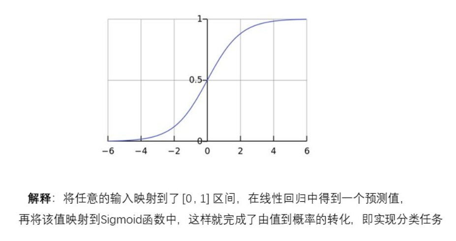
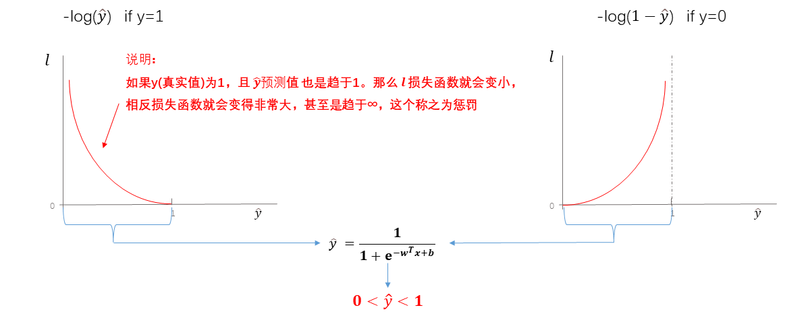
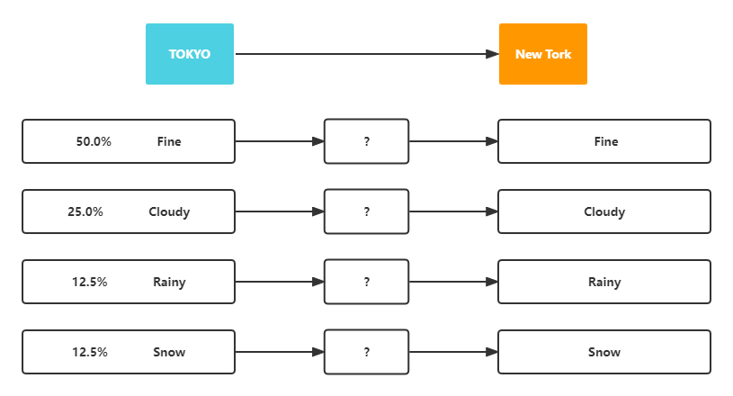
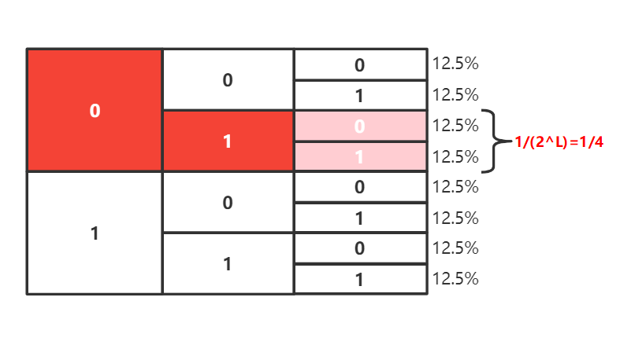
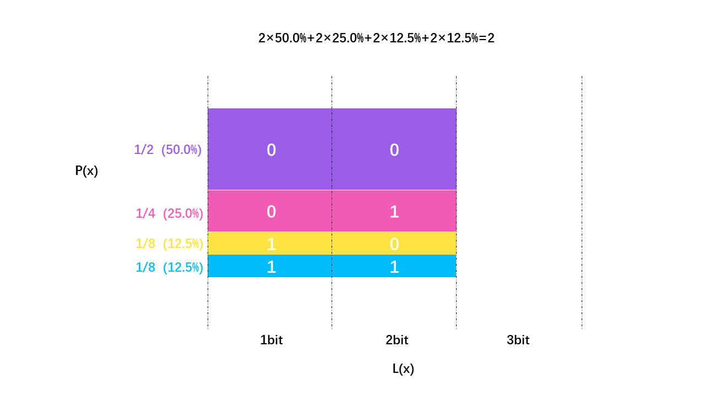
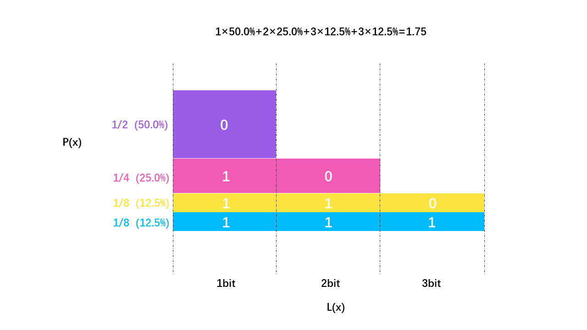
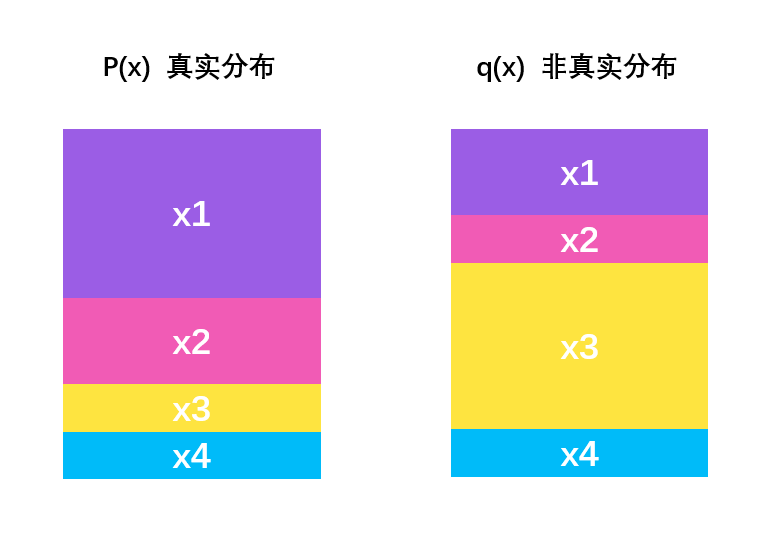
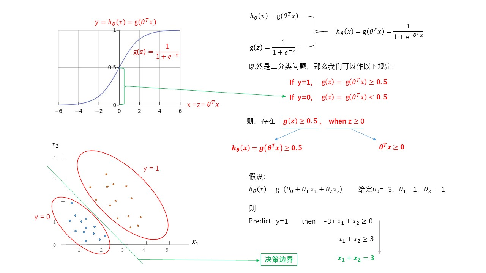
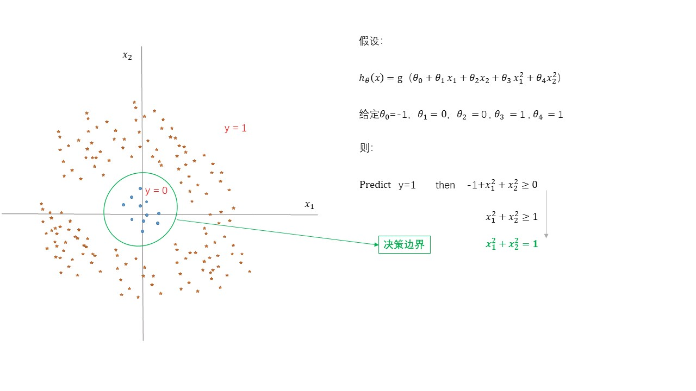
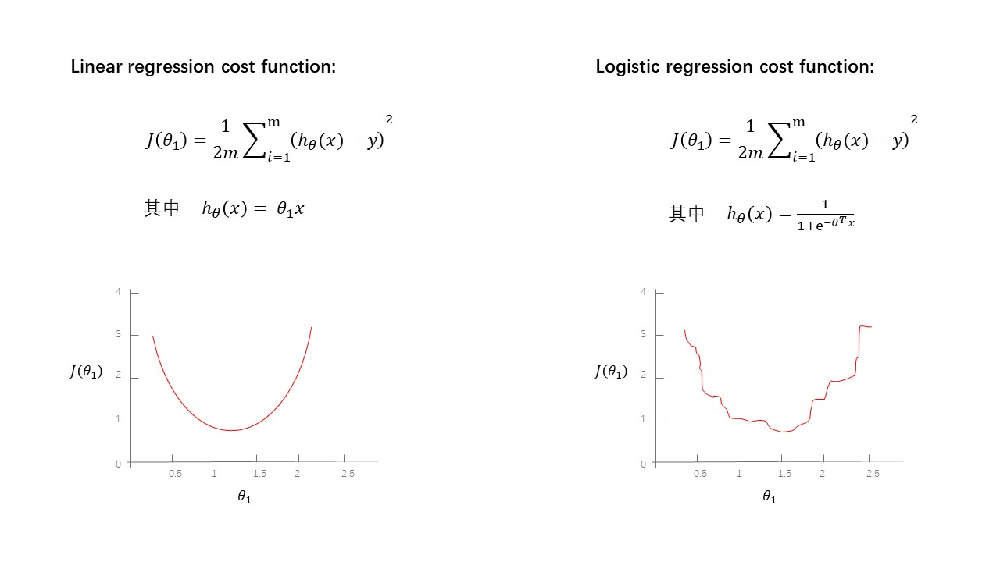

# Logistic Regression 逻辑回归
[toc]

# **一、什么是逻辑回归**
Logistic Regression（逻辑回归）是机器学习中一个非常常见的模型，在实际生产环境中也常常被使用，是一种经典的分类模型（不是回归模型）。

逻辑回归的过程可以理解为：面对一个**回归**或者**分类**问题，**建立代价函数**，然后通过**优化方法迭代**求解出最优的模型参数，然后测试验证我们这个求解的模型的好坏。

## **1、广义线性模型**
广义线性模型（generalize linear model，GLM）是线性模型的扩展，通过联结函数建立响应变量的**数学期望值**与线性组合的**预测变量****之间的关系**。其特点是不强行改变数据的自然度量，数据可以具有非线性和非恒定方差结构。直接理解就是：适用性更广的、更抽象的线性模型。

像线性回归和逻辑回归是比较具体的线性模型，有各自独特的假设和适用场景；而广义线性模型的广义就体现在其假设和适用场景范围更大，可以把线性回归、逻辑回归之类的模型都包括。

**逻辑回归**与**线性回归**都是一种**广义线性模型**（generalized linear model，GLM）。具体的说，都是从指数分布族导出的线性模型，**线性回归**假设$Y|X$服从**高斯分布(Gaussian distribution)**，**逻辑回归**假设$Y|X$服从**伯努利分布(Bernoulli Distribution)。**

因此逻辑回归与线性回归有很多相同之处，去除Sigmoid映射函数的话，逻辑回归算法就是一个线性回归。可以说，逻辑回归是以线性回归为理论支持的，但是逻辑回归通过Sigmoid函数引入了非线性因素，因此可以轻松处理0/1分类问题。

## **2、高斯分布**Gaussian distribution**（正态分布**normal distribution**）**
高斯分布（**正态分布**）是一个常见的连续概率分布。

正态分布的**数学期望值**或期望值$μ$ 等于**位置参数，决定了分布的位置**；其**方差**$σ^2$ 或**标准差**$σ$ 等于尺度参数，**决定了分布的幅度**。正态分布的概率密度函数曲线呈钟形，因此人们又经常称之为钟形曲线（类似于寺庙里的大钟，因此得名）。我们通常所说的**标准正态分布是位置参数**$μ$** = 0 ，方差**$σ^2$** = 1的正态分布。**

若随机变量$X$服从一个位置参数为$μ$ 、方差为$σ^2$的正态分布，可以记为$X\sim N (μ,σ^2)$，可以写成如下形式:

$$
N(x|\mu,\sigma^2)=\frac{1}{ \sqrt{2\pi }\sigma }exp(-\frac{(x-\mu )^2}{2\sigma ^2} )
$$

$\mu$是均值期望，$\sigma^2$是方差，以上形式是基于只有一个变化维度的连续随机变量，因此以上又称为**一元高斯分布**。

从上面可以看到，一维高斯分布可以用变量均值和方差进行描述，那么二维高斯分布的呢？一维正态分布只有一个变量，则二维高斯分布则包含有两个变量，二维高斯分布的均值$μ$ 由两个变量的均值描述，其方差由变量的协方差矩阵进行描述。

> 均值可取实数轴上的任意数值，决定正态曲线的具体位置；标准差(\$\\theta\$)决定曲线的“陡峭”或“扁平”程度：标准差越大，正态曲线越扁平；标准差越小，正态曲线越陡峭。这是因为，**标准差越小，意味着大多数变量值离均数的距离越短，因此大多数值都紧密地聚集在均数周围**，图形所能覆盖的变量值就少些，于是都挤在一块，图形上呈现瘦高型。相反，**标准差越大，数据跨度就比较大，分散程度大，所覆盖的变量值就越多**，图形呈现“矮胖型”。值得注意的是，正态分布曲线与x轴围成的面积为1。

## **3、伯努利分布(Bernoulli Distribution，0-1分布)**
伯努利分布（the Bernoulli distribution)，又名两点分布或者0-1分布，是一个离散型概率分布，为纪念瑞士科学家雅各布·伯努利而命名。

若伯努利试验成功，则伯努利随机变量取值为1。

若伯努利试验失败，则伯努利随机变量取值为0。

记其成功概率为p，则失败概率为q = 1 − p

因此，如果一个事情可以被简单分为**两个结果，且概率和为1**那么就可以服从伯努利分布。

所谓伯努利实验就是指服从伯努利分布的实验，它具有三条性质：

**（1）可重复**

**（2）两个种结果**

**（3）概率和为1**

只要现实世界中的事情符合伯努利实验的三个性质，那么它的发生概率分布就一定服从伯努利分布。

# **二、逻辑回归的假设函数**
首先我们要先介绍一下Sigmoid函数，也称为**逻辑函数（Logistic function**），可以看到sigmoid函数是一个 S 形的曲线，它的取值在\[0, 1\]之间，在远离0的地方函数的值会很快接近0或者1，它的这个特性对于解决二分类问题十分重要。

$$
y = \frac{1}{1+e^{-x}} (e=2.718281...)
$$

从而，我们得到**条件概率（这个表示，在给定X的情况下，Y的出现的概率是多少）：**

$$
P(Y|X) =\frac{1}{1+e^{-(w^Tx+b)}} (e=2.718281...)
$$

举个例子：

下面是借贷数据

| |**年龄**|**工资**|**学历**|**预期**|
| :-----: | :-----: | :-----: | :-----: | ----- |
|1|20|4000|本科|YES|
|2|25|5000|专科|NO|
|3|21|6000|本科|NO|
|4|25|5000|专科|YES|
|5|28|8000|硕士|NO|
|6|27|7000|本科|?|

我们的目标是预测第6个人，是否会预期借贷。

首先，我们使用条件概率，拿第1到第5个人的数据来训练，即：

$$
P（Y=YES | (20，4000，本科)） = \frac{1}{1+e^{-[(w_1,w_2,w_3){\begin{pmatrix}
 20\\
 4000\\
本科
\end{pmatrix}
 }+b]}} (e=2.718281...)
$$

$$
...
$$

$$
P（Y=NO | (28，8000，硕士)） = \frac{1}{1+e^{-[(w_1,w_2,w_3){\begin{pmatrix}
 28\\
 8000\\
硕士
\end{pmatrix}
 }+b]}} (e=2.718281...)
$$

通过上面，我们可以得出，$W=\begin{pmatrix}w_1\\w_2\\w_3\end{pmatrix}$，b 的最优解，然后，通过条件概率得出第6个人逾期贷款的 YES 概率越大越好 或者 NO 概率越大越好。

$$
P（Y=YES \space? \space NO | (27，7000，本科)） = \frac{1}{1+e^{-[(w_1,w_2,w_3){\begin{pmatrix}
 27\\
 7000\\
本科
\end{pmatrix}
 }+b]}} (e=2.718281...)
$$

因此，对于二分类问题，有

$$
P(y=1|x,w,b) =\frac{1}{1+e^{-(w^Tx+b)}}
$$

$$
P(y=0|x,w,b) =\frac{e^{-(w^Tx+b)}}{1+e^{-(w^Tx+b)}}=1-P(y=1|x,w)
$$

两个公式，可以合并成

$$
p(y|x,w,b)=p(y=1|x,w,b)^y[1-p(y=1|x,w,b)]^{1-y}
$$

综上，逻辑回归的假设函数为：

$$
\pmb{\textcolor{red}{P(Y|X) =h_{\theta}(\theta^Tx)=\frac{1}{1+e^{-(\theta^Tx)}} (e=2.718281...)}}
$$

# **三、逻辑回归的损失函数**
**损失函数（Loss Function) **直接作用于单个样本，用来表达样本的误差。

**代价函数（Cost Function）**是整个样本集的平均误差，对所有损失函数值的平均。

**目标函数（Object Function）**是我们最终要优化的函数，也就是代价函数+正则化函数（经验风险+结构风险）。

在**线性回归**中，最常用的是**使用****最小化均方误差（****MSE,均方误差****）****拟合，并得到损失函数。**

$$
J(\theta)=\frac{1}{2m}\sum^{m}_{i=1}(y_i-X_iw)^2
$$

其中，$\frac{1}{2}$**是为了求导计算方便，而**$\frac{1}{m}$**是将损失平均化，消除样本量**$m$**带来的影响。**

在**逻辑回归**中，最常用的是代价函数是**交叉熵(Cross Entropy)**，交叉熵是一个常见的代价函数。

$$
J(\theta)=-\frac{1}{m}\sum^{m}_{i=1}[ y_ilogh_{\theta}(x) + (1-y_i)log(1-h_{\theta(x)}) ]
$$

## **1、Sigmoid函数**
**可不可以用线性回归来表示**$P(Y|X)=w^Tx+b$**？为什么？**

答案是不可以。因为$P(Y|X)$首先是一个概率条件，而概率条件是需要满足两个条件：

$$
\begin{cases}
0\le P(y|x)\le1 
\\
\\
\sum_{i}^{n}P(y|x)=1 
\end{cases}
$$
一个是概率取值应该是在\[0,1\]之间，另一个是所有概率加起来的和为1。
然而，$w^Tx+b$取值明显是在$[-\infty ，+\infty ]$之间，所以不可以。

然而，有一个函数，却满足上述要求，即定义域在$[-\infty ，+\infty ]$，值域在$[0,1]$，那就是Sigmoid函数:

$$
h(x) = \frac{1}{1+e^{(-x)}}
$$

## **2、交叉熵(Cross Entropy)损失函数**
假设我们拥有数据集$D=\{(xi,yi)\}^{n}_{i=1}$,${x_i}\in{R^d}$, $y_i \in {\{0,1\}}$，其中n为样本数量，d为特征维度

而且我们已经定义了：

$$
\begin{cases}
  & p(y=1|x,w,b)=\frac{1}{1+e^{-(w^Tx+b)}}    & \text{ if } y=1 
\\
\\
  & p(y=0|x,w,b)=1-p(y=1|x,w,b)   & \text{ if } y=0
\end{cases}
$$

合并如下：

$$
p(y|x,w,b)=p(y=1|x,w,b)^y[1-p(y=1|x,w,b)]^{1-y}
$$

我们需要最大化目标函数：

$$
\pmb{\textcolor{red}{argmax_{w,b} \space \prod_{i=1}^{n}p(y_i|x_i,w,b)}}
$$

> $\begin{cases} \prod_{i=1}^{n}x_i = x_1\bullet x_2\bullet x_3...\bullet x_n 
\\
\\
 {\textstyle \sum_{i=1}^{n}}  = x_1+ x_2+ x_3...+ x_n
\end{cases}$

简化，**取对数，引入 log 函数，因为 log 运算并不会影响函数本身的单调性，此外，连乘会导致数值变得很小，不利于计算机计算，有可能溢出。**

$$
argmax_{w,b} \space \prod_{i=1}^{n}p(y_i|x_i,w,b) \Longrightarrow argmax_{w,b} \space log \space (\prod_{i=1}^{n}p(y_i|x_i,w,b))
\Longrightarrow argmax_{w,b} \space \sum_{i=1}^{n} log \space p(y_i|x_i,w,b)
$$

> $\begin{cases} log(xyz) = logx+logy+logz 
\\
\\
log(a^y,b^x) = log(a^y)+log(b^x) = yloga+xlogb
\end{cases}$

上面是最大化问题，我们加一个负号，变成最小化问题

$$
argmin_{w,b} \space -\sum_{i=1}^{n} log \space p(y_i|x_i,w,b)
$$

我们把$p(y|x,w)=p(y=1|x,w)^y[1-p(y=1|x,w)]^{1-y}$带入，得

$$
argmin_{w,b} \space -\sum_{i=1}^{n} log \space [\space p(y=1|x,w,b)^y[1-p(y=1|x,w,b)]^{1-y}\space ]
$$

$$
\pmb{\textcolor{red}{argmin_{w,b} \space -\sum_{i=1}^{n} \space [ \space  y \bullet log \space  p(y=1|x,w,b)+(1-y)\bullet log\space(1-p(y=1|x,w,b))\space ]}}
$$

由于，$P(y=1|x,w,b) =\frac{1}{1+e^{-(w^Tx+b)}}=\sigma (w^Tx+b)$，我们用$\sigma()$函数表示Sigmoid函数，带入替换上式子（下面是推导需要的基础知识）。$y_i$表示的是$y$中的第$i$个样本。

$$
基础知识\begin{cases}
\sigma (x) = \frac{1}{1+e^x} 
\\ 
\\
{\sigma (x)}'  = \sigma (x)\bullet (1-\sigma (x))
\\
 \\
{log(x)}'=\frac{1}{x} 
\end{cases}
$$

$$
\begin{matrix}
 argmin_{w,b} \space -\sum_{i=1}^{n} \space [ \space y_i \bullet log \space  p(y_i=1|x_i,w,b)+(1-y_i)\bullet log \space (1-p(y_i=1|x_i,w,b))\space ]
\\
\\
用 \sigma (w^Tx_i+b)替换p(y_i=1|x_i,w,b)
\\
 \\
 argmin_{w,b} \space \underset{L(w,b)}{\underbrace{-\sum_{i=1}^{n} \space [y_i \space  \bullet log \space  \sigma (w^Tx_i+b) + (1-y_i)\bullet log(1-\sigma (w^Tx_i+b))\space]} }

\end{matrix}
$$

到这里，我们其实已经推导出了**交叉熵损失函数**，即：

$$
Loss function：L= -\sum_{i=1}^{n} \space [ \space y_i \bullet log \space  p(y_i=1|x_i,w,b)+(1-y_i)\bullet log \space (1-p(y_i=1|x_i,w,b))\space ]
$$

我们用$\hat{y_i}$来表示预测值，去替换$p(y_i=1|x_i,w,b)$，得

$$
\pmb{\textcolor{blue}{L= -\sum_{i=1}^{n} \space [ \space y_i \bullet log \space  \hat{y_i}+(1-y_i)\bullet log \space(1-\hat{y_i})\space ]}}
$$

## **3、交叉熵损失函数的直观理解**
从图形的角度，分析交叉熵函数：

$$
\pmb{\textcolor{blue}{L= -\sum_{i=1}^{n} \space [ \space y_i \bullet log \space  \hat{y_i}+(1-y_i)\bullet log \space(1-\hat{y_i})\space ]}}
$$

先给出**单个样本的交叉熵损失函数**：

$$
l = y \bullet log \space  \hat{y}+(1-y)\bullet log \space(1-\hat{y})
$$

我们分别给出 y=1 和 y=0 时的，预测值和损失值函数图像：

## **4、什么是熵(Entropy)**
信息论中**熵的概念首次被香农提出**，目的是寻找一种高效/无损地编码信息的方法：

以编码后数据的平均长度来衡量高效性，平均长度越小越高效；同时还需满足“无损”的条件，即编码后不能有原始信息的丢失。

这样，**香农提出了熵的定义：无损编码事件信息的最小平均编码长度。**

### **（1）计算编码长度**
假设我们采用二进制编码东京的天气信息，并传输至纽约，其中东京的天气状态有4种可能，对应的概率如下图：

假设，每个可能性需要1个编码，东京的天气共需要4个编码。让我们采用3种编码方式，并对比下编码长度。如下：

|**编码方式**|**Fine(50.0%)**|**Cloudy(25.0%)**|**Rainy(12.5%)**|**Snow(12.5%)**|**编码长度**|
| :-----: | ----- | ----- | ----- | ----- | ----- |
|**1**|00|10|01|11|2×50.0%+2×25.0%+2×12.5%+2×12.5%=2|
|**2**|10|110|0|111|2×50.0%+3×25.0%+1×12.5%+3×12.5%=2.25|
|**3**|0|110|10|111|1×50.0%+3×25.0%+2×12.5%+3×12.5%=1.875|
|**4**|0|10|110|111|1×50.0%+2×25.0%+3×12.5%+3×12.5%=1.75|

不难发现，**方式4编码长度最小，且是平均意义上的最小**。方式3胜出的原因在于：对高可能性事件(Fine 50.0%,Cloudy25.0%)用短编码，对低可能性事件(Rainy 12.5%,Snow 12.5%)用长编码。

### **（2）直接计算熵**
制作出并非唯一可解码的编码方案是很有可能的。

例如，假设0和01都是码字，那么我们就不清楚编码字符串0100111的第一个码字是什么，因为可能是0，也可能是01。 

我们想要的是任何码字都不应该是另一个码字的前缀，这称为前缀属性，遵守该属性的编码称为前缀编码。

如果我们使用码字01，则会失去使用其前缀的任何其它码字的能力。 比如我们无法再使用010或011010110，因为会有二义性。那么，当我们确定下来一个码字，我们会丢失多少码字空间呢？

假设一个信息事件有8种可能的状态，且各状态等可能性，即可能性都是12.5%=1/8。我们需要多少位来编码8个值呢？1位可以编码2个值(0或1)，2位可以编码$2^2=4$个值(00,01,10,11)，则8个值需要3位，$2^3=8$个值(000,001,010,011,100,101,110,111)。

|**A(12.5%)**|**B(12.5%)**|**C(12.5%)**|**D(12.5%)**|**E(12.5%)**|**F(12.5%)**|**G(12.5%)**|**H(12.5%)**|
| ----- | ----- | ----- | ----- | ----- | ----- | ----- | ----- |
|000|001|010|011|100|101|110|111|

我们不能减少任何1位，因为那样会造成歧义，同样我们也不要多于3位来编码8个可能的值。

假设，我们选定01为前缀编码，那么，它会占用整个码字空间的$\frac{1}{4}$(即，C和D编码12.5%+12.5%=25%，刚好占全部码字空间的$\frac{1}{4}$)，这就是我们损失的空间，也是我们选择 2 bit （01）作为码字的成本。

假设，我们选择长度$L$做编码，那该编码付出的代价是$cost$,即

$$
cost=\frac{1}{2^L}
$$

我们做如下转换：

$$
cost = \frac{1}{2^L} \Longrightarrow  2^L = \frac{1}{ cost}  \Longrightarrow log_2 \space 2^L = log_2 \space \frac{1}{ cost}  \Longrightarrow  L=log_2 \frac {1}{cost}
$$

那么，如何获得最短平均编码呢？

|**编码方式**|**Fine(50.0%)**|**Cloudy(25.0%)**|**Rainy(12.5%)**|**Snow(12.5%)**|**编码长度**|
| :-----: | ----- | ----- | ----- | ----- | ----- |
|**1**|00|10|01|11|2×50.0%+2×25.0%+2×12.5%+2×12.5%=2|
|**2**|10|110|0|111|2×50.0%+3×25.0%+1×12.5%+3×12.5%=2.25|
|**3**|0|110|10|111|1×50.0%+3×25.0%+2×12.5%+3×12.5%=1.875|
|**4**|0|10|110|111|1×50.0%+2×25.0%+3×12.5%+3×12.5%=1.75|

根据上面的表格，我们可以认为根据事件的普遍程度来分配我们的预算。

如果一个事件发生了50.0%的时间，我们应该花费50.0%的预算为它买一个简短的代码。比如编码方式4中的 Fine(50.0%) 和Cloudy(25.0%)，我们都选取最简短的编码，即 0 和 10 。 

但是，如果一个事件只发生1%的时间，我们只花1%的预算，因为我们不太在乎代码是否长，反正预算也是很低的，我们只需要保障高概率的编码简短。比如编码方式4中的 Rainy(12.5%) 和Snow(12.5%)。上面表格的计算结果也显示，方式4的编码长度确实是最小的。

所以，我们可以认为，为一个编码分配的成本预算和该编码出现的概率成正比。我们就可以近似。

这样，**只要知道每个码字出现的概率而无需知道具体的编码方案，我们就可以计算编码的平均长度是：**

$$
L(x) = log_2 \space \frac{1}{p(x)}
$$

当每个码字$x$出现的概率是$p(x)$，那么最短的平均码字的长度是：

$$
\begin{align}
H(p) &= \sum_{x}^{}p(x) \bullet L(x)  
\\
&= \sum_{x}^{} p(x)\bullet \space  log_2 (\frac{1}{p(x)} ) 
 \\
&=-\sum_{x}^{}p(x) \bullet log_2 \space p(x) 

\end{align}
$$

该式子$H(p)$就是**熵**！

而神奇的是，我们方式4的编码长度是：

$$
1 × 50.0 \% + 2 × 25.0\%+3×12.5\%+3×12.5\%=1.75
$$

我们使用，我们推导出的$H(p)$去计算：

$$
\begin{align}
H &= -\sum_{x}^{}p(x) \bullet log_2 \space p(x) 
\\
&= -[0.5 \bullet log_2 0.5+ 0.25\bullet log_2 0.25+0.125\bullet log_2 0.125+0.125\bullet log_2 0.125]
 \\
&= -[0.5 \bullet (-1)+0.25\bullet (-2)+0.125\bullet (-3)+0.125\bullet (-3)]
\\
&= 0.5 \bullet 1+0.25\bullet 2+0.125\bullet 3+0.125\bullet 3
\\
&= 0.5 +0.5+0.375+0.375
\\
&= 1+0.75
\\
&= 1.75
\end{align}
$$

其结果刚好是方式4的熵，而且方式4也是最短的平均码字的编码方式。

### **（3）熵的直观理解**
我们从下图也可以直观地得到编码方案的熵，它就是图中各矩形的面积总和。

可以看到，如果不用最佳编码，那么它的熵就比较大。

如果最佳编码，那么它的熵就最小。

在信息论里，$-log_2p(x)$被信息论的创始人Shannon（香农）定位事件$x$的自信息，即一个概率为$p(x)$的事件$x$具有信息量，单位是比特 bit。熵就是所有事件的自信息的加权和，即这些事件的自信息的平均值。

熵也反应了这些事件的不确定度。熵越大，事件越不确定。如果一个事件的发生概率为1，那么它的熵为0，即它是确定性的事件。如果我们确定会发生什么，就完全不必发送消息了！结果越不确定，熵越大，平均而言，当我发现发生了什么时，我获得的信息就越多。

### **（4）交叉熵**
> 交叉熵（Cross Entropy）是Shannon（香农）信息论中一个重要概念，主要用于度量两个概率分布间的差异性信息。

假设现在有一个样本集中两个概率分布$p(x),q(x)$，其中$p(x)$为真实分布，$q(x)$为非真实分布。

假如，按照真实分布$p(x)$来衡量识别一个样本所需要的编码长度的期望为：

$$
\begin{align}
H(p) 
&= \sum_{x}^{} p(x)\bullet \space  log_2 (\frac{1}{p(x)} ) 
 \\
&=-\sum_{x}^{}p(x) \bullet log_2 \space p(x) 

\end{align}
$$

但是，如果采用错误的分布q来表示来自真实分布p的平均编码长度，则应该是：

$$
\begin{align}
H(p,q) 
&= \sum_{x}^{} p(x)\bullet \space  log_2 (\frac{1}{q(x)} ) 
\\
&=-\sum_{x}^{}p(x) \bullet log_2 \space q(x) 

\end{align}
$$

此时就将$H(p,q)$称之为**交叉熵。**

对于**离散变量**采用以下的方式计算：

$$
\begin{align}
H(p,q) 
&= \sum_{x}^{} p(x)\bullet \space  log_2 (\frac{1}{q(x)} ) 
\\
&=-\sum_{x}^{}p(x) \bullet log_2 \space q(x) 

\end{align}
$$

对于**连续变量**采用以下的方式计算：

$$
-\int_{X}^{}P(x)logQ(x)\space dr(x)=E_p[-logQ]
$$

**交叉熵为我们提供了一种表达两种概率分布的差异的方法。 **$p$**和**$q$**的分布越不相同，**$p$**相对于**$q$**的交叉熵越大于**$p$**的自己的熵。**

对于逻辑回归使用的交叉熵公式：

$$
\pmb{\textcolor{blue}{L= -\sum_{i=1}^{n} \space [ \space y_i \bullet log \space  \hat{y_i}+(1-y_i)\bullet log \space(1-\hat{y_i})\space ]}}
$$

给出**单个样本的交叉熵损失函数**：

$$
l = y \bullet log \space  \hat{y}+(1-y)\bullet log \space(1-\hat{y})\space ]
$$

观察上式并对比交叉熵公式就可看出，这个损失函数就是$y_i$与$\hat{y_i}$的交叉熵$H_y(\hat{y})$。

逻辑回归使用的交叉熵公式也称为**binary cross-entropy**，即二元交叉熵。从公式可以看出，它**是所有数据点的交叉熵之和**，即：**每个数据点的交叉熵是可以独立计算的。**

举个例子：

假设，我们有两张照片，我们观测到两个数据点：

$$
\begin{align}
y_1 &= \space 'Dog'
\\ 
y_2 &= \space 'Cat'
\end{align}
$$

转成one-hot编码：

$$
\begin{align}
y_1 &= [1,0]
\\
y_2 &= [0,1]
\end{align}
$$

我们可以把这种编码理解为概率分布向量$[P('Dog'),P('Cat')]$，且满足$P('Dog')+P('Cat')=1$。

假设，我们的模型经过训练后输出的概率分布为$[\hat{y},(1-\hat{y})]$，比如$[0.8,0.2]$，这个预测值与真实数据之间的差距，就可以用它们之间的交叉熵来衡量：

$$
\begin{align}
l(y_1,\hat{y} ) &= H_{y_1}(\hat{y}) = -(1\bullet log(0.8)+0\bullet log(0.2)) = 0.2231
\\
\\
l(y_2,\hat{y} ) &= H_{y_2}(\hat{y}) = -(0\bullet log(0.8)+1\bullet log(0.2)) = 1.6094
\end{align}
$$

从上面的计算结果可以看出，模型输出预测的$[0.8,0.2]$更接近$y_1=[1,0]$，那么模型对这个输入的数据点的分类结果就是$Dog$。

**交叉熵对比了模型的预测结果和数据的真实标签，随着预测越来越准确，交叉熵的值越来越小，如果预测完全正确，交叉熵的值就为0。**

在二分类模型中，标签只有是和否两种，这时，可以使用二分类交叉熵作为损失函数。比如上面的数据集中只有猫和狗的照片，则交叉熵公式中只包含两种可能性：

$$
\begin{align}
H(P,Q) &= -\sum_{i=(Cat,Dog)}^{}P(i) \bullet  logQ(i) 
\\
\\
&= -P(Cat)\bullet logQ(Cat) - P(Dog)\bullet logQ(Dog)
\end{align}
$$

又因为只有两种分类情况，我们可以看做是两类$P与Q$概率分布向量，则有：

$$
\begin{align}
P(Dog) = 1-P(Cat)
\\
\\
Q(Dog) = 1-Q(Cat)
\end{align}
$$

所以交叉熵可以表示为：

$$
\begin{align}
H(P,Q) &= -\sum_{i=(Cat,Dog)}^{}P(i) \bullet  logQ(i) 
\\
\\
&= -P(Cat)\bullet logQ(Cat) - P(Dog)\bullet logQ(Dog)
\\
\\
&=-P(Cat)\bullet logQ(Cat) -(1-P(Cat))\bullet log(1-Q(Cat))
\end{align}
$$

我们定义$P$为真实的数据，用$y$表示；$Q$为模型预测的数据，用$\hat{y}$表示。则交叉熵又可以表示为：

$$
\begin{align}
H(P,Q) &= -\sum_{i=(Cat,Dog)}^{}P(i) \bullet  logQ(i) 
\\
\\
&= -P(Cat)\bullet logQ(Cat) - P(Dog)\bullet logQ(Dog)
\\
\\
&=-P(Cat)\bullet logQ(Cat) -(1-P(Cat))\bullet log(1-Q(Cat))

\\
\\
&= -y\bullet log\hat{y} - (1-y)\bullet log(1-\hat{y} ) 
\\
\\
&= y\bullet log\hat{y} - (1-y)\bullet log(1-\hat{y} ) 
\\
\\
&= -[\space y\bullet log\hat{y} + (1-y)\bullet log(1-\hat{y} ) \space ]
\end{align}
$$

二分类的交叉熵可以写成我们逻辑回归熟悉的形式：

$$
BinaryCrossEntropy = -[\space y\bullet log\hat{y} + (1-y)\bullet log(1-\hat{y} ) \space ]
$$

### **（5）KL散度**
熵和交叉熵之间的差可以告诉我们，由于使用了针对另一个分布而优化的代码使得我们的消息变长了多少。 如果两个分布相同，则该差异将为零。如果两个分布不相同，则该差异增加，则消息的长度也增加。

这种差异为**Kullback-Leibler散度**，或简称为**KL散度**。

$q$相对于$p$的KL散度可定义为：

$$
D_p(q) =H(p)- H_p(q)
$$

$$
D_{KL}(p||q) = \sum_{i=1}^{n}p(x_i)\bullet log \frac{p(x_i)}{q(x_i)}
$$

直观的理解：**KL散度就像两个分布之间的距离，即KL散度可以衡量它们有多不同**

$$
\begin{align}
D_{KL}(p||q) &= \sum_{i=1}^{n}p(x_i)\bullet log \frac{p(x_i)}{q(x_i)}
\\
\\
&=\sum_{i=1}^{n}[\space  p(x_i)\bullet (log \space p(x_i) - log \space q(x_i))  \space]
\\
\\
&=\sum_{i=1}^{n}[\space  p(x_i)\bullet log \space p(x_i) -  p(x_i)\bullet log \space q(x_i)  \space]
\end{align}
$$

其中 $p$ 表示的是真实分布，$q$ 表示的是预测分布，**当真实分布 **$p$** 和预测分布 **$q$** 非常不同时，则 KL 散度很大，当两个分布较为接近时，则 KL 散度较小。**

在其中我们看到了两项，

**第一项是信息熵**** **$p(x_i)\bullet (log \space p(x_i)$，

只与我们目前所知道的信息有关，也就是只与我们用来训练的数据有关，因此这一项是已知的常数，但要注意的是，p 代表的真实概率分布只是近似的真实概率分布，因为这个概率分布是用样本得到的，而非使用总体得到，并且我们无法得到总体的数据。

**第二项就是我们都很熟悉的交叉熵**$p(x_i)\bullet log \space q(x_i)$,

$$
\begin{align}
D_{KL}(p||q) &=\sum_{i=1}^{n}[\space  p(x_i)\bullet log \space p(x_i) -  p(x_i)\bullet log \space q(x_i)  \space]
\\
&= \sum_{i=1}^{n}\space  p(x_i)\bullet log \space p(x_i) -  \sum_{i=1}^{n}p(x_i)\bullet log \space q(x_i)  

\end{align}
$$

我们小小的转换下：

$$
\begin{align}
D_{KL}(p||q) &= \sum_{i=1}^{n}\space  p(x_i)\bullet log \space p(x_i) -  \sum_{i=1}^{n}p(x_i)\bullet log \space q(x_i)  
\\
&\Downarrow 
\\
D_{KL}(p||q) + (- \sum_{i=1}^{n}\space  p(x_i)\bullet log \space p(x_i))& = -  \sum_{i=1}^{n}p(x_i)\bullet log \space q(x_i)  

\end{align}
$$

也就是说**交叉熵就是 KL 散度加上信息熵，即 KL散度+信息熵 =交叉熵**，而信息熵是一个常数（在机器学习训练网络时，输入数据与标签常常已经确定），并且在计算的时候，交叉熵相较于 KL 散度更容易，所以我们直接使用了交叉熵作为损失函数。

**因此我们在最小化交叉熵的时候，实际上就是在最小化 KL 散度，也就是在让预测概率分布尽可能地与真实概率分布相似。**

为什么逻辑斯蒂回归使用交叉熵而不是MSE，从逻辑的角度出发，我们知道逻辑斯蒂回归的预测值是一个概率，而交叉熵又表示真是概率分布与预测概率分布的相似程度，因此选择使用交叉熵。从MSE的角度来说，预测的概率与欧氏距离没有任何关系，并且在分类问题中，样本的值不存在大小关系，与欧氏距离更无关系，因此不适用MSE。

# **四、参数求解**
逻辑回归**假设函数**：

$$
P(y=1|x,w) =\sigma(w^Tx+b)=\frac{1}{1+e^{-(w^Tx+b)}} (e=2.718281...)
$$

逻辑回归**目标函数**：

$$
\begin{matrix}
 argmin_{w,b} \space -\sum_{i=1}^{n} \space [ \space y_i \bullet log \space  p(y_i=1|x_i,w,b)+(1-y_i)\bullet log \space (1-p(y_i=1|x_i,w,b))\space ]
\\
\\
用 \sigma (w^Tx_i+b)替换p(y_i=1|x_i,w,b)
\\
 \\
 argmin_{w,b} \space \underset{L(w,b)}{\underbrace{-\sum_{i=1}^{n} \space [y_i \space  \bullet log \space  \sigma (w^Tx_i+b) + (1-y_i)\bullet log(1-\sigma (w^Tx_i+b))\space]} }

\end{matrix}
$$

求导过程：

**对**$w$**求偏导：**

$$
argmin_{w,b} \space \underset{L(w,b)}{\underbrace{-\sum_{i=1}^{n} \space [y_i \space  \bullet log \space  \sigma (w^Tx_i+b) + (1-y_i)\bullet log(1-\sigma (w^Tx_i+b))\space]} }
$$

$$
\begin{align}
\mathbf{{\color{Green} \frac{\partial L(w,b)}{\partial w}} }  &= - \sum_{i=1}^{n}\space [\space y_i\bullet \frac{\sigma (w^Tx_i+b)\bullet [1-\sigma (w^Tx_i+b)]}{\sigma (w^Tx_i+b)}\bullet x_i+(1-y_i)\bullet \frac{- \sigma (w^Tx_i+b)\bullet [1-\sigma (w^Tx_i+b)]}{1-\sigma (w^Tx_i+b)} \bullet x_i\space ]\space \\
  &= - \sum_{i=1}^{n} \space [\space y_i\bullet \frac{ \sigma (w^Tx_i+b)\bullet [1-\sigma (w^Tx_i+b)]}{\sigma (w^Tx_i+b)}\bullet x_i+(y_i-1)\bullet \frac{ \sigma (w^Tx_i+b)\bullet [1-\sigma (w^Tx_i+b)]}{1-\sigma (w^Tx_i+b)} \bullet x_i\space ]\space \\
&= - \sum_{i=1}^{n}\space [\space y_i\bullet  (1-\sigma (w^Tx_i+b))\bullet x_i+(y_i-1)\bullet  \sigma (w^Tx_i+b)\bullet  x_i \space ]\space
\\
&= - \sum_{i=1}^{n}[y_i-\sigma (w^Tx_i+b)]\bullet x_i\\
&=  \mathbf{{\color{Green} \sum_{i=1}^{n}[\sigma (w^Tx_i+b)-y_i]\bullet x_i} } 
\end{align}
$$

从最终的结果可以看出，$\sigma (w^Tx_i+b)-y_i$其实就是 **预测值-真实值。**

**对**$b$**求偏导：**

$$
argmin_{w,b} \space \underset{L(w,b)}{\underbrace{-\sum_{i=1}^{n} \space [y_i \space  \bullet log \space  \sigma (w^Tx_i+b) + (1-y_i)\bullet log(1-\sigma (w^Tx_i+b))\space]} }
$$

$$
\begin{align}
\mathbf{{\color{Green} \frac{\partial L(w,b)}{\partial b}} }  &= - \sum_{i=1}^{n}\space [\space y_i\bullet \frac{\sigma (w^Tx_i+b)[1-\sigma (w^Tx_i+b)]}{\sigma (w^Tx_i+b)}  + (1-y_i)\bullet \frac{-\sigma (w^Tx_i+b) [1-\sigma (w^Tx_i+b)]}{1-\sigma (w^Tx_i+b)}   \space ]
 \\
\\
&=- \sum_{i=1}^{n}\space [ \space  y_i\bullet (1-\sigma (w^Tx_i+b)) + (1-y_i)\bullet (-\sigma (w^Tx_i+b))]
\\
\\
&=\mathbf{{\color{Green} \sum_{i=1}^{n} \space [ \space  \sigma (w^Tx_i+b) -y_i \space ] \space } } 
 \end{align}
$$

使用**梯度下降法**：

$$
\begin{align}
初始化 & {w}' 、{b}' 
 \\
 \\
 for \space \space \space &t=1,2,3....
\\
& w^{t+1} = w^t -\eta \bullet \sum_{i=1}^{n}[\sigma (w^Tx_i+b)-y_i]\bullet x_i
\\
& b^{t+1} = b^t -\eta \bullet \sum_{i=1}^{n}[\sigma (w^Tx_i+b)-y_i]\

\end{align}
$$

# **五、逻辑回归优缺点**
## **1、优点**
* **实现简单，对因变量的分布没有要求。**
直接对分类的可能性建模，无需事先假设数据分布，避免了假设分布不准确带来的问题
* **对构建的模型有较强的解释性。**
容易使用和解释，计算代价低
* **分类时计算量小，速度快，存储资源低。**
可应用于分布式数据，并且还有在线算法实现，用较小资源处理较大数据。
* **对数据中小噪声鲁棒性很好，并且不会受到轻微多重共线性影响。**
* **不仅预测出类别，还可得到近似概率预测。**
* **因为结果是概率，可用作排序模型。**
* **可以适用于连续性（特征离散化处理）和类别性自变量。**

## **2、缺点**
* **容易欠拟合，分类精度不高。**
* **数据特征有缺失或特征空间很大时效果不好。处理海量、多维、非线性的数据时效果不是很好。**
* **算法的范化能力、灵活性比较差。**
* **算法处理数据的不对称性问题能力不足。**

# **六、面试题**
## **1、可不可以用线性回归来表示**$P(Y|X)=w^Tx+b$**？为什么？**
答：不可以。因为$P(Y|X)$首先是一个概率条件，而概率条件是需要满足两个条件：

$$
\begin{cases}
0\le P(y|x)\le1 
\\
\\
\sum_{i}^{n}P(y|x)=1 
\end{cases}
$$
一个是概率取值应该是在\[0,1\]之间，另一个是所有概率加起来的和为1。
然而，$w^Tx+b$取值明显是在$[-\infty ，+\infty ]$之间，所以不可以。
## **2、逻辑回归是一个线性分类器吗？**
答：不是。是不是线性分类器，主要看决策边界

**线性决策边界（Linear decision boundary）**

**非线性 决策边界（Non - linear decision boundary）**

**如果是线性分类器，那么，落在决策边界上的点，其落在两边的概率是等同的，**

所以，对于逻辑回归

$$
P(y=1|x,w) =\frac{1}{1+e^{-(w^Tx+b)}}
$$

$$
P(y=0|x,w) =\frac{e^{-(w^Tx+b)}}{1+e^{-(w^Tx+b)}}=1-P(y=1|x,w)
$$

由于在决策边界上的点，其落在两边的概率是等同的，那么

$$
\frac{P(y=1|x,w)}{P(y=0|x,w)}=1=\frac{\frac{1}{1+e^{-(w^Tx+b)}}}{\frac{e^{-(w^Tx+b)}}{1+e^{-(w^Tx+b)}}}=\frac{1}{e^{-(w^Tx+b)}}
$$

即

$$
e^{-(w^Tx+b)} = 1
$$

两边取log

$$
log e^{-(w^Tx+b)} = log 1 \Longrightarrow  -(w^Tx+b)=0 \Longrightarrow w^Tx+b=0
$$

所以，逻辑回归是线性分类器。

## **3、为什么LR模型损失函数使用交叉熵不用均方差？**
答：

**（1）从图像直观理解角度：**

上图可以看出，**因为有sigmoid函数，就会导致 J（θ）函数不平滑（非凸函数，不易优化，容易陷入局部最小值），这样就会很难确保下降到最低点，得到一个最优解，因此需要更换新的损失函数。**

**（2）从信息熵角度：**

我们知道逻辑斯蒂回归的预测值是一个概率，而交叉熵又表示真是概率分布与预测概率分布的相似程度，因此选择使用交叉熵。从MSE（均方差）的角度来说，预测的概率与欧氏距离没有任何关系，并且在分类问题中，样本的值不存在大小关系，与欧氏距离更无关系，因此不适用MSE。

## **4、逻辑回归与线性回归的区别与联系**
答：

**（1）区别**

* 线性回归假设响应变量服从**正态分布**，逻辑回归假设响应变量服从**伯努利分布**
* 线性回归优化的目标函数是**均方差（最小二乘）**，而逻辑回归优化的是**似然函数（交叉熵）**
* 线性归回要求自变量与因变量呈线性关系，而逻辑回归没有要求
* 线性回归分析的是**因变量自身与自变量的关系**，而逻辑回归研究的是**因变量取值的概率与自变量的概率**
* 线性回归处理的是**回归问题**，逻辑回归处理的是**分类问题**，这也导致了两个模型的取值范围不同：**0-1和实数域**
* 参数估计上，都是用极大似然估计的方法估计参数（高斯分布导致了线性模型损失函数为均方差，伯努利分布导致逻辑回归损失函数为交叉熵）

**（2）联系**

* 两个都是线性模型，线性回归是普通线性模型，逻辑回归是广义线性模型
* 表达形式上，逻辑回归是线性回归套上了一个Sigmoid函数

# **七、参考**
\[1\][逻辑回归模型详解(Logistic Regression)](https://blog.csdn.net/iqdutao/article/details/109478633?ops_request_misc=%257B%2522request%255Fid%2522%253A%2522165216273616782391830982%2522%252C%2522scm%2522%253A%252220140713.130102334.pc%255Fall.%2522%257D&request_id=165216273616782391830982&biz_id=0&utm_medium=distribute.pc_search_result.none-task-blog-2~all~first_rank_ecpm_v1~rank_v31_ecpm-2-109478633-null-null.142^v9^pc_search_result_cache,157^v4^control&utm_term=%E9%80%BB%E8%BE%91%E5%9B%9E%E5%BD%92&spm=1018.2226.3001.4187)

\[2\][一文搞懂熵(Entropy),交叉熵(Cross-Entropy)](https://zhuanlan.zhihu.com/p/149186719)

\[3\][损失函数：交叉熵详解](https://zhuanlan.zhihu.com/p/115277553)

\[4\][面试题解答6：逻辑斯蒂回归为什么使用交叉熵而不是MSE](https://zhuanlan.zhihu.com/p/453411383)

