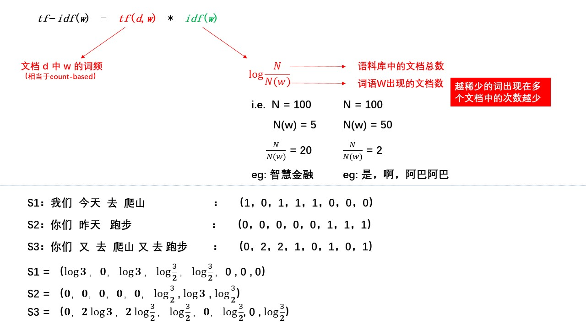
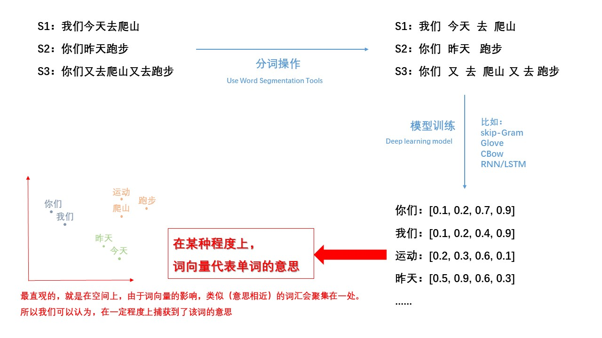
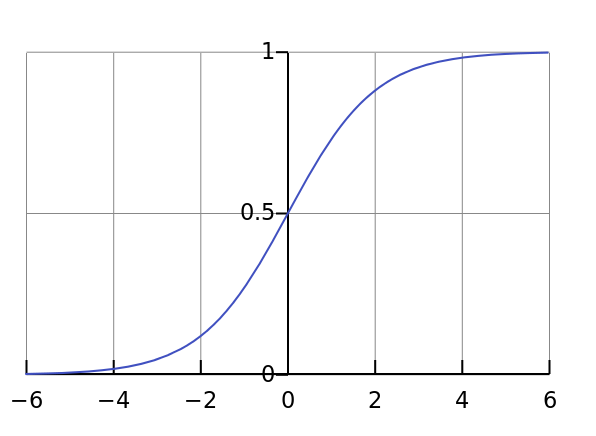

# Word2vec


Word2vec 是 Word Embedding 方式之一，属于 NLP 领域。它是将词转化为**「可计算」「结构化」**的向量的过程。

# **一、文本表示方法**
计算机不像人类，可以很好的理解文本（文字）的含义、意思。

但是计算机有很强大的计算能力，可以很快速地处理数值问题，所以，我们希望将文本转化成数值，来帮助计算机理解。

**文本表示的作用就是将这些非结构化的信息转化为结构化的信息。**


## **1、单词表示（word representation）**
### **（1）独热编码（one-hot representation）**
用0或1组成向量来表示。


## **2、句子表示（sentence representation）**
### **（1）****Boolean****-based representation**
用**0或1组成**向量来表示，**不考虑词频**。


### **（2）Count-based representation**
用**0或1组成**向量来表示，**考虑词频**。


### **（3）Tf-idf representation**
$$
tf-idf(w) = tf(d,w)*idf(w)
$$



## **3、文本相似度（text similarity）**
### **（1）欧氏距离（Euclidean distance）**
$$
d = |S_1-S_2|
$$

$$
S_1 = (x_1,x_2,x_3)    ; S_2 = (y_1,y_2,y_3)
$$

$$
d =\sqrt{(x_1-y_1)^2 + (x_2-y_2)^2 + (x_3-y_3)^2}
$$


### **（2）余弦相似度（Cosine similarity）**
$$
d =\frac {S_1·S_2}{|S_1|*|S_2|}
$$

$$
S_1 = (x_1,x_2,x_3)    ; S_2 = (y_1,y_2,y_3)
$$

$$
d =\frac{x_1y_1+x_2y_2+x_3y_3}{\sqrt{x_1^2 + x_2^2 + x_3^2} * \sqrt{y_1^2 + y_2^2 + y_3^2}}
$$


## **4、One-hot representation 缺点**
**事实上Boolean-based representation、Count-based representation、Tf-idf representation 属于 One-hot representation，是稀疏(sparsity)的表示方法。**

缺点也很明显:

* **不能表示语义的相似度**
* **向量过于稀疏，导致计算和存储的效率都不高**

举个例子：


利用上述的向量来计算

**欧氏距离**：均为$\sqrt{2}$ 

**余弦相似度**：均为 0

所以还是不足以去帮助计算机理解我们的语言含义。

因此，我们需要一个新的文本表示方法，即word embedding

## **5、word embedding **
词向量（Word embedding），又叫Word嵌入式自然语言处理（NLP）中的一组语言建模和特征学习技术的统称，其中来自词汇表的**单词或短语被映射到实数的向量**。

> Distributed Representation最早是Hinton于1986年提出的，可以克服One-Hot Representation的上述缺点。其基本想法是：通过训练将某种语言中的每一个词 **映射成一个固定长度的短向量（**当然这里的“短”是相对于One-Hot Representation的“长”而言的），所有这些向量构成一个词向量空间，而每一个向量则可视为 该空间中的一个点，在这个空间上引入“距离”，就可以根据词之间的距离来判断它们之间的语法、语义上的相似性了。Word2Vec中采用的就是这种Distributed Representation 的词向量。

> 为什么叫做 Distributed Representation？很多人问到这个问题。一个简单的解释是这样的：对于One-Hot Representation，向量中只有一个非零分量，非常 集中（有点孤注一掷的感觉）；而对于Distributed Representation，**向量中有大量非零分量，相对分散**（有点风险平摊的感觉），把词的信息分布到各个分量中去了。这一点，跟并行计算里的分布式并行很像。



word embedding 是文本表示的一类方法。跟 one-hot 编码和整数编码的目的一样，不过​他有更多的优点。

词嵌入并不特指某个具体的算法，跟上面2种方式相比，这种方法有几个明显的优势：

1. **他可以将文本通过一个低维向量来表达，不像 one-hot 那么长。**
2. **语意相似的词在向量空间上也会比较相近。**
3. **通用性很强，可以用在不同的任务中。**
> **mbedding 是处理稀疏特征的利器**。以推荐场景为例，One-hot 编码时，类别、ID 型特征非常多，大量使用 One-hot 编码会导致样本特征向量极度稀疏，而深度学习的结构特点又不利于稀疏特征向量的处理（反向传播时，特征过于稀疏时，每一个样本的学习只有极少数的权重会得到更新，梯度难以更新，模型不收敛），因此几乎所有深度学习推荐模型都会由 Embedding 层负责将稀疏高维特征向量转换成稠密低维特征向量。
> **Embedding 可以融合大量有价值信息**。 相比由原始信息直接处理得来的特征向量，本身就是极其重要的特征向量，Embedding 的表达能力更强。
**2 种主流的 word embedding 算法：**

* **Word2vec**
这是一种基于统计方法来获得词向量的方法，他是 2013 年由谷歌的 Mikolov 提出了一套新的词嵌入方法。
* **GloVe**
GloVe 是对 Word2vec 方法的扩展，它将全局统计和 Word2vec 的基于上下文的学习结合了起来。

# 二、预备知识
## **1、Sigmoid函数**
Sigmoid函数定义域在$[-\infty ，+\infty ]$，值域在$[0,1]$:

$$
\sigma(x) = \frac{1}{1+e^{(-x)}}
$$



其相关的导函数如下：

$$
\begin{align}
  &\sigma^{'}(x) = \sigma(x)[1-\sigma(x)]   \\\\
  &[log\space \sigma (x)]^{'}=1-\sigma(x) \\\\
&[log \space (1-\sigma(x) )] ^{'}= -\sigma(x) 
\end{align}
$$


## **2、Bayes公式**
贝叶斯公式是英国数学家贝叶斯（Thomas Bayes）提出来的，用来描述两个条件概率之间的关系。

若记$P(A)$，$P(B)$分别表示事件$A$和事件$B$发生的概率，

$P(A|B)$**表示事件**$B$**发生的情况下事件**$A$**发生的概率，**

$P(A,B)$**表示事件**$A$**,**$B$**同时发生的概率，**

则有

$$
P(A|B)=\frac{P(A，B)}{P(B)} ,\space \space P(B|A) = \frac{P(A，B)}{P(A)}
$$

利用上式子，进一步得出

$$
P(A|B) = \frac{P(B|A)}{P(B)}P(A)
$$

这就是**Bayes公式。**

## **3、Softmax**
Softmax从字面上来说，可以分成soft和max两个部分。max故名思议就是最大值的意思。

Softmax的核心在于soft，而soft有软的含义，与之相对的是hard硬。

很多场景中需要我们找出数组**所有元素中值最大的元素**，实质上都是求的**hardmax**。

**使用Numpy模块实现hardmax：**

```python
import numpy as np

a = np.array([1, 2, 3, 4, 5]) # 创建ndarray数组
a_max = np.max(a)
print(a_max) # 5
```
通过上面的例子可以看出**hardmax最大的特点就是只选出其中一个最大的值**，即非黑即白。

但是往往在实际中这种方式是不合情理的，比如对于文本分类来说，一篇文章或多或少包含着各种主题信息，我们更期望得到文章对于每个可能的文本类别的概率值（置信度），可以简单理解成属于对应类别的可信度。所以此时用到了soft的概念，**Softmax的含义就在于不再唯一的确定某一个最大值，而是为每个输出分类的结果都赋予一个概率值，表示属于每个类别的可能性。**

下面给出Softmax函数的定义（以第i个节点输出为例）

$$
Softmax(z_i) = \frac{e^{z_i}}{\sum_{c=1}^{C}e^{z_c}}
$$

**其中 **$z_i$**为第**$i$**个节点的输出值，**$C$**为输出节点的个数，即分类的类别个数。通过Softmax函数就可以将多分类的输出值转换为范围在**$[0, 1]$**和为1的概率分布。**

### **引入指数形式的优点**


上面是$y=e^x$函数图像，指数函数曲线呈现递增趋势，最重要的是斜率逐渐增大，也就是说在x轴上一个很小的变化，可以导致y轴上很大的变化。这种函数曲线能够将输出的数值拉开距离。

假设拥有三个输出节点的输出值为 $z_1,z_2,z_3$为$[2, 3, 5]$。

```python
import tensorflow as tf

print(tf.__version__) # 2.0.0
a = tf.constant([2, 3, 5], dtype = tf.float32)

b1 = a / tf.reduce_sum(a) # 不使用指数
print(b1) # tf.Tensor([0.2 0.3 0.5], shape=(3,), dtype=float32)

b2 = tf.nn.softmax(a) # 使用指数的Softmax
print(b2) # tf.Tensor([0.04201007 0.11419519 0.8437947 ], shape=(3,), dtype=float32)
```
结果还是挺明显的，经过**使用指数形式的Softmax函数能够将差距大的数值距离拉的更大。**

在深度学习中通常使用反向传播求解梯度进而使用梯度下降进行参数更新的过程，而**指数函数在求导的时候比较方便**。比如$(e^x)'=e^x$。

### **引入指数形式的缺点**
指数函数的曲线斜率逐渐增大虽然能够将输出值拉开距离，但是也带来了缺点，**当 **$z_i$** 值非常大的话，计算得到的数值也会变的非常大，数值可能会溢出。**

```python
import numpy as np

scores = np.array([123, 456, 789])
softmax = np.exp(scores) / np.sum(np.exp(scores))
print(softmax) # [ 0.  0. nan]
```
**当然针对数值溢出有其对应的优化方法，将每一个输出值减去输出值中最大的值。**

$$
D=max(z)
$$

$$
Softmax(z_i) = \frac{e^{z_i-D}}{\sum_{c=1}^{C}e^{z_c-D}}
$$

```python
import numpy as np

scores = np.array([123, 456, 789])
scores -= np.max(scores)
p = np.exp(scores) / np.sum(np.exp(scores))
print(p) # [5.75274406e-290 2.39848787e-145 1.00000000e+000]
```


# 三、**什么是 Word2vec**
**Word2vec 是 Word Embedding 的方法之一**。他是 2013 年由谷歌的 Mikolov 提出了一套新的词嵌入方法。

word2vec主要是基于这样的思想，在一个句子中，一个词的周围若干词和这个词有较强的相关性，而其他词相关性则较差，根据这样的思想，我们构建神经网络，来对当前词和其上下文词进行模型训练，最终得到词向量。其实，word2vec的本质上是构建一个语言模型，而词向量是其一个副产物。

**CBOW(Continuous Bag-of-Words Model)**和**Skip-gram (Continuous Skip-gram Model)**，是Word2vec 的两种训练模式。

**CBOW**

通过上下文来预测当前值。相当于一句话中扣掉一个词，让你猜这个词是什么。

> CBOW模型在数据量小的情况下效果更好一点


**Skip-gram**

用当前词来预测上下文。相当于给你一个词，让你猜前面和后面可能出现什么词。


## **1、CBOW模型流程举例**
假设 Corpus = { I drink coffee everyday } ，根据 “I”“drink”“everyday”来预测“coffee”。

经过分词，我们的词库为 **\[ I, drink,  coffee,  everyday \]**，由于我们这个模型是训练一个词到一个词的模型，所以，我们对单词进行两两分组，这里我们设置**windowsize=1**，得到的**\[ \[I, drink\], \[drink, I\], \[drink, coffee\], \[coffee, everyday\], \[coffee, drink\], \[everyday, coffee\] \]**。在最原始的word2vec模型中，我们将分组好的词汇分别输入到下面的模型中，进行训练。

* **输入层**

假设训练的时候，我们将\[drink, coffee\]输入到模型中，模型的 input layer 输入为 drink 的一个 one-hot representation，即\[0,1,0,0\]。输入层的节点个数即为词汇数量$V$，我们这里的$V$即为4。


* **输入层——>隐藏层**

输入层到隐藏层是一个$W$的$V∗h$维的向量，其中$h$为隐藏层节点个数，一般情况下，我们会把$W$的向量作为最终的词向量。

单个单词：


多个单词：


* **隐藏层——>输出层**

 隐藏层到输出层是一个$H∗v$的权值向量$W^{'}$，其中输出层节点个数也是$V$，即我们根据计算，得到每一个输出节点的权值。最终的输出需要经过softmax函数，将输出向量中的每一个元素归一化到0-1之间的概率，概率最大的，就是预测的词。


最终，通过大量的数据迭代，使用梯度下降或反向传播算法更新$W$和$W^{'}$，来最小化$loss$函数，训练结束后的$W$就是词向量的矩阵，任何一个单词的one-hot representation乘以这个矩阵$W$就可以得到其词向量的表示。

## **2、单个单词到单个单词的推导**


我们**假定：**

输入层为$X$，其维度为$V$，一般维词库的大小，也就是分词后一共有多少个单词，$x_i$表示第$i$个节点的输入值；

$W$为输入层到隐藏层的权值向量，$w_{ki}$表示第$k$个输入层节点到第$i$个隐藏层节点边的权值；

$h_i$为第$i$个隐藏层节点，$W^{′}$表示隐藏层到输出层的权值向量，$w_{ij}^{'}$表示隐藏层第$i$个节点到输出层第$j$个节点边的权值；

输出层同样是一个$V$维的向量，其中$y_j$表示输出层第$j$个节点。

我们接下来将分三步走，

**第一步：对前向流程建模**

$$
h = W^Tx = W^{T}_{k}
$$

$W$代表输入层到隐藏层权值向量，$x$表示输入的一个单词的one-hot representation，$h$表示隐藏层向量。

$$
u_j = \sum_{i=1}^{|H|}W^{'}_{ij}h_i
$$

该式子表示隐藏层到输出层（还没有经过Softmax），$u_j$表示输出层第$j$个节点的输出值。之后，我们对输出层进行softmax。

$$
P(w_j|w_I) = y_i = \frac{exp(u_j)}{\sum_{j^{'}=1}^{V}exp(u_{j^{'}})}
$$

式子中，$P(w_j|w_I)$表示，给定中心词$w_I$的情况下，出现上下文词$w_j$（$w_I$周围滑动窗口windowsize大小的词）的概率，$y_i$表示最终输出层第$i$个节点的输出值，$u_j$表示输出层第$j$个节点的输出值（还没有经过Softmax），其中$u_{j}^{'}$是属于词库中的词，但是不属于中心词上下文的词（不在中心词windowsize大小周围的词）,Softmax函数，可以理解为，通过$exp()$函数指数爆炸的特点，将数值进行拉伸（指数函数很小的$x$，就可以导致很大的$y$），然后除以一个数值，进行归一化，使得取值在\[0,1\]之间。

**第二步：构造损失函数**

接下来，我们就要构造损失函数，我们的目标是使得

$$
{argmax}  \space \space \space \space \prod_{w\in Text}^{}  \space  \prod_{c\in content(w)} P( \underset{content(上下文词)} {\underbrace{w_j}} \space  \space  | \space  \space  \underset{中心词}{\underbrace{w_I}} )
$$

也就是说，我们要最大化$max \space {y_{j^{*}}}$，这个$j^{*}$就是我们需要输出的那个单词，我们希望这个词的概率越大越好。

$$
max \space \space \space \space y_{j^{*}} \cong max \space \space \space log\space y_{j^{*}} \cong u_{j^*{}}-log\sum_{j^{'}=1}^{V}exp(u_{j^{'}}):=-E
$$

其中，“:=”表示“定义为”, “**≅”**是"约等于"。最后最大化$max{y_{j^∗}}$转化为了最小化E。

**第三步：反向传播对权值进行更新**

所以最后我们其实就是在最大化释然函数。为什么说计算上面的释然函数很复杂呢？大家可以看到对数里面的求和项，其实需要对所有单词进行一次遍历，也就是说如果我们词库有1万个单词，那么每一步迭代就需要计算一万次，如果词库有一百万，一千万甚至是上亿的单词量呢？可想而知道，这个计算量是相当当大的。所以有一系列的方法来逼近这个计算，后面我们也会介绍hierarchical softmax和negative sampling的方法，他们是为解决这个计算效率问题的。


## **3、Skip-gram Model **
**在Skip-gram模型中，Word2vec旨在通过中心词来最大化背景词出现的联合概率分布，并以此对中心词和背景词进行有效的嵌入表示。**

假设我们有这样的一个文本：**Text  = We are working on NLP, it is interesting.**

我们设置 $Windowsize = 2$

当给定中心词 $w$为 **We**，则我们希望:

$$
P(are|We) \bullet P(working|We)
$$

这个概率越大越好。

当给定中心词 $w$为** are**，则我们希望:

$$
P(We|are) \bullet P(working|are) \bullet P(on|are)
$$

这个概率越大越好。

当给定中心词 $w$为 **working**，则我们希望:

$$
P(We|working) \bullet P(are|working) \bullet P(on|working)  \bullet P(NLP|working)
$$

这个概率越大越好。

当给定中心词 $w$为 **on**，则我们希望:

$$
P(are|on) \bullet P(working|on) \bullet P(NLP|on)  \bullet P(it|on)
$$

这个概率越大越好。

...

以此类推。

那么其实，我们的目标就是：

$$
\begin{align}
Maximize \space\space\space\space  & P(are|We) \bullet P(working|We) \\ & \bullet P(We|are) \bullet  P(working|are) \bullet P(on|are)\\ & \bullet P(We|working) \bullet P(are|working) \bullet P(on|working)  \bullet P(NLP|working)
 \\ & \bullet P(are|on) \bullet P(working|on) \bullet P(NLP|on)  \bullet P(it|on) ...
  &
\end{align}
$$

归纳下，我们可以写成：

$$
\underset{\theta}{argmax}  \space \space \space \space \prod_{w\in Text}^{}  \space  \prod_{c\in content(w)} P( \underset{content(上下文词)} {\underbrace{c}} \space  \space  | \space  \space  \underset{中心词}{\underbrace{w}}  ;\theta )
$$

取对数$log$，得：

$$
\underset{\theta}{argmax}  \space \space \space \space \sum_{w\in Text}  \space \space  \sum_{c\in content(w)}  \space \space log P(c|w;\theta)
$$

其中，$\theta = [U,V]$


$$
P(c|w;\theta) = \frac{e^{U_{c}\bullet V_w}}{\sum_{c'\in{词库}}^{}e^{U_{c'}\bullet V_w}}
$$

上述公式满足下面条件：

$$
\begin{cases}
0<P<1
 \\
\\
\sum_{c'}P=1
\end{cases}
$$

其中$c'$是属于**Text**词库中的词，但是不属于中心词上下文的词（不在中心词Windowsize大小周围的词）。$w$是中心词。

将上面两个式子合并并化简：

$$
\begin{cases}
\underset{\theta}{argmax}  \space \space \space \space \sum_{w\in Text}  \space \space  \sum_{c\in content(w)}  \space \space log P(c|w;\theta)
 \\
\\
P(c|w;\theta) = \frac{e^{U_{c}\bullet V_w}}{\sum_{c'\in{词库}}^{}e^{U_{c'}\bullet V_w}}
\end{cases}
$$

得

$$
\begin{matrix}
\underset{\theta}{argmax}  \space \space \space \space \sum_{w\in Text}  \space \space  \sum_{c\in content(w)}  \space \space log \space \frac{e^{U_{c}\bullet V_w}}{\sum_{c'\in{词库}}^{}e^{U_{c'}\bullet V_w}}
 \\
 \\
\Downarrow 
\\
\\
\underset{\theta}{argmax}  \space \space \space \space \sum_{w\in Text}  \space \space  \sum_{c\in content(w)}  \space \space [\space \space U_c\bullet V_w - log \sum_{c'\in{词库}}^{}e^{U_{c'}\bullet V_w} \space \space ]

\end{matrix}
$$


因此，我们换一种形式。

之前的假设是这样的：

**Text  = We are working on NLP, it is interesting.**

$$
\begin{align}
Maximize \space\space\space\space  & P(are|We) \bullet P(working|We) \\ & \bullet P(We|are) \bullet  P(working|are) \bullet P(on|are)\\ & \bullet P(We|working) \bullet P(are|working) \bullet P(on|working)  \bullet P(NLP|working)
 \\ & \bullet P(are|on) \bullet P(working|on) \bullet P(NLP|on)  \bullet P(it|on) ...
  &
\end{align}
$$

转成

$$
\begin{align}
 P(D=1|w, c)&  \space  \space  \space \space 表示w和c作为上下文单词出现的概率
\\
\\
  P(D=0|w,\tilde{c} )& \space  \space  \space \space  表示w和\tilde{c}不是作为上下文单词出现的概率
\end{align}
$$

比如：

Windowsize=2

作为上下文单词出现的概率：$P(D=1|We,are)、P(D=1|working,are)...$

不作为上下文单词出现的概率：$P(D=1|We,it)、P(D=1|working,interesting)...$

由此，我们可以写成这种形式：

$$
P(D=1|w_i,w_j;\theta) = \frac{1}{1+e^{(-U_{w_i}\bullet V_{w_j} )}}
$$

**Negative Sampling**

$$
\begin{align}
\underset{\theta }{argmax }& \space \space \space \space \prod_{(w,c)\in D}^{}P(D=1|w;c;\theta ) \prod_{(w,c)\in\tilde{D}}P(D=0|w;c;\theta)
\\
\\
= \underset{\theta }{argmax }& \space \space \space \space \prod_{(w,c)\in D}^{} \frac{1}{1+e^{-U_c\bullet V_w}} \prod_{(w,c)\in\tilde{D}}[1-\frac{1}{1+e^{-U_c\bullet V_w}}]
\\
\\
= \underset{\theta }{argmax }& \space \space \space \space \sum_{(w,c)\in D}^{}log \space \sigma(U_c\bullet V_w) +{\color{Red} \sum_{(w,c)\in \tilde{D}}} log \space \sigma(-U_{c'}\bullet V_w)  
\\
\\
\approx \underset{\theta }{argmax }& \space \space \space \space \sum_{(w,c)\in D}^{} [\space   \space \underset{{\color{red} (w,c)正样本} }{\underbrace{log \space \sigma(U_c\bullet V_w)}}   + \underset{{\color{Red} (w,c')负样本} }{\underbrace{\sum_{c'\in N(w)} }}  log  \space \sigma(-U_{c'}\bullet V_w)    \space \space ]

\end{align}
$$

**SG with Negative Sampling**

$$
\underset{\theta }{argmax } \space \space \space \space \sum_{(w,c)\in D}^{} [ \space log \space \sigma(U_c\bullet V_w) +{\sum_{c'\in N(w)}} log \space \sigma(-U_{c'}\bullet V_w) \space]
$$

$$
\underset{\theta }{argmax } \space \space \space \space \sum_{(w,c)\in D}^{} [\underset{l(\theta)}{\underbrace{ \space log \space \sigma(U_c\bullet V_w) +{\sum_{c'\in N(w)}} log \space \sigma(-U_{c'}\bullet V_w) \space}] }
$$

$$
\begin{align}
\frac{\partial l(\theta )}{\partial U_c}  =& \frac{\sigma (U_c\bullet V_w)[1-\sigma (U_c\bullet V_w)]\bullet V_w}{\sigma (U_c\bullet V_w)} = [1-\sigma (U_{c}\bullet V_w)]\bullet V_w
\\
\\
\frac{\partial l(\theta )}{\partial U_{c'}}  =& \frac{\sigma (-U_{c'}\bullet V_w)[1-\sigma (-U_{c'}\bullet  V_w)]\bullet (-V_w)}{\sigma (-U_{c'}\bullet V_w)} = [\sigma (-U_{c'}\bullet V_w)-1]\bullet V_w
\\
\\
\frac{\partial l(\theta )}{\partial V_w}  =& \frac{\sigma (U_c\bullet V_w)[1-\sigma (U_c\bullet V_w)]\bullet U_c}{\sigma (U_c\bullet V_w)} + \sum_{c'\in N(w)} \frac{\sigma (-U_{c'}\bullet V_{w})[1-\sigma(-U_{c'}\bullet V_w)]\bullet (-U_{c'})}{\sigma(-U_{c'}\bullet V_w)}
\\
\\
=& [1-\sigma (U_{c}\bullet V_w)]\bullet U_c + \sum_{{c'}\in N(w) }[\sigma(-U_{c'}\bullet V_w)-1] \bullet U_{c'} u

\end{align}
$$


$$
\begin{align}
for \space \space each  \space \space  &(\underset{中心词}{\underbrace{w{} }}  ,\underset{上下文}{\underbrace{c{} }}) \in D \Leftarrow 正样本集合 
\\
\\
N(w) \space :& \space 针对中心词w，采样负样本:
\\
\\

&U_c \gets U_c + \eta \bullet \frac{\partial l(\theta)}{\partial U_c} 

\\
\\
&U_{c'} \gets U_{c'} + \eta \bullet \frac{\partial l(\theta)}{\partial U_{c'}}   \space \space {c'}\in N(w)

\\
\\
&V_w \gets V_w + \eta \bullet \frac{\partial l(\theta)}{\partial V_w} 


\end{align}
$$


# **四、基于Hierarchical Softmax的CBOW和Skip-gram模型**


基于神经网络的语言模型的目标函数通常取为如下**对数似然函数**

$$
L=\sum_{w\in C}{}log \space \space P\space (\space  \space w|Context(w) \space \space)
$$

其中

$$
P\space (\space  \space w|Context(w) \space \space) = \frac{exp{(y_{w,i_w})}}{\sum_{i=1}^{N}exp(y_{w,i})}
$$

式子中，$i_w$表示词$w$在词库$D$中的索引。

对于Word2vec中基于Hierarchical Softmax的**CBOW模型**，优化的目标函数：

$$
L=\sum_{w\in C}{}log \space \space P\space (\space  \space w|Context(w) \space \space)
$$

而对于Word2vec中基于Hierarchical Softmax的**Skip-gram模型**，优化的目标函数：

$$
L=\sum_{w\in C}{}log \space \space P\space (\space  \space Context(w) | w\space \space)
$$

## **1、CBOW模型**
### **网络结构**
**CBOW模型网络结构包括三层：输入层、投影层和输出层**

下面以样本$(Context(w),w)$为例，其中$w$为中心词，$Context(x)$为中心的$w$的上下文词，由$w$前后各$c$个词构成（$c$也是windowsize的大小）


**输入层（Input Layer）：**

包含$Context(w)$中$2c$个词的词向量$V(Context(w)_1),V(Context(w)2),V(Context(w)3),...V(Context(w)_{2c})\in R^m$，其中$m$表示词向量的长度，也就是词库里一共多少个单词，因为这是one-hot representation。

**投影层（Projection Layer）:**

将输出层的$2c$个向量做求和累加，即$X_w = \sum_{i=1}^{2c}V(Context(w)_i) \in R^m$。

**输出层（Output Layer）：**

输出层对应一棵二叉树，它是以语料中出现过得词作为叶子结点，以各词在语料中出现的次数当做权值构建出来的Huffman树。叶子结点一共$N = |D|$个，分别对应词库$D$中的词，非叶子结点的个数为$N-1$个（图中黄色标记的结点）

### **梯度计算**
Hierarchical Softmax是Word2vec中用于提高性能的一项关键技术。

先引入若干相关记号，Huffman树中的某个叶子结点，假设它对应词库$D$中的词$w$，记

**1.**$p^w$**：从根结点出发到达**$w$**对应叶子结点的路径。**

**2.**$l^w$**：路径**$p^w$**中包含结点的个数。**

**3.**$p_{1}^{w},p_{2}^{w},p_{3}^{w}...p_{l^w}^{w}$**：路径**$p^w$**中的**$l^w$**个结点，其中**$p_{1}^{w}$**表示根结点，**$p_{l^w}^{w}$**表示词**$w$**对应的结点。**

**4.**$d_{2}^{w},d_{3}^{w},d_{4}^{w}...d_{l^w}^{w}\in{\{0,1\}}$**:词**$w$**的Huffman编码，它由**$l^w-1$**位编码构成，**$d^{w}_{j}$**表示路径**$p^w$**中第**$j$**个结点对应的编码（根结点不对应编码）。**

**5.**$\theta_{1}^{w},\theta_{2}^{w},\theta_{3}^{w}...\theta_{l^w-1}^{w} \in R^m$**：路径**$p^w$**中非叶子结点对应的向量，**$\theta^{w}_{j}$**表示路径**$p^w$**中第**$j$**个非叶子结点对应的向量。**

下图中由4条红色边串起来的5个结点就构成路径$p^w$，其长度$l^w$=5。$p_{1}^{w},p_{2}^{w},p_{3}^{w},p_{4}^{w},p_{5}^{w}$为路径$p^w$上的5个结点，其中$p^{w}_{1}$对应根结点。$d_{2}^{w},d_{3}^{w},d_{4}^{w},d_{5}^{w}$分别为1、0、0、1，即“足球”的Huffman编码为1001，此外，$\theta_{1}^{w},\theta_{2}^{w},\theta_{3}^{w},\theta_{4}^{w}$分别表示路径$p^w$上4个非叶子结点对应的向量。


如何定义条件概率函数$P\space (\space  \space w|Context(w) \space \space)$?

以上图$w$="足球"为例，从根结点出发到达“足球”这个叶子结点，**中间共经历了4次分支（每条红色的边对应一次分支），而每一次分支都可视为进行了一次 二分类。**

我们**定义编码为1的是负类，编码为0定义为正类，即讲一个结点进行分类时，分到左边就是负类，分到右边就是正类**（word2vec源码选用该种方式）

$$
Label(p_{i}^{w}) = 1-d_{i}^{w}, \space \space \space i = 2,3,...,l^w
$$

根据逻辑回归的知识，我们知道，一个结点被分为正类（这里是1表示）的概率是

$$
\sigma (x^T_{w}\theta) = \frac{1}{1+e^{-x^{T}_{w}\theta}}
$$

被分为负类（这里是0表示）的概率当然就是

$$
1-\sigma (x^T_{w}\theta)
$$

其中，$\theta$是待定参数，在非叶子结点对应的那些向量$\theta_{i}^{w}$就可以扮演参数$\theta$的角色。

对于从根结点出发到达“足球”这个叶子结点所经历的4次二分类，将每次

分类结果的概率写出来就是：

1.第一次：$P(d_{2}^{w}|X_w,\theta_{1}^{w}) = 1- \sigma(X^T_{w}\theta^w_1)$

2.第二次：$P(d_{3}^{w}|X_w,\theta_{2}^{w}) =\sigma(X^T_{w}\theta^w_2)$

3.第三次：$P(d_{4}^{w}|X_w,\theta_{3}^{w}) =\sigma(X^T_{w}\theta^w_3)$

4.第四次：$P(d_{5}^{w}|X_w,\theta_{4}^{w}) = 1- \sigma(X^T_{w}\theta^w_4)$

因此，我们对于有

$$
P(足球\space |\space Context(足球)) =\prod_{j=2}^{5}P(d^w_j|X_w,\theta_{j-1}^{w} )
$$

至此，通过$w$=“足球”的小例子，Hierarchical Softmax的基本思想就介绍完了。

小结一下：**对于词库**$D$**中的任意词**$w$**，Huffman树中必然存在一条从根结点到词**$w$**对应结点的路径**$P^w$**(且这条路径是唯一的)，路径**$P^w$**上存在**$l^w-1$**个分支，将每一个分支看做一次二分类，每一次分类就产生一个概率，将这些概率乘起来，就是所需的**$P\space (\space  \space w|Context(w) \space \space)$**。**

因此，条件概率$P\space (\space  \space w|Context(w) \space \space)$的一般公式可以写为：

$$
P\space (\space  \space w|Context(w) \space \space) =\prod_{j=2}^{l^w}P(d^w_j|X_w,\theta_{j-1}^{w} )
$$

其中

$$
P(d^w_j|X_w,\theta_{j-1}^{w} ) = \begin{cases}
  &\sigma(X^T_w\theta_{j-1}^w) \space \space \space \space  &\text{ if } \space \space \space d^w_j=0  
\\\\
  &1-\sigma(X^T_w\theta_{j-1}^w) \space \space \space \space  &\text{ if } \space \space \space d^w_j=1  
\end{cases}
$$

整合成一个表达式

$$
P(d^w_j | X^w,\theta^w_{j-1}) = [\sigma(X^T_w\theta_{j-1}^w) ]^{1-d^w_j} \bullet [1-\sigma(X^T_w\theta_{j-1}^w) ]^{d_j^w}
$$

又由于，对于Word2vec中基于Hierarchical Softmax的**CBOW模型**，优化的目标函数：

$$
L=\sum_{w\in C}{}log \space \space P\space (\space  \space w|Context(w) \space \space)
$$

上面两个式子结合，得**对数似然函数**：

$$
\begin{align}
L =& \sum_{w\in C}^{}log \prod_{j=2}^{l^w}{\space \space  [ \space \space  [\sigma(X^T_w\theta_{j-1}^w) ]^{1-d^w_j} \bullet [1-\sigma(X^T_w\theta_{j-1}^w) ]^{d_j^w}  \space \space ]   \space \space}
\\\\
=& \sum_{w\in C}{}\sum_{j=2}^{l^w} {\space \space  [ \space \space \underset{L(w,j)}{ \underbrace{(1-d^w_j)\bullet log [\sigma(X^T_w\theta_{j-1}^w) ] +  d_j^w \bullet log [1-\sigma(X^T_w\theta_{j-1}^w) ]   } \space \space ] }  \space \space}

\end{align}
$$

因此，CBOW模型的目标函数为

$$
L(w,j) = (1-d^w_j)\bullet log [\sigma(X^T_w\theta_{j-1}^w) ] +  d_j^w \bullet log [1-\sigma(X^T_w\theta_{j-1}^w) ]
$$

接下来讨论如何将这个函数最大化，word2vec采用的是**随机梯度上升法**

公式求导：

$$
\begin{align}
\frac{\partial L(w,j)}{\partial \theta ^w_{j-1}} &= \frac{\partial }{\partial \theta ^w_{j-1}} [\space \space  (1-d^w_j)\bullet log [\sigma(X^T_w\theta_{j-1}^w) ] +  d_j^w \bullet log [1-\sigma(X^T_w\theta_{j-1}^w) ] \space \space ]
\\\\
由于  \space \space  &[log\space \sigma (x)]^{'}=1-\sigma(x) ，[log \space (1-\sigma(x) )] ^{'}= -\sigma(x) 
\\\\
&= (1-d^w_j)\bullet [1-\sigma(X^T_w\theta_{j-1}^w) ]\bullet X_w -  d_j^w \bullet \sigma(X^T_w\theta_{j-1}^w)\bullet X_w
\\\\
&= \space \space [\space \space (1-d^w_j)\bullet [1-\sigma(X^T_w\theta_{j-1}^w) ]-  d_j^w \bullet \sigma(X^T_w\theta_{j-1}^w)\space \space ]\space \space \bullet X_w
\\\\
&= \space \space [\space \space 1-d^w_j-\sigma(X^T_w\theta_{j-1}^w)] \bullet X_w
\\\\
\frac{\partial L(w,j)}{\partial X_w} &= \space \space  [1-d_j^w-\sigma (X_w^T\theta^w_{j-1})]\theta ^w_{j-1}
\end{align}
$$

于是，$\theta_{j-1}^{w}$的更新公式为：

$$
\begin{align}

e &:= e+ \eta[1-d_j^w-\sigma (X_w^T\theta^w_{j-1})]\bullet \theta_{j-1}^{w}
\\\\

\theta_{j-1}^{w} &:= \theta_{j-1}^{w} +\eta [\space \space 1-d^w_j-\sigma(X^T_w\theta_{j-1}^w)] \bullet X_w

\end{align}
$$

其中，$\eta$表示学习率。我们的最终目的是要求词库$D$中每个词的词向量，而这里的$X_w$表示的是$Context(w)$中各词词向量的累加，那么，如何利用$\frac{\partial L(w,j)}{\partial X_w}$来对$V(\tilde{w})$，$\tilde{w} \in Context(w)$进行更新呢？word2vec的做法很简单，直接取：

$$
V(\tilde{w} ) := V(\tilde{w} )+ \eta \sum_{j=2}^{l^w} \frac{\partial L(w,j)}{\partial X_w}, \space \space \tilde{w} \in Context(w)
$$

即把$\sum_{j=2}^{l^w} \frac{\partial L(w,j)}{\partial X_w}$贡献到$Context(w)$中的每一个词的词向量上，这个好理解，既然$X_w$本身就是$Context(w)$中各词词向量的累加，求完梯度后当然应该将其贡献到每个分量上去。

下面以样本$(Context(w),w)$为例，给出CBOW模型中采用随机梯度上升法更新各参数的伪代码：

$$
\begin{align}
  1.& e=0. \\
  2.& X_w = \sum_{u\in Context(w)}^{} V(u)  \\
3.&FOR \space  \space \space  \space j=2 : l^w    \space \space \space \space  DO
  \\
\{&\\
 &3.1\space \space q=\sigma(X_{w}^{T}\theta_{j-1}^{w} ) \\
&3.2\space \space g=\eta(1-d_{j}^{w}-q)\\ 
&3.2\space \space e:=e+g\theta_{j-1}^{w}  \\ 
&3.2\space \space \theta_{j-1}^{w} := \theta^{w}_{j-1} + gX_w \\ 
\}&
\\
4.&FOR \space  \space \space  \space u \in Context(w) \space  \space \space  \space DO \\
\{
\\
&V(u):=V(u)+e
\\


\}

\end{align}
$$

> 注意：3.3和3.4不能交换次序，即$\theta^w_{j-1}$应该等贡献到$e$后再做更新。word2vec源码中$syn0$对应$V(u)$，$syn1$对应$\theta^w_{j-1}$，$neu1$对应$X_w$，$neu1e$对应$e$。


## **2、Skip-gram模型**
### **网络结构**
Skip-gram模型由于推导过程和CBOW大同小异，因此会沿用CBOW中的记号。

**CBOW模型网络结构包括三层：输入层、投影层和输出层**

下面以样本$(w,Context(w))$为例，其中$w$为中心词，$Context(x)$为中心的$w$的上下文词，由$w$前后各$c$个词构成（$c$也是windowsize的大小）


**输入层（Input Layer）：**

只含当前样本的中心词$w$的词向量$V(w)\in R^m$。

**投影层（Projection Layer）:**

这是个恒等投影，把$V(w)$投影到$V(w)$，因此，这个投影其实是多余的，这里之所以保留是为了方便和CBOW模型的网络结构做对比。

**输出层（Output Layer）：**

这里和CBOW一样，输出层也是一颗Huffman树。输出层对应一棵二叉树，它是以语料中出现过得词作为叶子结点，以各词在语料中出现的次数当做权值构建出来的Huffman树。叶子结点一共$N = |D|$个，分别对应词库$D$中的词，非叶子结点的个数为$N-1$个（图中黄色标记的结点）。

### **梯度计算**
对于Skip-gram模型，已知的是当前词$w$，需要对其上下文$Context(w)$中的词进行预测，因此目标函数如下

$$
P\space (\space  \space Context(w) | w\space \space) = \prod_{u\in Context(w) | w }p(u|w)
$$

其中

$$
P(u|w) = \prod_{j=2}^{l^u}p(d_j^u | V(w),\theta_{j-1}^{u})
$$

$$
p(d_j^u | V(w),\theta_{j-1}^{u}) =[\sigma(V(w)^T\theta_{j-1}^u) ]^{1-d^u_j} \bullet [1-\sigma(V(w)^T\theta_{j-1}^u) ]^{d_j^u}
$$

将上面的式子带入，简化，可以得到对数似然函数如下

$$
\begin{align}

L =& \sum_{w\in C} log \prod_{u\in Context(w)} \prod_{j=2}^{l^u} \space \space [\space \space 
[\sigma(V(w)^T \theta_{j-1}^{u} )]^{1-d_j^u} \bullet [1-\sigma(V(w)^T \theta_{j-1}^{u} )]^{d_{j}^{u}} \space \space]
\\\\
=& \sum_{w\in C} \sum_{Context(w)} \sum_{j=2}^{l^u}  \space \space [\space \space 
\underset{L(w,u,j)}{\underbrace{(1-d_j^u)\bullet log[\sigma(V(w)^T \theta_{j-1}^{u} )]  +d_{j}^{u}\bullet log  [1-\sigma(V(w)^T \theta_{j-1}^{u} )] }}  \space \space]


\end{align}
$$

接下来就是求导

$$
\begin{align}
\frac{\partial L(w,u,j)}{\partial \theta ^u_{j-1}} &= \frac{\partial }{\partial \theta ^u_{j-1}} [\space \space  (1-d^u_j)\bullet log [\sigma(V(w)^T\theta_{j-1}^u) ] +  d_j^u \bullet log [1-\sigma(V(w)^T\theta_{j-1}^u) ] \space \space ]
\\\\
由于  \space \space  &[log\space \sigma (x)]^{'}=1-\sigma(x) ，[log \space (1-\sigma(x) )] ^{'}= -\sigma(x) 
\\\\
&= \space \space  (1-d^u_j)\bullet [1-\sigma(V(w)^T\theta_{j-1}^u) ]\bullet V(w) -  d_j^u \bullet \sigma(V(w)^T\theta_{j-1}^u)\bullet V(w)
\\\\
&= \space \space [\space \space (1-d^u_j)\bullet [1-\sigma(V(w)^T\theta_{j-1}^u) ]-  d_j^u \bullet \sigma(V(w)^T\theta_{j-1}^u)\space \space ]\space \space \bullet V(w)
\\\\
&= \space \space [\space \space 1-d^u_j-\sigma(V(w)^T\theta_{j-1}^u)] \bullet V(w)
\\\\
\frac{\partial L(w,u,j)}{\partial V(w)} &= \space \space  [1-d_j^u-\sigma (V(w)^T\theta^u_{j-1})]\theta ^u_{j-1}
\end{align}
$$

于是，$\theta_{j-1}^{u}$的更新公式为：

$$
\begin{align}


\theta_{j-1}^{u} &:= \theta_{j-1}^{u} +\eta [\space \space 1-d^u_j-\sigma(V(w)^T\theta_{j-1}^u)] \bullet V(w) \\\\
V(w) &:= V(w)+ \eta\sum_{u\in Context(w)}\sum_{j=2}^{l^u} \frac{\partial L(w,u,j)}{\partial V(w)}

\end{align}
$$

下面以样本$(w,Context(w))$为例，给出Skip-gram模型中采用随机梯度上升法更新各参数的伪代码：

$$
\begin{align}
 e=0  & \\
FOR& \space  \space \space  \space  u\in Context(w)    \space \space \space \space  DO
  \\
\{\\
&FOR \space  \space \space  \space j=2:l^u \space  \space \space  \space DO \\
\{
\\
&1.\space \space q=\sigma(V(w)^{T}\theta_{j-1}^{u} ) \\
&2.\space \space g=\eta(1-d_{j}^{u}-q)\\ 
&3.\space \space e:=e+g\theta_{j-1}^{u}  \\ 
&4.\space \space \theta_{j-1}^{u} := \theta^{u}_{j-1} + gV(w) \\ 
\}\\
\}&
\\
V(w) &:= V(w)+e
\end{align}
$$

但是在word2vec源码中，并不是等$Context(w)$中所有词都处理完后才刷新$V(w)$，而是，每处理完$Context(w)$中的一个词$u$，就及时刷新一次$V(w)$，具体为

$$
\begin{align}
 e=0  & \\
FOR& \space  \space \space  \space  u\in Context(w)    \space \space \space \space  DO
  \\
\{\\
&FOR \space  \space \space  \space j=2:l^u \space  \space \space  \space DO \\
\{
\\
&1.\space \space q=\sigma(V(w)^{T}\theta_{j-1}^{u} ) \\
&2.\space \space g=\eta(1-d_{j}^{u}-q)\\ 
&3.\space \space e:=e+g\theta_{j-1}^{u}  \\ 
&4.\space \space \theta_{j-1}^{u} := \theta^{u}_{j-1} + gV(w) \\ 
\}\\
&V(w) := V(w)+e
\\
\}&
\\

\end{align}
$$


> 注意：3和4不能交换次序，即$\theta^w_{j-1}$应该等贡献到$e$后再做更新。word2vec源码中$syn0$对应$V(.)$，$syn1$对应$\theta^u_{j-1}$，$neu1e$对应$e$。

# **五、基于Negative Sampling的CBOW和Skip-gram模型**
Negative Sampling（简称为NEG），是NCE（Noise Contrastive Estimation）的一个简化版本，目的是用来提**高训练速度**并**改善所得向量的质量**，与Hierarchical Softmax相比，NEG不再使用复杂的Huffman树，而是利用相对简单的**随机负采样**，能大幅提高性能，因而可作为Hierarchical Softmax的一种替代。

> NCE的细节有点复杂，其本质就是利用已知的概率密度函数来估计未知的概率密度函数，简单来说，假设未知的概率密度函数为X，已知的概率密度函数为Y，如果得到了X和Y的关系，那么X也就可以求出来了。

## **1、CBOW模型**
在CBOW模型中，已知词$w$的上下文$Context(w)$，需要预测$w$，因此，对于给定的$Context(x)$，词$w$就是一个**正样本**，其他词就是**负样本**了。

[https://www.cnblogs.com/peghoty/p/3857839.html](https://www.cnblogs.com/peghoty/p/3857839.html)


优点：

* 运行速度还是较快的，尤其是用了HS和NS之后。
* 得到的词向量可以比较好的表示word-level之间的相关性。

缺点：

* 没有考虑单词顺序之间的关系。比如"我 爱 你"和"你 爱 我"学到的词向量表示是一样的，但是其实这两者不太一样。(这块的解决办法就是加入n-gram特征，详见fasttex)
* 单词无法消岐。比如"苹果"这个词，既可以表示吃的苹果，也可以表示苹果手机。


word2vec 关注的并不是神经网络模型本身，而是训练之后得到的词汇的向量化表征。这种表征使得最后的词向量维度要远远小于词汇表大小，**所以 word2vec 从本质上来说是一种降维操作**


# **面试**
## **1、与n-gram模型相比，神经概率语言模型有什么优势？**
答：

**（1）词语之间的相似性可以通过词向量来体现。**

举个例子，假设 $S_1$="A dog is running in the room" 出现了10000次，而$S_2$=“A cat is running in the room”出现了1次。按照n-gram模型的做法，$P(S_1)$肯定要远大于$P(S_2)$。注意，$S1、S_2$的唯一区别就是dog 和 cat，而这两个词无论是句法还是语义

然而，由神经概率语言模型算的$P(S_1)$和$P(S_2)$是大致相等。原因在于：a.在神经概率语言模型中假定了“相似的”的词对应的词向量也是相似的；b.概率函数关于词向量是光滑的，即词向量中的一个小变化对概率的影响也是一个小变化，这样一来，对于下面这些句子：

A dog is running in the room

A cat is running in the room

The cat is running in a room

A dog is walking in thebedroom

The dog was walking in the room

...

只要在语料中出现一个，其他句子的概率也会相应地增大。

**（2）基于词向量的模型自带平滑功能，不再需要像n-gram那样进行额外处理了。**


参考

[https://ronxin.github.io/wevi/](https://ronxin.github.io/wevi/) 【动图】

[https://www.cnblogs.com/peghoty/p/3857839.html](https://www.cnblogs.com/peghoty/p/3857839.html)

\[1\][词嵌入 | Word embedding](https://easyai.tech/ai-definition/word-embedding/)

\[2\][谈谈Word2Vec的CBOW模型](https://blog.csdn.net/github_36235341/article/details/78607323)

\[3\][词向量模型word2vector详解](https://www.cnblogs.com/stephen-goodboy/articles/12574738.html)

\[4\][反向传播算法详解(手算详解传播过程)](https://zhuanlan.zhihu.com/p/464268270)

\[1\]Tomas Mikolov.(2013). Distributed Representations of Words and Phrases and their Compositionality.
\[2\]Tomas Mikolov.(2013). Efficient Estimation of Word Representations in Vector Space.
\[3\]Xin Rong.(2014). word2vec Parameter Learning Explained.