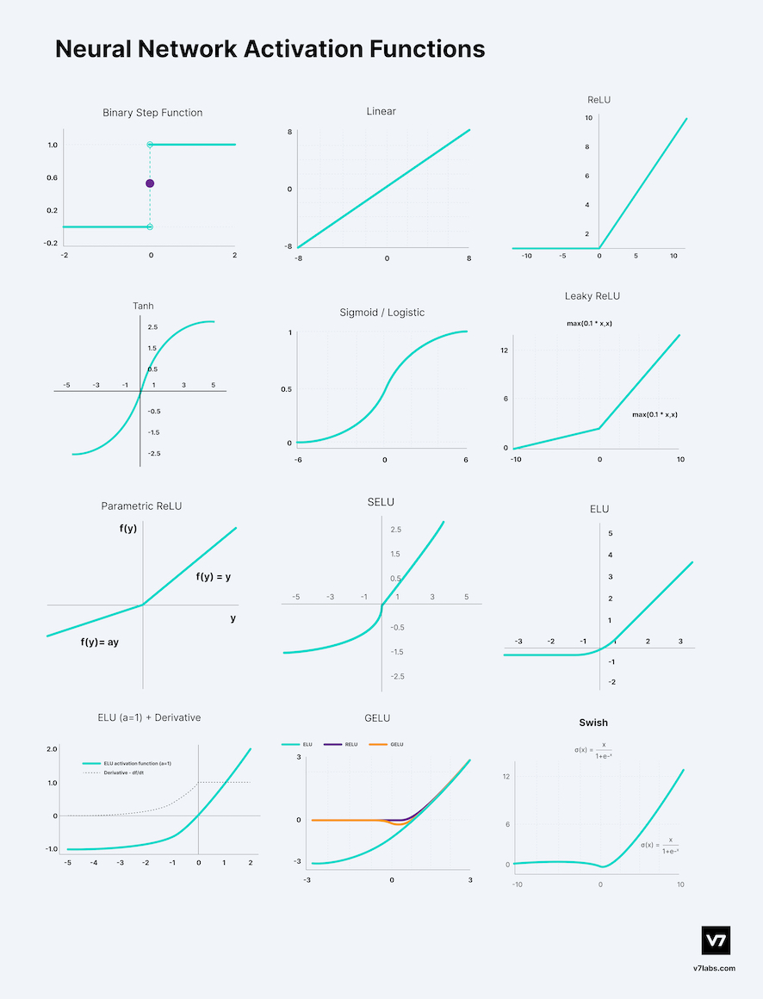
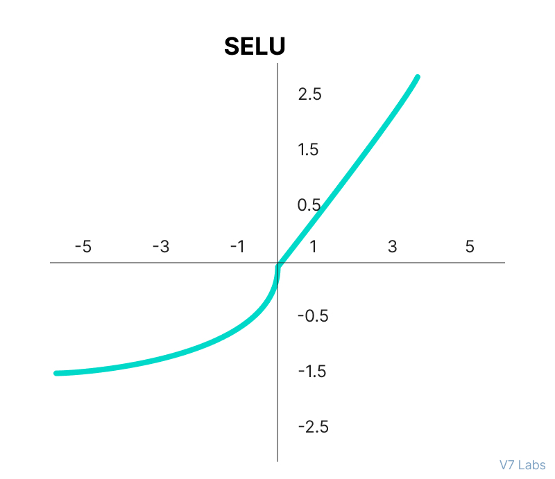

# 常见激活函数

本文所有图像来自[Activation Functions in Neural Networks (v7labs.com)](https://www.v7labs.com/blog/neural-networks-activation-functions)， 建议阅读原文。

## 1. Sigmoid/Logistic
表达式:
$$
f(x) = \frac{1}{1+e^{-x}} 
$$

图像：

特点：(TODO)

## 2、tanh

表达式：
$$
tanh(x) =\frac{e^x-e^{-x}}{e^x+e^{-x}}= \frac{1-e^{-2x}}{1+e^{-2x}}
$$
图像：

## 3、ReLU

表达式：
$$
f(x) = \max(0,x)
$$
图像：

## 4、Leaky ReLU

表达式：
$$
f(x) = \max(0.1*x, x)
$$
图像：

## 5、Parametric ReLU

表达式：
$$
f(x) = \max(ax, x)
$$
图像：

## 6、Exponential Linear Units (ELUs)

表达式：
$$
f(x) = \left\{  \begin{array}{} x & for \  x \ge 0 \\ \alpha(e^x-1) & for \ x < 0 \end{array} \right.
$$
图像：

## 7、Softmax

表达式：

$$
softmax(x_i) = \frac{\exp(x_i)}{\sum_j\exp(x_j)}
$$

## 8、Swish

表达式：
$$
f(x) = \frac{x}{1+e^{-x}} = x*sigmoid(x)
$$
图像：

## 9、Gaussian Error Linear Unit (GELU)

表达式：
$$
f(x) = xP(X\le x)= x \Phi(x) = 0.5x(1+tanh[\sqrt{2/\pi}(x+0.044715x^3)])
$$
图像：

## 10、Scaled Exponential Linear Unit (SELU)

表达式：
$$
f(\alpha,x)=\lambda \left\{  \begin{array}{} \alpha(e^x-1) &for \ x<0 \\ x & for \ x \ge 0 \end{array}  \right.
$$
图像：

