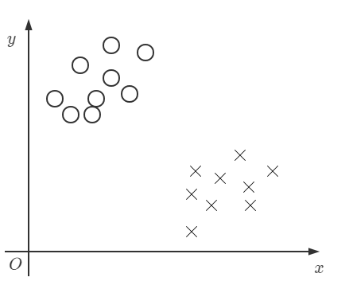
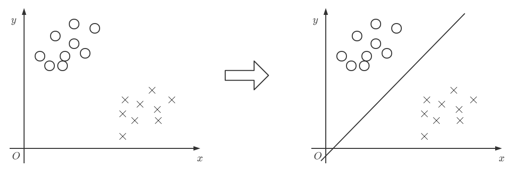

# 逻辑回归

## 1、什么是逻辑回归

Logistic Regression（逻辑回归）（其实跟“逻辑”本意没有太大的关系，主要是音译）是机器学习中一个非常常见的模型，在实际生产环境中也常常被使用，是一种经典的分类模型（不是回归模型）。

逻辑回归的过程可以理解为：面对一个**回归**或者**分类**问题，**建立代价函数**，然后通过**优化方法迭代**求解出最优的模型参数，然后测试验证我们这个求解的模型的好坏。

**问题描述**：

假设我们的数据在笛卡尔坐标系上分布如下:

其中圈（⚪）代表一类，记为$1$类，也就是$y_{⚪} = 1$

同理，叉（×）代表一类，记为$0$类，也就是$y_{×} = 0$

我们最直观的想法就是通过一条直线(超平面)去将这两“块”数据给分开。

也就是说我们的目标就是去找这样一条直线或这样一个超平面：$y=wx+b$能够将数据给分开。

目标确定了，但是我们不能像线性回归那样去确定损失函数。因为数据本身不具备线性回归的特征。

我们知道如果取同一个$x$,直线上面的点的$y$会大于直线对应的$y$值。

也就是$y_{⚪} > wx_{⚪}+b$

同理：$y_{×} < wx_{×} +b$

那么我们怎么去建立这样一个分类问题的损失函数呢？

## 2、Sigmoid函数

$Sigmoid$函数也称为**逻辑函数（Logistic function**）,公式和图像分别如下：
$$
y=\frac{1}{1+e^{-x}}
$$

我们可以看到$Sigmoid$很多良好的性质：

- 当$x>0$时，$y>0.5$并逐渐趋向于$1$；
- 同理当$x<0$时和当$x=0$时；
- 值域为$(0,1)$。

## 3、逻辑回归

从上面我们知道了逻辑回归是要解决一个(二)分类问题。那么可以有两种思路去表达模型的输出。

1. 直接输出$0$或$1$，类似于线性回归，直接输出预测值
2. 输出$0$或$1$的概率

