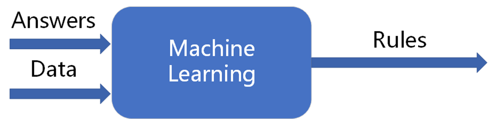
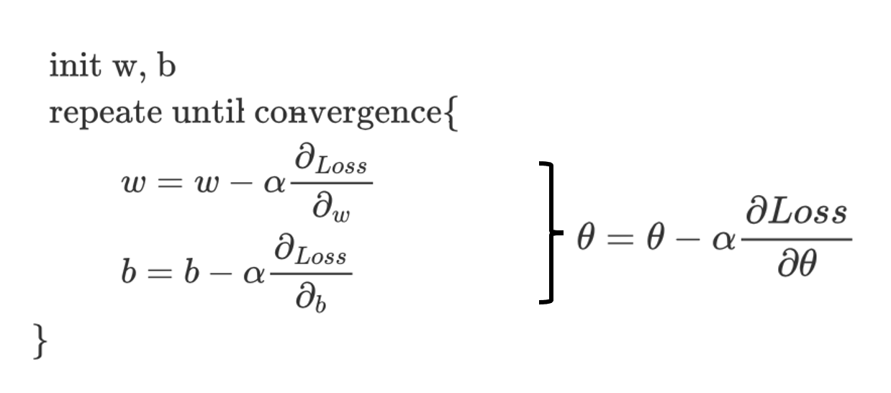

# 一文总结人工智能之机器学习

## 机器学习定义
机器学习没有一个严格的定义，在吴恩达老师《机器学习》课中的引用到一个定义,也是现代常用的说法是：

> Tom Mitchell provides a more modern definition:
>
> "A computer program is said to learn from experience **E**
>
> with respect to some class of tasks **T**
>
> and performance measure **P**,
>
> if its performance at tasks in T, as measured by P, improves with experience E."

从这段话中我们可以提取出一些要素：

1. 机器学习是一个计算机程序
2. 机器学习程序作用在一定的具体任务上面
3. 我们希望机器学习程序在这些任务上的表现是可以被某种指标衡量(measure)的
4. 这样的一个机器学习程序能够在某种衡量标准下，通过在一定的经验(数据)上学习，从而在某个任务上的表现越来越好。
定义总是简练而枯燥的，我们再从其它角度来宏观的理解一下。

# 一、传统算法与机器学习算法的区别
我们在本科课程中学过《数据结构与算法》，还有ACM-ICPC、蓝桥杯等的一些程序设计大赛，包括我们刷牛客、leetcode等来准备面试的编程题。而在往往企业招聘的时候，算法岗一般指的是机器学习、深度学习之类的。那么这两个算法之间有什么区别呢？

**首先我们来看看传统编程的范式:**

图源自Tensorflow2.0 官方教程

如上图，假设我们要判断人物运动状态，我们可以通过判断人物的速度大小来判断人物的运动状态(如速度小于4的时候，我们就认为这个人的运动状态是在走路)。

不难看出，我们传统编程范式往往是"数据"和"规则"都是直接体现在代码当中。

这里的"数据"往往是由一定的"数据结构"体现的；

而"规则"则是根据具体任务手动编写的代码逻辑，我们可能会应用到很多算法知识(穷举法、分治法和贪心法等等等，也就是我们《数据结构与算法》中经常提到的算法)来实现这些规则;

最终得到"数据"和"规则"共同影响下的"结果"。

我们可以理解为我们把"数据"和"规则"当作传统编程的输入，"结果"作为输出。

图源自Tensorflow2.0 官方教程

衡量传统编程范式中的算法的指标主要有"时间复杂度"、"空间复杂度"和"鲁棒性"等，很多算法竞赛就是给出具体任务，要求选手设计满足特定指标(如时间复杂度)的算法程序。算法竞赛能够综合考察学生的各项素质(如数学知识、编程能力等)，十分有魅力。

ps:

1. 传统编程"数据"和"规则"都直接体现在代码当中，所以数据结构和算法往往是紧密相关的。
2. 针对很多复杂的逻辑，算法的实现会应用到很多离散数学(如数论、图论等)中的知识。

**我们再来描述一下机器学习的思想:**

我们可以根据运动速度来判断一个人的实在"走路"、"跑步"还是在"骑自行车"，但是用速度来判断这个人是否在"打高尔夫球"是不合理的, 甚至再仔细想一想，我们很难通过可观测数据和人为制定规则来描述很多复杂的运动状态。
我们机器学习的思想就是  我们编写一个程序用来替代"人为制定规则"这个过程。也就是说，相对于传统编程的输入和输出，我们需要做一些调整。

图源自Tensorflow2.0 官方教程

我们把"数据"和对应的"结果"输入到机器学习程序当中，输出则是"规则"。

针对判断人物运动状态的例子，我们先告诉机器学习程序人物走路是大概是什么样的、跑步大概是什么样的等等，通过机器学习程序学习之后，最终我们能够得到这个规则(当然这个规则可能我们无法直接"理解")。获取到规则之后，对于新来的数据，我们就可以根据这个规则做出一个预测。

我们的目的是根据数据和结果得出规则，数据的选取和体现形式显得尤为考究，具体的方法和技巧后面会讲到。根据判断人物运动状态这个例子，我们可能会选取"速度"、"心率"、"血氧浓度"以及甚至于运动时的图像信息等等，我们更希望得到最"原始"的数据，因为我们的目的就是通过数据(和标签)来寻找规则，所以数据不需要过多的加工(...)。

**总结**

传统编程和机器学习编程都属于计算机程序，传统编程主要是针对数据  人为的描述规则  最终得到结果。机器学习主要是根据数据(和结果)来学习到规则。

之后我们提到的算法，更多指的是机器学习算法，当然我们在机器学习算法编程中 肯定会涉及到 传统编程中说道的算法。

# 二、人工智能概述
机器学习是人工智能里面的一个分支，那么我们经常听到的名词"人工智能"、"机器学习"、"深度学习"等等等，它们互相有什么联系呢？

  在B站 <a href="https://space.bilibili.com/21241234/?spm_id_from=333.999.0.0" target="_blank">刘二大人</a> 的Pytorch课程中看到这张图

>  通常人工智能是指通过普通计算机程序来呈现人类智能的技术。

那么很多传统编程程序也在完成呈现人类智能的目标，那么人工智能(AI)也应该包含着一部分内容。

先关注图中的包含关系，我们发现深度学习(Deep Learning, DL)属于表示学习(Representation Learning)的部分，然后都属于机器学习(Machine Learning, ML)。需要注意的是，这个图仅表示包含关系，我们发现深度学习只是人工智能很少的一部分，但随着近十来年深度学习的大火， 投入实际生产环境的更多的还是深度学习。

我们在来从历史发展的角度来仔细看一下这些内容。

我们还是要带着刚刚说的传统编程和机器学习编程的思想(输入和输出)来理解下面的内容。

  在B站 <a href="https://space.bilibili.com/21241234/?spm_id_from=333.999.0.0" target="_blank">刘二大人</a> 的Pytorch课程中看到这张图。

**基于规则的系统：**也就是传统编程中 人为的制定规则并程序实现。但是对于很多任务  我们发现人为的制定是很繁琐甚至于不可能实现的事情， 比如刚刚说的判断人物运动状态、人脸识别等等等。

**经典机器学习思想：**既然人为手动的制定规则是一件不容易的事情，那我们就手动的去选取数据的"特征"，然后通过机器学习学到的规则来映射得到结果。图中深色部分就是机器学习算法需要发力的地方。

手动选取到的特征往往体现为向量(Vector)或张量(Tensor)的形式(这里记为$x$)，然后这里的映射规则(记为$f(x)$)，最终得到的输出($y$)。机器学习的目标就是得出合理的映射规则，也就是$f(x)$，也就是我们需要通过一些机器学习算法(后面提到)来得出$f(x)$。

在判断人物运动状态的例子中，我们可以手动选取<速度>、<心率>、<血氧浓度>等特征，可以表达为向量$x = \left[ \begin{matrix}
value_{速度} \\
value_{心率}  \\
value_{血氧浓度} 
\end{matrix}
\right]$。然后根据不同的机器学习算法可能会学习到不同的规则$f(x)$,最终得到预测的结果。

ps: 我们发现机器学习有两个过程容易搞混淆：

1. 学习过程：也就是我们获取映射关系$f(x)$的这个过程，这个时候 我们需要数据和对应结果，也就是我们告诉机器学习程序走路的时候大概是什么样子的、跑步的时候大概是什么样子的。
2. 预测过程：就是我们拿到$f(x)$之后，类似于传统编程，我们将新的数据套用在这个$f(x)$中， 从而做出预测过程。

通常情况下，学习过程和预测过程中的数据类型是一样的(同样维度的向量或张量)，得到的结果也是如此。

**表示学习思想：**在经典机器学习思想中，我们需要手动去选取特征，但对于有些任务，选取特征可能也是一件麻烦的事情。例如数学建模竞赛中就有很多题目背景就是某种事物会受很多特征(大多是几千的量级)影响，还有就是像一张图片，一句话等的情况，这个时候手动去选取特征就显得尤为困难，然后我们就希望有一些算法来帮助我们筛选特征，然后就形成了一个特征工程的概念(具体内容之后再慢慢写)。

**深度学习思想：**表示学习中特征提取 和 映射 是两个分开的过程， 也就是说特征提取往往不依赖于数据的对应结果(以后结果用标签(label)更为合理)，那么久有可能在特征提取过程中会有一些信息损失。 那么深度学习思想就是我想要最"原汁原味"的数据，我自己来完成特征的表示和映射的过程。那么从数据到标签这个过程是连续的，我们又可以称之为端到端(end-to-end)的机器学习。

ps: 既然深度学习能解决这么多弊端，那我们是不是所有任务都可以用深度学习来解决呢？甚至说基于规则的系统都不"智能"了。答案肯定是否定的，有很多任务也是深度学习不太适合的， 例如我们要求一个函数的导函数、或者求不定积分之类的，这个时候用深度学习是不太合理的，因为基于规则的系统可以把每个特征的界限表达的很清楚(比如速度小于4， 这个4是很明确的数值)， 而深度学习里面的规则可能更多的是个"大概"。而且往往传统机器学习的可解释性比深度学习的可解释性好。

我们通过历史脉络知道了机器学习大体的一个思想，然后再回到人工智能的本质——模拟人类智能，那么我们主要需要模拟哪些智能呢？

  在B站 <a href="https://space.bilibili.com/21241234/?spm_id_from=333.999.0.0" target="_blank">刘二大人</a> 的Pytorch课程中看到这张图。

我们主要是需要模拟完成人类"推断"和"预测"的过程，实际上推断和预测两者之间的含义挺微妙的。举个例子，假设早晨起来看到地面是湿的，这个时候我们就可以"推断"昨晚下了雨，这是一个推断的过程；假设我们发现头顶乌云密布，那我们可以"预测"快要下雨了，这是一个预测的过程。

# 三、 线性回归
线性回归是最简单的机器学习算法之一， 但是麻雀虽小 五脏俱全。我们通过线性回归的例子能够很好的理解机器学习算法是怎么工作的。

假设我们需要根据房子面积来预测房子价格。

假设我们拿到的数据是很多 房子面积和对应的价格， 那么我们可以在笛卡尔坐标系上得到一个散点图。

按照传统机器学习的思想， 我们手动选取到的特征自然是房屋面积(size)；然后然后选择的机器学习算法自然就是小标题提到的线性回归，也就是说我们假设房屋价格与房屋面积呈线性关系，也就是说它们之间的映射关系可以表达为$price = w*size+b$（之后用x、y替代size和price）；标签则是房子的价格(price)。

**学习过程：**

我们知道$y =f(x)= w*x+b$在笛卡尔坐标系上的表现形式是一条直线， 其中$w、b$确定了，那么这条直线就确定了，那么我们现在的任务就是确定合理的$w、b$从而确定$f(x)$。

那么如何确定合适的$w$和$b$呢？假设我们随机初始化一个$w$和一个$b$，那么我们能够得到一条直线， 当然这个$w、b$可能不是那么合理。这个时候我们根据每个数据的面积套入到我们的这条直线当中 假设得到一个$\hat{y}$， 然后这个预测出来$\hat{y}$与真实的$y$之间会存在误差，我们可以把这个误差量化为两者之间的差值的绝对值$|\hat{y}-y|$,也就是说，误差越大，差值的绝对值越大。

为了方便， 我们可以把绝对值符号去掉，并记作损失:$loss_{i} = (\hat{y} _i- y_i)^2$，这里的$i$指的是第$i$条数据。那么总的损失可以表达为:

损失函数：$Loss = \sum_{i}(\hat{y}_i-y_i)^2= \sum_{i}[(wx_i+b)-y_i]^2$

那么这个函数的最小值，也就是误差的最小的时候，就是这条直线最合理的时候。

再来观察一下这个表达式， 其中$x_i$和$y_i$分别是已有的数据(房屋面积和对应的价格)，是已知的。

那么$Loss$是关于$w$和$b$的一个函数，我们的目的就变成了最优化问题$\min Loss(w, b)$，从而得出在$Loss$最小的情况下$w$和$b$的值。我们可以通过推导最小二乘法来获得解析解。但是我们这里还是要介绍机器学习中很常用的优化算法——梯度下降法。

**梯度下降：**

我们先忽略掉$b$，假设$Loss$只是关于$w$的函数，不难看出，这是一个二次函数。那开启假设性原则，假设这个二次函数长下面这样。

我们先给出梯度下降的更新原则， 再来解释为什么这样做。

我们先随机初始化一个$w$，然后进行一个循环，每次循环都将这个$w$减去一个**学习率**$\alpha$乘上梯度$\frac{d_{Loss(w)}}{d_w}$。

那么为什么每次都做减法呢？假设我们初始化的$w$在左边那条直线相切的地方，这个时候梯度算出来的值为负值，这个时候做减法相当于$w$加上了一个正值，相当于左移。同理，如果在右边，$w$会左移。

我们可以在$w$变化不大的时候结束循环。

学习率可以理解为我们希望$w$每次变化的幅度。如果太小，循环可能会执行很久，比较耗时；如果太大，就有可能造成一下子就从左边变到右边，然后右边变到左边。无法收敛。

这里我们只探讨了只有一个$w$的情况，如果同时考虑$w$和$b$的情况下， 就是一个三维的图像。绝大部分情况下，图像都不是完美的抛物线或"碗状"的图形。

我们依然采用梯度下降法来处理两个甚至两个以上(不能作图)**参数**(parameter)(通常需要机器学习程序确定的变量我们叫做参数，通常记作$\theta$)的情况。

那么针对每个变量，都使用求偏导的方式来算梯度，然后每个参数都按照自己梯度下降的方向移动。

在上面三维图像中，梯度下降的过程就是参数从`随机初始化的点`往`更低的点`移动的过程。如果机器学习算法的参数不止两个， 依然按照求偏导的方式进行梯度下降，但是很难可视化。

图中可以看到，很有可能根据初始化的不同而收敛的结果不同，很多情况下，我们得到的都是一个局部最优解(local minima)，实际上这个局部最优解虽然比全局最优解(global minima)要差一点， 但是也没有想象中那么差，很多情况下都是满足要求的。 

梯度下降法最不希望遇到的就是鞍点(saddle point)因为这个时候参数的导数为0， 也就是参数不再变化，但是这个时候的情况并不是太好。也有很多方法来解决这个问题，后续有机会再写。

梯度下降法能够通过找到损失的(局部)最小值从而确定参数的值，也就意味着完成了这个学习的过程，我们再来梳理一下整个流程。

ps: 我们机器学习程序中要去学习确定的变量 我们称之为参数(如$w$和$b$)， 人为确定的一些变量称之为超参数(hyper parameter)(如学习率$\alpha$)

# 四、经典机器学习算法
通过线性回归的例子，我们可以知道机器学习的大致流程是怎么样的。在以上的基础上，再补充几点：

1. 损失函数的形式可以多种多样，损失函数的存在也响应了定义中"机器学习的表现是可以被衡量的"，损失通常情况下是正值，也就是说 损失越小越好
2. 上面描述的是最朴素的梯度下降的方法，有很多方法来优化梯度下降的缺点(如加速收敛、关于鞍点的处理等等等)，机器学习中很多情况下都是用的梯度下降来确定参数，本文后面就不再细讲这个过程。
3. 为了更好的利用GPU的并行计算能力，我们往往喜欢把数据批量化训练。上面只是描述了一下整个线性回归的思想，但是没有细节的探讨我们拿到数据应该怎么处理，这些内容之后会单独写出来。

到这里，我们知道机器学习程序就是从数据中寻找规则，那么寻找规则的方法肯定不止线性回归一种，因此肯定就会出现各种各样的机器学习算法。下图罗列了很多经典的机器学习算法。

  在B站一个课程中看到这张图，但是找不到了，侵删。

 针对不同问题有不同的机器学习方法，或针对相同的问题有不同的思想。这里面的大部分算法，我都会以单独的博客去记录，这里先大致的描述一下。

1. 广义线性回归。上文描述了线性回归的思想，现在我们假设有一个分类问题(比如分类香蕉和苹果)， 假设我们能够在二维平面上表示成下图这个样子。我们发现我们还是需要去确定一条直线，把这个数据划分成两个部分。
其中逻辑斯蒂回归(Logistics Regression)、感知机(Perceptron)和支持向量机(Support Vector Machine, SVM)都是解决这一问题的不同思路。

如果是在二维平面上，我们需要寻找到一条直线。如果维度上升到三维，我们就需要找到一个平面。如果更高维，那么我们寻找的就是一个[超平面(Hyperplane)](https://baike.baidu.com/item/%E8%B6%85%E5%B9%B3%E9%9D%A2/5360532?fr=aladdin)。

大多情况下，我们的机器学习的任务都是回归任务(如预测房价)和分类任务(如判断图片是猫是狗)。

2. 集成学习思想。这里面包含了树的概念，然后基本的决策树算法等(以单独的博客描述)，集成学习的主要思想就是"三个臭皮匠顶个诸葛亮", 通俗来说就是，如果我们不相信一个模型预测的结果，那我们可以通过多个模型的预测值以投票、求均值等方式来得到最终的预测结果。
3. 概率图模型。统计学中分为频率学派与贝叶斯学派，概率图模型大都基于贝叶斯网络。图中所圈中的主要是发挥了统计学的暴力美学处理一些序列模型(如预测天气变化、交通变化、自然语言等)。
4. 监督学习和无监督学习。之前我们探讨的是我们告诉机器学习程序 走路什么样、跑步什么样， 这一类数据是带有"标签"的，我们管这一类机器学习叫做监督学习。假设我们有一堆苹果和香蕉的数据，但是我们不知道哪些是苹果 哪些是香蕉， 我们也希望做一个分类，我们也有一些算法来完成这些任务， 我们管这一类没有标签的数据叫做无监督学习。

