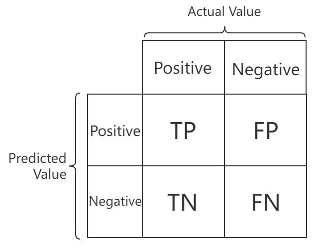
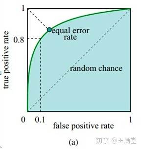

# 模型评估

背景：为了评估模型的效果，我们需要引入一些指标来评价。

先来看看二分类的评估指标。

首先我们需要引入TP，TN，FP，FN四个概念。这四个概念包含了模型预测样本的所有情况。

TP（True Positive）：样本为正例，预测为正例

TN（True Negative）：样本为负例，预测为负例

FP（False Positive）：样本为负例，预测为正例

FN（False Negative）：样本为正例，预测为负例

记忆方法：首先T表示预测正确了，后面跟着的P和N是正确的结果。

F表示预测错误了，后面跟着的P和N是错误的结果，真实标签是反过来的

有了上述四种预测情况，因此我们可以引入评价的指标了

**混淆矩阵(Confusion Matrix)**又叫可能性矩阵或错误矩阵。

> 在人工智能中，混淆矩阵（confusion matrix）是可视化工具，特别用于监督学习，在无监督学习一般叫做匹配矩阵。
>
> [百度百科](https://baike.baidu.com/item/%E6%B7%B7%E6%B7%86%E7%9F%A9%E9%98%B5/10087822)

## 1.准确率($Accuracy$)

准确率，顾名思义，是指模型预测正确的样本占总体样本的比例。模型预测正确的样本为：TP+TN，整体的样本为TP+TN+FP+FN。因此准确率为：

$$
Accuracy = \frac{TP+FN}{TP+TN+FP+FN} \tag{1}
$$

## 2.精确率($Precision$)

精确率针对的是对于预测结果而言，预测为正的样本有多少是真的正样本。预测为正的样本为TP+FP，真的正样本为TP。

$$
Precision = \frac{TP}{TP+FP}  \tag{2}
$$

## 3.召回率($Recall$)、TPR(True Positive Rate)

召回率针对的是对于原来的**样本而言，**正样本被预测准确准确的比例。所有的正样本为TP+FN,预测准确的正样本为TP。 召回率可以理解为对正样本的识别率。又叫**TPR**。

可以理解为 在所有预测正确中，有多少是正例。
$$
Recall = \frac{TP}{TP+FN}  \tag{3}
$$

1. 为什么不能单纯使用准确率accuracy？
    当样本不均衡时，准确率并不能较好反应模型的泛化例子，比如，正样本为犯病的病人，负样本为正常人，正样本远小于负样本时(正样本1例，负样本999例)，此时模型只要把所有的样本预测为负例，就能有99.99%的准确率，**然而，对于正样本的准确预测才是我们更为关注的**。

2. 精确率和召回率的关系？为什么不能只使用一个？ 

   首先，我们希望的是精确率和召回率都很高，但在现实生活中，这很难做到，往往呈现此消彼长。
   假设正样本50，负样本50。极端情况下，我们只预测了一个样本为正例，且预测正确。则TP=1，FP=0。那么precision=1，但是此时Recall表示的正确召回正例的比例却很低，TP=1，FN=49，recall=1/50。
   另外一种极端情况，我们把所有的样本都预测为正，那么TP=50，FN=0，FP=50,那么recall=1，precision=1/2。

**因此我们常常使用recall和precision的一个协调平均数(F1-measure)作为评判模型泛化能力的标准**

## 4. FNR（False Negative Rate）

同理，可以理解为在所有预测正确中，有多少是负例。
$$
FNR = \frac{FN}{TP+FN}  \tag{3}
$$

## 5. TNR(True Negative Rate)

可以理解为 在所有预测错误中，有多少是被预测成了负例。
$$
TNR = \frac{TN}{TN+FP} \tag{4}
$$

## 6. FPR（False Positive Rate）

可以理解为 在所有预测错误中，有多少是被预测成了正例。
$$
FPR = \frac{FP}{TN+FP} \tag{5}
$$

## 7.Balanced Accuracy

去TPR和TNR的平均：
$$
balanced\_accuracy = \frac{TPR+TNR}{2} \tag{7}
$$
## 8.F1-measure

F1分数主要用于二分类模型，综合考虑了recall和precision的关系。实际上它是召回率和精准率的调和平均数。
$$
F1 = \frac{(1+\beta^2)\cdot precision \cdot recall}{\beta^2 \cdot precision + recall} \tag{8}
$$
在日常生活中，我们常令$\beta = 1$。但是如果我们认为召回率应该更重要，则$\beta >1$,反之亦然。

## 9.ROC曲线

ROC的横坐标为FPR，FPR也称为**虚惊概率**，负例中被预测为正例的占比，正常人被预测成了病人可不就是虚惊了嘛。

ROC的竖坐标为TPR，也就是召回率，也叫做正例覆盖率。

ROC的每一个点都由(FPR,TPR)组成，假设使用的是逻辑回归分类器，当对某个样本预测分数大于阈值时，将该样本划分为正例，由该阈值产生的分类结果可以计算出FPR，TPR。随着阈值的减小，越来越多的样本被划分为正样本，FPR和TPR都在增大。阈值最大时，所有的样本都是负例，坐标为(0,0)，阈值为0时，所有的样本都是正例，坐标为(1,1),如下图所示。

ROC的优点

1.TPR关注所有正样本，FPR关注所有负样本，比较能评估模型的整体性能。

2.FPR和TPR都不依赖于类的具体分布，不会受类分布的改变而改变(对类别不平衡不敏感，也不会随着样本比例变化而变化)。

**要想理解不敏感，我们可以这样看，FPR = FP/(FP+TN) FP和TN都是样本真实是负例，只关注了负例。TPR只关注了正例，没有负例。**

ROC缺点

1.有的时候，由于ROC对类别平衡不敏感，反而是坏事。比如：对于FPR，当负例远大于正例时，FP即使增加很多，由于TN过大，也会使得FPR增加很少，即出现大量FP，但ROC曲线无法直观得到。

## 10. AUC

对于某个ROC曲线来说，如果越陡峭，即TPR高，FPR越低，即：正例覆盖的高，负例错误分类低，那么说明模型的泛化能力强。这也就对应了ROC曲线下面的面积AUC，越陡峭，面积越大，AUC越大，模型泛化能力越强。越平缓，面积越小，泛化能力越差。AUC取值范围0.5-1。

## 11.kappa系数

Kappa系数是一个用于一致性检验的指标，也可以用于衡量分类的效果。

因为对于分类问题，所谓一致性就是模型预测结果和实际分类结果是否一致。

kappa系数的计算是基于混淆矩阵的，取值为-1到1之间,通常大于0。
$$
kappa = \frac{p_o-p_e}{1-p_e} \tag{9}
$$
其中$p_o = \frac{对角线元素之和}{整个矩阵元素之和}$, $p_e = \frac{\sum_i 第i行元素之和 * 第i列元素之和}{(\sum 矩阵所有元素)^2}$

## 12 .马修斯相关系数

$$
MCC = \frac{TP \cdot TN - FP \cdot FN}{\sqrt{(TP+FP) \cdot (TP+FN) \cdot (TN+FP) \cdot(TN+FN)}} \tag{10}
$$

现在问题来了，上面我们讲述的都是二分类，那么多分类呢？

多分类问题我们尝试用micro-F1和macro-F1

## 样本不均衡时各评价指标分析

当样本不均衡时(负样本多时)：

TP = 1

FP = 1

TN = 1

FN = 99

指标及分析

| 指标                | 值     | 分析                                  |
| ----------------- | ----- | ----------------------------------- |
| Accuracy          | 0.98  | 负例多时，我们显然不能直接说正例有99%概率是负例(比如癌症预测等)。 |
| Precision         | 0.5   | 精准率不高，说明没有“把握”。                     |
| Recall、TPR        | 0.01  | 召回率低，说明对正样本的区分能力很低。                 |
| Balanced Accuracy | 0.255 | 能够反应出样本不均衡的问题。                      |
| F1-score          | 0.196 | 能够反应出样本不均衡的问题。                      |
| mcc               | -0.49 | 能够反应出样本不均衡的问题。                      |

当样本不均衡时(正样本多时)：

TP = 99

FP = 1

TN = 1

FN = 1

指标及分析

| 指标                | 值     | 分析   |
| ----------------- | ----- | ---- |
| Accuracy          | 0.98  |      |
| Precision         | 0.99  |      |
| Recall、TPR        | 0.99  |      |
| Balanced Accuracy | 0.745 |      |
| F1-score          | 0.99  |      |
| mcc               | 0.49  |      |

实际上，当样本大量不均匀时，不能用precision和recall、f1评估。需要使用auc,auc不受样本分布的影响。

但是仍然可以看到mcc表现良好，这也是我经常使用mcc的原因。

## 13.多分类

### 13.1 micro-F1

micro-F1对于每种分类给予一样的权重，假设由1,2,3三种类别，则micro-F1计算方式为：

$$
Recall_m = \frac{TP_1 + TP_2 + TP_3}{TP_1 + TP_2 + TP_3 + FN_1 +FN_2 +FN_3} 
$$

$$
Precision_m = \frac{TP_1 + TP_2 + TP_3}{TP_1 + TP_2 + TP_3 + FP_1 +FP_2 +FP_3} 
$$

$$
F1 = \frac{2\cdot precision_m \cdot recall_m}{\cdot precision_m + recall_m}
$$

存在的问题：当类分布不平衡时，会影响结果，假设1样本非常多，那么Recall和Precision将被1的预测能力所主导。

### 13.2 macro-F1

macro-F1也是对每种分类给予一样的权重，然后由各个类别的F1分数取平均得到，即：

$$
F1 = \frac{F1_1 + F1_2 + \cdots + F1_N }{ N}
$$

优点：不会受数据不平衡影响。

缺点：会受到高识别率类的影响。比如某个类别的F1比较大。

​	