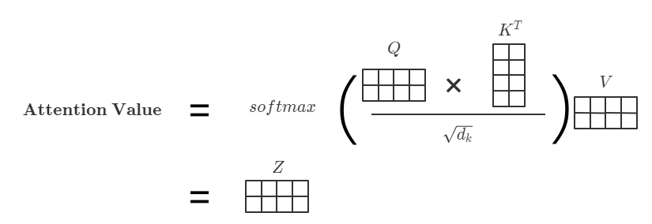

# Attention机制与self-attention

## 1、Attention机制理解

> Attention机制最早是应用于图像领域的，九几年就被提出来的思想。随着谷歌大佬的一波研究鼓捣，2014年google mind团队发表的这篇论文《Recurrent Models of Visual Attention》让其开始火了起来，他们在RNN模型上使用了attention机制来进行图像分类，然后取得了很好的性能。然后就开始一发不可收拾了。。。随后Bahdanau等人在论文《Neural Machine Translation by Jointly Learning to Align and Translate》中，使用类似attention的机制在机器翻译任务上将翻译和对齐同时进行，他们的工作算是第一个将attention机制应用到NLP领域中。接着attention机制就被广泛应用在基于RNN/CNN等神经网络模型的各种NLP任务中去了，效果看样子是真的好，仿佛谁不用谁就一点都不fashion一样。2017年，google机器翻译团队发表的《Attention is all you need》中大量使用了自注意力（self-attention）机制来学习文本表示。这篇论文引起了超大的反应，本身这篇paper写的也很赞，很是让人大开眼界。因而自注意力机制也自然而然的成为了大家近期的研究热点，并在各种NLP任务上进行探索，纷纷都取得了很好的性能。
>
> attention机制的本质是从人类视觉注意力机制中获得灵感(可以说很‘以人为本’了)。大致是我们视觉在感知东西的时候，一般不会是一个场景从到头看到尾每次全部都看，而往往是根据需求观察注意特定的一部分。而且当我们发现一个场景经常在某部分出现自己想观察的东西时，我们就会进行学习在将来再出现类似场景时把注意力放到该部分上。
>
> [浅谈Attention机制的理解 - 知乎 (zhihu.com)](https://zhuanlan.zhihu.com/p/35571412)

我们以基于RNN的Encoder-decoder做sequence to sequence模型来说，最常见也就是翻译任务了。

模型结构大概如下:

我们发现encoder端所有的信息都通过last hidden state传递给decoder，然后通过decoder翻译成另一个序列。当我们序列长度很长的时候，很难通过一个hidden state包含句子的所有信息，则会导致我们翻译出错。

> 《Neural Machine Translation by Jointly Learning to Align and Translate》

论文中应该算是第一个讲attention机制应用到NLP任务中，我们先看看论文中是怎么做的：

从图中可以看到，模型将Encoder的每个hidden state形成一个$c_i$当作context vector输入给decoder的每一步。

那么它是怎么计算的呢？以Decoder第二个hidden state为例。

$c_2 = h_1 \cdot w_{21} + h_2 \cdot w_{22} + h_3 \cdot w_{23} + h_4 \cdot w_{25}$

$\overline{h_1^{\prime}} \leftarrow contact(\overline{h_1^{\prime}}, c_2)$

这时新的$\overline{h_1^{\prime}}$就成了$h_2^{\prime}$的上一个神经元的输出当作$h_2^{\prime}$的输入。

也就是说把上一个神经元的hidden state 与当前的context vector做一个简单的链接，当作当前神经元的输入。

由于$w_{21}, w_{22}, \cdots$的不同，Decoder的每个神经元对Encoder的每个输入能够学习到不同的“注意力”。

**实际上，注意力机制就是一系列权重分配或权重系数。**

另外：Bahdanau 和 Luong 都是两种 Attention机制的实现方式。

参照[一文看懂 Bahdanau 和 Luong 两种 Attention 机制的区别 - 知乎 (zhihu.com)](https://zhuanlan.zhihu.com/p/129316415) （**重要**）

## 2、Q、K、V又是什么？

> [浅谈Attention机制的理解 - 知乎 (zhihu.com)](https://zhuanlan.zhihu.com/p/35571412)
>
> 我们现在抛开encoder-decoder来说attention机制。既然attention是一组注意力分配系数的，那么它是怎样实现的？这里要提出一个函数叫做attention函数，它是用来得到attention value的。
>
> 比较主流的attention框架如下：
>
> 

这里先用大白话说一下怎么理解$Q、K、V$。

假如你脑子里面想去图书馆查阅一些关于NLP相关的书籍,

到了图书馆发现图书馆是按照“人文”、“地理“、”人工智能“等等分类的，

然后通过一系列寻找发现了你想要的书。

这里我们就可以把”你想要去图书馆找书“当作一个**Query(Q)**,

图书馆提供了分类方案成为了**Key(K)**，

书籍本身就成了**Value(V)**.

Attention框架的做法是：

> 1. Q与K进行相似度计算得到权值
> 2. 对上部权值归一化
> 3. 用归一化的权值与V加权求和
>
> 公式：$\text{Attention Value} = similarty(QK^T)V$

最终得到一系列的权重分配系数，用上面的例子来说就是，你根据你的Query和图书馆提供的Key算了一个相似度，大概率可能在”人工智能“分类下找到了相应的书籍（Value）（也就是权重系数(Attention Value)最大的）。

## 3、Self-Attention呢？

self-attention是在 [Attention is All you Need](https://arxiv.org/abs/1706.03762)提出的，其摒弃了传统RNN的结构，

那他是怎么应用attention机制的呢？

从第2节我们知道，注意力机制可以是通过QKV计算出一系列的权重分配。

self-attention意味着自己和自己做attention。

那么QKV从哪儿来呢？

论文里面的做法是通过**Input**分别学习出Q K V。

也就是说$Q = W_Q * \text{Input Embedding}$，$ K= W_K * \text{Input Embedding}$，$ V= W_V * \text{Input Embedding}$，
也就是经常说的”self-attention的QKV来源于同一输入“，其实我觉得这个说法弱化了QKV都是通过学习的来的。

论文中还提出了新的Attention Value的计算方式：$Attention(Q,K,V) = softmax(\frac{QK^T}{\sqrt{d_k}})V$

其中$d_k$是Q和K的维度，至于为什么要除以这个我们之后再详细讨论。

其实到这里，我们可以对论文的很多东西提问，比如换一种Attention Value的计算方式行不行？
也启发了我们在阅读论文的时候要多提问。

接下来再用图来看看张量维度的变化：

这个时候我们我们将

$Q = W_Q * \text{Input Embedding}$，$ K= W_K * \text{Input Embedding}$

$\text{batch size} * \text{sequence length} * \text{embedding size} (d_{model})$经过self-attention之后变成了

$\text{batch size} * \text{sequence length} * d_k$

然后每个$\text{sequence length}$阶的向量就是一系列的权重分配。

注意，图中$d_k = d_{model}$，实际上如果张量是$\text{sequence length} * \text{embedding size}$（$\text{sequence length}$在前），应该是$W_Q * X$（$W$在前才能得到正确的维度变换)（上图有些不严谨）。

​