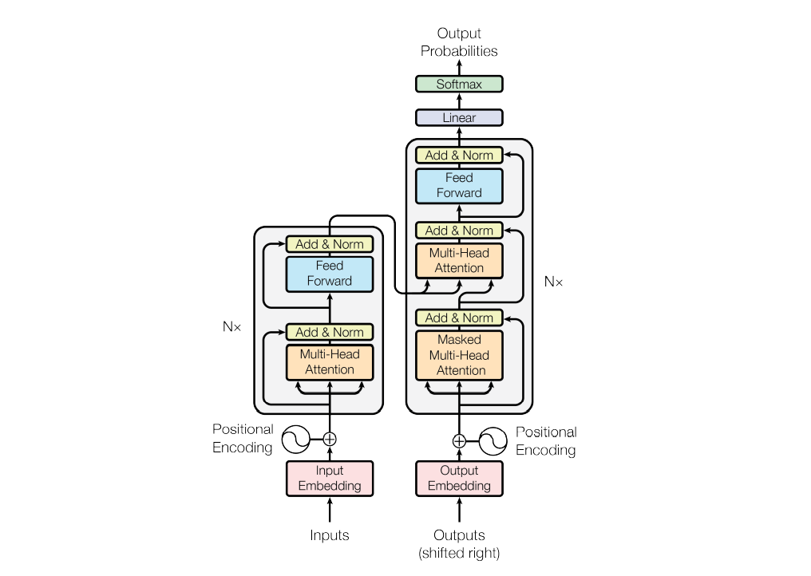
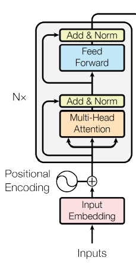
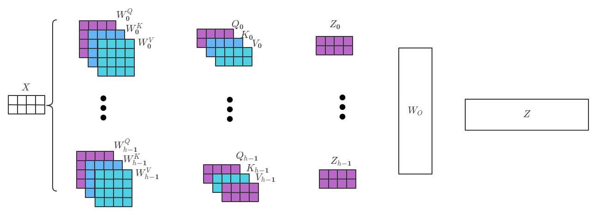
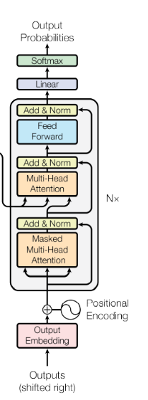

# Transformer 理解

网上有很多对此类文章的详解，这里写下我的理解，肯定存在很多疏漏的地方，还望指正！

Transformer模型是Google在 [Attention is All you Need](https://arxiv.org/abs/1706.03762)提出的Encode-Decoder模型，
在从CNN和RNN类的Encode-Decoder模型过度到Transformer这种“全连接”模型，这篇文章肯定是教科书般的存在。

这篇文章先对Transformer模型结构，进行简要的梳理，之后再用单独文章去看论文和一些细节的地方。

## 1、回顾RNN
我们知道RNN存在一些问题，例如：

1) 梯度消失和梯度爆炸
2) 训练非常缓慢(因为当前状态需要等待上一个状态的输出，不能很好的发挥当代GPU并行能力)

后来长短期记忆模型(Long short-term memory, LSTM)和GRU模型都试图通过门结构来试图缓解梯度消失和梯度爆炸的问题，也就是我们可以通过LSTM和GRU处理更长的序列模型，但是多长算长呢？从几十个到几百个？那么几千个呢？

由于加入了LSTM和GRU加入了更多的参数，LSTM的训练变得更加缓慢了，当然GRU会比LSTM快一点。早期的一些paper会因为算力原因，更愿意去选择GRU。

## 2、Transformer整体结构

图源自原论文

从图中我们可以看到,图的左边是Transformer的Encoder端，右边则是Decoder端。

为了更加方便解释整个Transformer结构，我们通过翻译文本的例子来阐述。

也就是假设我们要将 “我喜欢自然语言处理” 翻译成 “I love nlp”。

## 3、 Transformer的Encoder端

我们先把Encoder端单独拿出来

**Input Embedding**：我们从Input Embedding开始，我们可以通过常用的Word2Vec的方式去将我们的自然语言编码成特征向量(张量)。原文中，特征向量的维度是$d_{model} = 512$，也就是说经过Input Embedding之后我们得到了一个$batch\_size * seqence\_length * d_{model}$的一个张量。

**Positional Encoding**：[TODO 位置编码的重要性]接下来就是位置编码(Positional Encoding, PE)，我们说RNN类网络能够处理序列模型，是因为它独特的网络结构就包含了序列信息。因为Transformer没有类似与RNN的网络结构，到那时它也需要获得token的绝对位置信息和相对位置信息。Transformer用了一个很巧妙的位置编码来表达序列信息，同时能够并行计算。

Transformer用了$\sin$和$\cos$函数来进行位置编码，我们先把表达式写出来，然后再进一步解释：
$$
PE_{(pos,2i)} = \sin(pos/10000^{2i/d_{model}}) \\
PE_{(pos,2i+1)}=\cos(pos/10000^{2i/d_{model}})
$$
Why?其实我第一次在学这一部分的时候也很疑惑，包括看了很多解释也理解得不是很明白。

我们先从最直观的位置编码说起，可能最容易想到的就是从$1$编码到$n$。但是Transformer处理的是变长序列的问题，那就可能有些句子已经编到好几百了，有些句子只能编到几十，况且大多词向量的数值是$softmax$到$[0,1]$区间的，数值太大会对计算产生很大的影响。

那如果我们把这些位置数值也缩放到$[0,1]$之间呢？实际上，也会因为句子长度影响，导致编码的步长不一致。句子长度会影响位置编码的差异。

（这里理解不知道对不对）其实后来BERT使用的位置编码是一种绝对位置编码的方式，实际上它是在训练的时候通过“学习”的方式最终确定位置编码。BERT这种编码方式放在Transformer上是行不通的，因为BERT在预训练的时候就确定了最长token限制(可以通过一个很简单的线性变换实现)，Transformer句子长度是灵活的。

那么Transformer是怎么处理的呢？

我们先搞懂上面的$\sin$函数和$\cos$函数表达式到底是怎么计算位置编码的。

先抛开$batch\_size$不谈，一个句子的**Input Embedding**的张量形状为$seqence\_length * d_{model}$的。

那么表达式中的$pos$表示就是$seqence\_length$中的第几维。$2i$和$2i+1$表示$d_{model}$里面第几维，也就是说偶数维度用$sin$函数，奇数维度用$\cos$函数。为了保证能够和**Input Embedding**进行简单相加操作，PE的位置编码的维度和$d_{model}$一致。

举个例子就是$PE_{(0,0)} = \sin (0 / 10000^{2 \cdot 0 / 512 }),PE_{(0,1)} = \cos(0 / 10000^{2 \cdot 0 / 512 })$,假设$d_{model}=512$。 

第一个词的位置编码大概就是$\left [  \begin{array}{} PE_{0,0} \\ PE_{0,1} \\ \cdots \\ PE_{0,d_{model}-1} \end{array} \right ]$。 

最终所有的位置编码也是形状为$batch\_size * seqence\_length * d_{model}$的张量，

然后再和**Input Embedding**简单的相加。注意位置编码中是不产生可学习参数的。

那么如何理解Transformer使用这样的位置编码呢？

这里偷懒引用一篇文章，[Transformer Architecture: The Positional Encoding]([Transformer Architecture: The Positional Encoding - Amirhossein Kazemnejad's Blog](https://kazemnejad.com/blog/transformer_architecture_positional_encoding/)) ， 其实我翻译的话，肯定还会出很多差错的，建议阅读原文。

我们知道经过位置编码之后张量的形状仍然是$batch\_size * seqence\_length * d_{model}$。

接下来就是$N$块图中阴影部分中结构串行连接在一起。我们将细致的描述。

**Multi-Head Attention**

在说多头注意力机制(Multi-Head Attention)之前，我们需要先看<a href="/#/machine-learning/ml_summay.md" target="_blank">Attention机制与self-attention</a>里介绍的内容。

从之前的内容知道，self-attn机制可以将

$batch\_size * seqence\_length * d_{model}$ 映射成$\text{batch_size}  * \text{sequence_length}* d_k$。

假设我们令$d_k=d_{model}$，相当于经过一次self-attention之后，张量形状依然是$batch\_size * seqence\_length * d_{model}$。

可能是类似与CV里面的多重卷积吧，论文中提出了多头注意力机制，

如果只做一次self-attn机制的话，一个token可能会更多注意到离自己更近的token，甚至是自己。

multi-head的思想就是计算出多组不同的QKV分别算Attention Value，然后再Concat起来。
$$
\begin{array} 
\text{MultiHead}(Q,K,V)  =  Concat(head_1, \cdots , head_h)W^O \\
where \  head_i  =  Attention(QW^Q_i,KW^K_i,VW^V_i)
\end{array}
$$
论文中为了保证连接后的维度一致，将头的数量($h$)和每个$d_k$约定为$d_k = d_{model} / h$，论文中$d_k$、$h$、$d_{model}$分别为64、8、512。

我们再来捋一下维度变化

位置编码之后：$\text{batch_size} * \text{sequence_length} * d_{model}$

多头注意力机制：

- 分多头，每个头的维度，$\text{batch_size} * \text{sequence_length} *\text{num_head} * d_k$
- 多头拼接：$\text{batch_size} * \text{sequence_length} * d_{model}$

**Add&Norm**

接下来就是简单的前馈神经网络(FNN)和Normalization。

简单写一下就是
$$
FFN(x)=\max (0, xW_1+b_1)W_2+b_2 
$$
Transformer用的是Layer Normalization：
$$
LayerNorm(x+Sublayer(x))
$$
这一部分会再写一篇博客内容中写更细节，具体是怎么实现的和为什么。

## 4、Decoder

我们看到Encoder向Decoder传递了两个参数，分别是利用了Encoder的K和V。

很多块儿和Encoder的结构差不多。我们主要写一下不同的地方。

首先捋一下逻辑：假设我们已经将”我喜欢自然语言处理“按照Encoder的方式编码了。

第一步：

- Outputs: <start>
- Output Probabilities: "I" （I的概率最大）

第二步：

- Outputs: <start> I
- Output Probabilities: "love" 

这样直到预测出停止符号位置。

由于我们训练的时候标记数据已经知道翻译后的句子是什么了，上述的方法是串行的方式，

为了利用并行的方式，可以通过mask上三角的方式：

<start>	<mask>		<mask>		<mask>		<mask>

<start>	     I			<mask>		<mask>		<mask>

<start>	     I			love			<mask>		<mask>

<start>	     I			love			nlp			<mask>

<start>	     I			love			nlp			<end>

这样就可以做到并行输入了。然后经过的Multi-Head Attention也叫做Masked Multi-Head Attention。

再与Encoder生成的KV做一次Attention是为了去衡量目标语言与源语言的注意力。

这篇文章主要是理解Transformer的主要结构。之后我会再写一篇文章来表出很多细节，如：

- Attention计算方式对比
- Transformer的可学习参数
- Transformer中的Add & Norm实现，为什么用Layer Norm不用Batch Norm
- 注意力机制中除以$\sqrt{d_k}$的作用

等等等。

