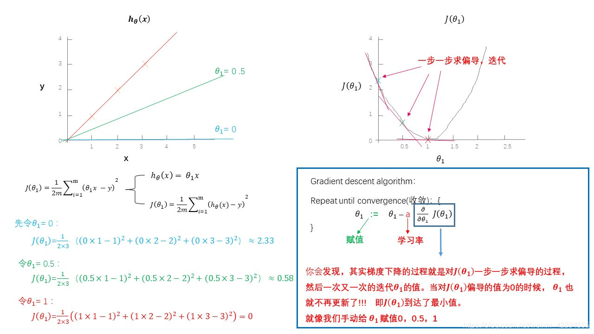
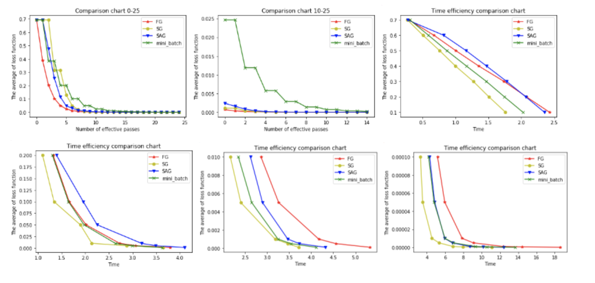

# 常见的优化器

## 1、梯度下降法(Gradient Descent)
梯度下降法的基本思想可以类比为一个下山的过程。

假设这样一个场景：一个人被困在山上，需要从山上下来(i.e. 找到山的最低点，也就是山谷)。
但此时山上的浓雾很大，导致可视度很低。因此，下山的路径就无法确定，他必须利用自己周围的信息去找到下山的路径。
这个时候，他就可以利用梯度下降算法来帮助自己下山。
具体来说就是，以他当前的所处的位置为基准，寻找这个位置最陡峭的地方，然后朝着山的高度下降的地方走，
（同理，如果我们的目标是上山，也就是爬到山顶，那么此时应该是朝着最陡峭的方向往上走）。
然后每走一段距离，都反复采用同一个方法，最后就能成功的抵达山谷。

梯度下降的基本过程就和下山的场景很类似。

首先，我们有一个可微分的函数。这个函数就代表着一座山。

我们的目标就是找到这个函数的最小值，也就是山底。

> 在多变量函数中，梯度是一个向量，向量有方向，梯度的方向就指出了函数在给定点的上升最快的方向
>

**梯度下降（Gradient Descent）公式**

> 梯度的具体的数学含义可看这篇博客：[《什么是梯度》](https://www.cnblogs.com/yanFlyBlog/p/15143163.html)

$$
\theta_i = \theta_i - \alpha \frac{\partial }{\partial \theta_i}J(\theta)
$$

1. $\alpha$是什么含义？

   $\alpha$在梯度下降算法中被称作为**学习率**或者**步长**，意味着我们可以通过$\alpha$来控制每一步走的距离，以保证不要步子跨的太大扯着蛋，哈哈，其实就是不要走太快，错过了最低点。同时也要保证不要走的太慢，导致太阳下山了，还没有走到山下。所以$\alpha$的选择在梯度下降法中往往是很重要的！$\alpha$不能太大也不能太小，太小的话，可能导致迟迟走不到最低点，太大的话，会导致错过最低点！

    

2. 为什么梯度要乘以一个负号？

   梯度前加一个负号，就意味着朝着梯度相反的方向前进！我们在前文提到，梯度的方向实际就是函数在此点上升最快的方向！而我们需要朝着下降最快的方向走，自然就是负的梯度的方向，所以此处需要加上负号

   我们通过两个图更好理解梯度下降的过程
   
   

## 2. 全梯度下降算法(Full gradient descent,FGD）

**计算训练集所有样本误差**，对其求和再取平均值作为目标函数。

权重向量沿其梯度相反的方向移动，从而使当前目标函数减少得最多。

因为在执行每次更新时，我们需要**在整个数据集上计算所有的梯度，所以批梯度下降法的速度会很慢，同时，批梯度下降法无法处理超出内存容量限制的数据集**。

**批梯度下降法同样也不能在线更新模型，即在运行的过程中，不能增加新的样本。**

在整个训练数据集上计算损失函数关于参数θ的梯度：
$$
\theta=\theta-\eta\bullet \nabla_\theta J(\theta )
$$
其中，$\nabla$称为**哈密顿算子**，其定义如下：
$$
\bigtriangledown f=(\frac{\partial f}{\partial x_1},\frac{\partial f}{\partial x_2},...,\frac{\partial f}{\partial x_n}  )
$$

## 3. 随机梯度下降(Stochastic Gradient Descent,SGD)

由于**FGD（全梯度下降算法）**每迭代更新一次权重都需要计算所有样本误差，而实际问题中经常有上亿的训练样本，故**效率偏低，且容易陷入局部最优解**，因此提出了随机梯度下降算法。

其每轮计算的目标函数**不再是全体样本误差，而仅是单个样本误差，即每次只代入计算一个样本目标函数的梯度来更新权重**，再取下一个样本重复此过程，直到损失函数值停止下降或损失函数值小于某个可以容忍的阈值。

此**过程简单，高效，通常可以较好地避免更新迭代收敛到局部最优解**。其迭代形式为
$$
\theta=\theta-\eta\bullet \nabla_\theta J(\theta ;x^{(i)};y^{(i)})
$$
其中，$x^{(i)}$表示一条训练样本的特征值，$y^{(i)}$表示一条训练样本的标签值

**每次只使用一个样本迭代，若遇上噪声则容易陷入局部最优解**。

##4.随机平均下降(Stochastic average gradient descent)

在SGD（随机梯度下降算法）方法中，虽然避开了运算成本大的问题，但对于大数据训练而言，SGD（随机梯度下降算法）效果常不尽如人意，因为每一轮梯度更新都完全与上一轮的数据和梯度无关。

随机平均梯度算法克服了这个问题，在内存中为每一个样本都维护一个旧的梯度，随机选择第i个样本来更新此样本的梯度，其他样本的梯度保持不变，然后求得所有梯度的平均值，进而更新了参数。

如此，每一轮更新仅需计算一个样本的梯度，计算成本等同于SGD（随机梯度下降算法），但收敛速度快得多。

## 5. 小批量梯度下降算法（Mini-batch gradient descent，BGD）

小批量梯度下降算法是FGD（全梯度下降算法）和SGD（随机梯度下降算法）的折中方案，在一定程度上兼顾了以上两种方法的优点。

**每次从训练样本集上随机抽取一个小样本集，在抽出来的小样本集上采用FGD（全梯度下降算法）迭代更新权重。**

被抽出的小样本集所含样本点的个数称为batch\_size，通常设置为2的幂次方，更有利于GPU加速处理。

特别的，若batch\_size=1，则变成了**SGD（随机梯度下降算法）**；若batch\_size=n，则变成了**FGD（全梯度下降算法）**。其迭代形式为
$$
\theta=\theta-\eta\bullet \nabla_\theta J(\theta ;x^{(i:i+n)};y^{(i:i+n)})
$$

## 6、四种基本梯度下降算法比较

为了比对四种基本梯度下降算法的性能，我们通过一个逻辑二分类实验来说明。本文所用的Adult数据集来自UCI公共数据库（[http://archive.ics.uci.edu/ml/datasets/Adult）。](http://archive.ics.uci.edu/ml/datasets/Adult）。) 数据集共有15081条记录，包括“性别”“年龄”“受教育情况”“每周工作时常”等14个特征，数据标记列显示“年薪是否大于50000美元”。我们将数据集的80%作为训练集，剩下的20%作为测试集，使用逻辑回归建立预测模型，根据数据点的14个特征预测其数据标记（收入情况）。

以下6幅图反映了模型优化过程中四种梯度算法的性能差异。

在图1和图2中，横坐标代表有效迭代次数，纵坐标代表平均损失函数值。图1反映了前25次有效迭代过程中平均损失函数值的变化情况，为了便于观察，图2放大了第10次到25次的迭代情况。

从图1中可以看到，**四种梯度算法下，平均损失函数值随迭代次数的增加而减少**。**FG的迭代效率始终领先**，能在较少的迭代次数下取得较低的平均损失函数值。**FG与SAG的图像较平滑**，这是因为这两种算法在进行梯度更新时都结合了之前的梯度；**SG与mini-batch的图像曲折明显**，这是因为这两种算法在每轮更新梯度时都随机抽取一个或若干样本进行计算，并没有考虑到之前的梯度。

从图2中可以看到**虽然四条折现的纵坐标虽然都趋近于0，但SG和FG较早，mini-batch最晚****。**这说明如果想使用mini-batch获得最优参数，必须对其进行较其他三种梯度算法更多频次的迭代。

在图3，4，5，6中，横坐标表示时间，纵坐标表示平均损失函数值。

从图3中可以看出使用四种算法将平均损失函数值从0.7降到0.1最多只需要2.5s，由于本文程序在初始化梯度时将梯度设为了零，故前期的优化效果格外明显。其中SG在前期的表现最好，仅1.75s便将损失函值降到了0.1，虽然SG无法像FG那样达到线性收敛，但在处理大规模机器学习问题时，**为了节约时间成本和存储成本，可在训练的一开始先使用SG，后期考虑到收敛性和精度可改用其他算法****。**

从图4，5，6可以看出，随着平均损失函数值的不断减小，SG的性能逐渐反超FG，FG的优化效率最慢，即达到相同平均损失函数值时FG所需要的时间最久。

综合分析六幅图我们得出以下结论：

**（1）FG方法由于它每轮更新都要使用全体数据集，故花费的时间成本最多，内存存储最大。**

**（2）SAG在训练初期表现不佳，优化速度较慢。这是因为我们常将初始梯度设为0，而SAG每轮梯度更新都结合了上一轮梯度值。**

**（3）综合考虑迭代次数和运行时间，SG表现性能都很好，能在训练初期快速摆脱初始梯度值，快速将平均损失函数降到很低。但要注意，在使用SG方法时要慎重选择步长，否则容易错过最优解。**

**（4）mini-batch结合了SG的“胆大”和FG的“心细”，从6幅图像来看，它的表现也正好居于SG和FG二者之间。在目前的机器学习领域，mini-batch是使用最多的梯度下降算法，正是因为它避开了FG运算效率低成本大和SG收敛效果不稳定的缺点。**